# 高中 数学 必修 第一册

# 第五章 三角函数 5.1 任意角和弧度制

# 一、单选题（共2题）

1.【单选题】已知一扇形的周长为28，则该扇形面积的最大值为（）

A. 36   
B. 42   
C. 49   
D. 56

2.【单选题】一条弧所对的圆心角是 $2 \mathrm{rad}$ , 它所对的弦长为 2 , 则这条弧的长是 ( )

A. $\frac{1}{\sin1}$   
B. $\frac{1}{\sin2}$   
C. $\frac{2}{sin2}$   
D. $\frac{2}{\sin1}$

# 二、填空题（共2题）

3.【填空题】在矩形ABCD中，AB=4，AD=3，将该矩形按照如图所示位置放置在直线AP上，然后不滑动的转动，当它转动一周时 $(A\rightarrow A_{1})$

叫做一次操作，则经过5次这样的操作，顶点A经过的路线长等于\_\_\_\_。

text_image

D C
A B A₁ P

4.【填空题】中国折扇有着深厚的文化底蕴．如图所示，在半径为20cm的半圆O中作出两个扇形OAB和OCD，用扇环形ABDC（图中阴影部分）制作折扇的扇面．记扇环形ABDC的面积为 $S_{I}$

，扇形 $OAB$ 的面积为 $S_{2}$ ，当 $\frac{S_1}{S_2} = \frac{\sqrt{5} - 1}{2}$ 时，扇形的形状较为美观，则此时扇形 $OCD$ 的半径为

natural_image

Chinese calligraphy fan with cherry blossoms and red seal, no text or symbols present

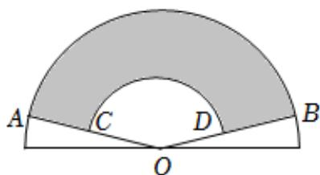

text_image

A
C
D
B
O

# 三、问答题（共1题）

5.【问答题】将下列角度化为弧度，弧度转化为角度

(1) $780^{\circ}$

(2) $-1560^{\circ}$ ,

(3) $67.5^{\circ}$ ,

(4) $-\frac{10}{3}\pi,$

(5) $\frac{\pi}{12}$ ,

(6) $\frac{7\pi}{4}.$

# 高中 数学 必修 第一册

# 第五章 三角函数 5.1 任意角和弧度制

# 一、单选题（共3题）

1.【单选题】已知 $\alpha$ 是第一象限角，那么 $2\alpha$ 是（）的角

A. 第一象限  
B. 第二象限  
C. 第一或第二象限  
D. 第一、二象限或y轴的非负半轴上

2.【单选题】设 $A=\{\theta|\theta$ 为锐角， $B=\{\theta|\theta$ 为小于 $90^{\circ}$ 的角， $C=\{\theta|\theta$ 为第一象限的角， $D=\{\theta|\theta$ 为小于 $90^{\circ}$ 的正角，则下列等式中成立的是（）

A. A = B   
B. B = C   
C. $A = C$   
D. A = D

3.【单选题】如果 $\theta$ 是第二象限角，那么 $\frac{\theta}{2}$ 是（）

A. 第一或第四象限角  
B. 第一或第三象限角  
C. 第二或第三象限角  
D. 第二或第四象限角

# 二、填空题（共2题）

4.【填空题】集合 $\{\alpha|k\cdot180^{\circ}+45^{\circ}\leq\alpha\leq k\cdot180^{\circ}+90^{\circ},\quad k\in Z\}$

中，角所表示的取值范围（阴影部分）正确的是 \_\_\_\_（填序号）.

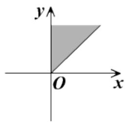

text_image

y
O x

①

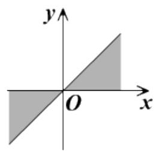

text_image

y
O
x

②

text_image

y
O
x

③

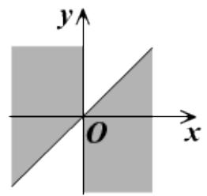

text_image

y
O
x

④

5.【填空题】若角 $\theta$ 的终边与角 $\frac{6\pi}{7}$ 的终边相同，则在 $[\pi, 2\pi)$ 内与角 $\frac{\theta}{3}$ 的终边相同的角是 \_\_\_\_.

# 高中 数学 必修 第一册

# 第五章 三角函数 5.2 三角函数的概念

# 一、单选题（共2题）

1.【单选题】已知点 $P(x,1)$ 为角 $\alpha$ 终边上一点．若角 $\alpha$ 是第二象限角， $\sin \alpha = \frac{\sqrt{3}}{3}$ ，则 $x$ 的值为（）

A. $\sqrt{3}$   
B. $-\sqrt{3}$   
C. $\sqrt{2}$   
D. $-\sqrt{2}$

2.【单选题】如果点 $P(2\sin\theta,\sin\theta\cdot\cos\theta)$ 位于第四象限，那么角 $\theta$ 所在象限为（）

A. 第一象限  
B. 第二象限  
C. 第三象限  
D. 第四象限

# 二、填空题（共2题）

3.【填空题】已知角 $\alpha$ 的顶点在原点，始边与 x 轴非负半轴重合，终边与直线 $2x + y + 3 = 0$ 平行，则 $\frac{\sin\alpha - \cos\alpha}{\sin\alpha + \cos\alpha}$ 的值为 \_\_\_\_.  
4.【填空题】若 $0 \leqslant \alpha \leqslant 2\pi$ ，且有 $|cos\alpha| < |sin\alpha|$ ，则 $\alpha$ 的取值范围是 \_\_\_\_.

# 三、问答题（共2题）

5.【问答题】已知角 $\theta$ 的终边经过点 $P(m,2\sqrt{2}m)(m\neq0)$ 。求 $\sin\theta,\quad\cos\theta,\quad\tan\theta$ 的值.  
6.【问答题】利用单位圆和三角函数线，求满足条件 $\left\{\begin{aligned}\cos x &\leq -\frac{\sqrt{2}}{2}\\ \sin x &\geq \frac{1}{2}\end{aligned}\right.$ 成立的x的集合.

# 高中 数学 必修 第一册

# 第五章 三角函数 5.2 三角函数的概念

# 一、填空题（共3题）

1.【填空题】若 $\tan(\pi + \theta) = 3$ ，则 $\frac{\sin\theta + 2\cos\theta}{2\sin\theta - \cos\theta} =$ \_\_\_\_ .  
2.【填空题】已知 $\tan\alpha = -\frac{1}{2}$ ，则 $\frac{\sin2\alpha - \cos^{2}\alpha}{1 + \cos2\alpha} =$ \_\_\_\_ .  
3.【填空题】已知 $cos\alpha + 2sin\alpha = \sqrt{5}$ ，则 $tan\alpha =$ \_\_\_\_.

# 二、复合题（共2题）

4.【复合题】化简下列各式:

(1)【问答题】 $\frac{\sin 760^{\circ}}{\sqrt{1 - \cos^{2}40^{\circ}}}$ ;  
(2)【问答题】 $\tan\alpha\sqrt{\frac{1}{\sin^{2}\alpha}-1}$ （其中 $\alpha$ 是第二象限角）.

5.【复合题】已知 $0<x<\frac{\pi}{2}$ ，用单位圆求证下面的不等式：

(1)【问答题】 $\sin x < x < \tan x$   
(2)【问答题】 $\sin\frac{1}{2}\cdot\sin\frac{2}{3}\cdot\sin\frac{3}{4}\cdot\cdots\cdot\sin\frac{2010}{2011}<\frac{1}{2010}$

# 三、问答题（共1题）

6.【问答题】求证： $2(1 - \sin\alpha)(1 + \cos\alpha) = (1 - \sin\alpha + \cos\alpha)^{2}$

# 高中 数学 必修 第一册

# 第五章 三角函数 5.2 三角函数的概念

# 一、填空题（共4题）

1.【填空题】已知 $cos\alpha = \frac{1}{7}$ , $sin(\alpha + \beta) = \frac{5\sqrt{13}}{14}$ , $0 < \alpha < \frac{\pi}{2}$ , $0 < \beta < \frac{\pi}{2}$ , 则角 $\beta =$ \_\_\_\_.  
2.【填空题】化简 $\frac{1 + \cos x - \sin x}{1 - \sin x - \cos x} +\frac{1 - \cos x - \sin x}{1 - \sin x + \cos x} =$   
3.【填空题】已知 $\frac{\pi}{4} < \alpha < \frac{\pi}{2}$ ，化简： $\sqrt{2 + 2\cos 2\alpha} + \sqrt{1 - \sin 2\alpha} - \sqrt{1 + \sin 2\alpha} =$ \_\_\_\_.  
4.【填空题】已知 $\theta$ 为第三象限角，化简 $\sqrt{\frac{l + cos\theta}{l - cos\theta}} + \sqrt{\frac{l - cos\theta}{l + cos\theta}} = \underline{\quad}$ .

# 二、复合题（共2题）

5.【复合题】已知 $\sin x + \cos x = \frac{1}{5}, -\pi < x < 0.$

(1)【问答题】求 $\sin x \cdot \cos x$ 的值并指出角x所处的象限;

(2)【问答题】求 $\tan x$ 的值.

6.【复合题】求证:

(1)【问答题】 $\sin^{4}\alpha - \cos^{4}\alpha = 2\sin^{2}\alpha - 1$   
(2)【问答题】 $\sin^{2}\alpha + \sin^{2}\beta - \sin^{2}\alpha \cdot \sin^{2}\beta + \cos^{2}\alpha \cos^{2}\beta = 1$

# 高中 数学 必修 第一册

# 第五章 三角函数 5.3 诱导公式

# 一、单选题（共2题）

1.【单选题】已知 $\frac{\sin(\alpha - \pi) + \cos(\pi - \alpha)}{\sin\left(\frac{\pi}{2} - \alpha\right) + \cos\left(\frac{\pi}{2} + \alpha\right)} = 5$ ，则 $tan\alpha =$ （）

A.-2   
B. 2   
C. $-\frac{3}{2}$   
D. $\frac{3}{2}$

2.【单选题】化简： $\frac{\sin(2\pi + \alpha)\cos(\pi + \alpha)\sin\left(\frac{\pi}{2} + \alpha\right)}{\cos(-\alpha)\cos(-\pi + \alpha)\tan(-\alpha - \pi)} =$ （ ）

A. sinα   
B. $-\frac{l}{cos\alpha}$   
C. $-\frac{1}{\sin\alpha}$   
D. $-cos\alpha$

# 二、填空题（共2题）

3.【填空题】 $f(x)=asin(\pi x+\alpha)+bcos(\pi x+\beta)+3,\quad a,\quad b,\quad \alpha,\quad \beta\in R$ ，若 $f(2021)=5$ ，则 $f(2022)=\_$   
4.【填空题】若 $f(\alpha) = \frac{\sin(-\alpha - \frac{3\pi}{2})\cos(\frac{3\pi}{2} - \alpha)\tan^2(\pi - \alpha)}{\cos(\frac{\pi}{2} + \alpha)\sin(\pi + \alpha)}$ ，则 $f(\frac{\pi}{4}) =$ \_\_\_\_.

# 三、复合题（共1题）

5.【复合题】已知 $f(\alpha) = \frac{\sin\left(\frac{\pi}{2} + \alpha\right)\cos(\pi + \alpha)\sin(-\alpha)}{\sin\left(\frac{3\pi}{2} - \alpha\right)\cos(2\pi - \alpha)\tan(\pi - \alpha)}$ .

(1)【问答题】化简 $f(\alpha)$ ;   
(2)【问答题】若 $f(\frac{\pi}{3}-\alpha)=\frac{1}{3}$ ，求 $cos^{2}(\frac{\pi}{6}+\alpha)+cos(\frac{2\pi}{3}+\alpha)$ 的值.

# 四、问答题（共2题）

6.【问答题】已知 $f(\alpha) = \frac{\cos\left(\frac{\pi}{2} + \alpha\right)\sin\left(\alpha - \frac{\pi}{2}\right)}{\cos(-\pi - \alpha)\tan(\pi - \alpha)}$ ，求 $f\left(\frac{2017\pi}{3}\right)$ .

7.【问答题】若 $\tan\theta=2$ ，求 $\frac{\cos(2\pi-\theta)}{\cos(\pi+\theta)\sin\left(\frac{\pi}{2}+\theta\right)-\sin\left(\frac{3\pi}{2}+\theta\right)}+\frac{\cos(\pi-\theta)}{\cos\theta\left[\sin\left(\frac{3\pi}{2}-\theta\right)-1\right]}$ 的值.

# 高中 数学 必修 第一册

# 第五章 三角函数 5.3 诱导公式

# 一、单选题（共1题）

1.【单选题】已知 $\tan\alpha=2$ ，则 $\frac{\sin(\frac{\pi}{2}-\alpha)+2\cos(\frac{\pi}{2}+\alpha)}{\sin(\pi+\alpha)-\cos(\pi-\alpha)}$ 的值为（）

A. 3   
B.-3   
C. $\frac{5}{3}$   
D.-1

# 二、填空题（共2题）

2.【填空题】若 $\sin\theta=\frac{\sqrt{3}}{3}$ ，求 $\frac{\cos(\pi-\theta)}{\cos\theta[\sin(\frac{3\pi}{2}-\theta)-1]}+\frac{\cos(2\pi-\theta)}{\cos(\pi+\theta)\sin(\frac{\pi}{2}+\theta)-\sin(\frac{3\pi}{2}+\theta)}$ 的值为 \_\_\_\_.  
3.【填空题】已知 $f(\alpha)=\frac{\sin(\pi-\alpha)\cdot\cos(2\pi-\alpha)}{\cos\left(\frac{\pi}{2}+\alpha\right)\cdot\sin(\pi+\alpha)\cdot\cos(-\alpha)}$ ，则 $f(\frac{\pi}{6})=$ \_\_\_\_.

# 三、复合题（共4题）

4.【复合题】已知角 $\alpha$ 终边上有一点 $P(-\sqrt{3}, m)$ ，且 $\sin \alpha = \frac{\sqrt{2}}{4} m (m \neq 0)$ .

(1)【问答题】求m的值，并求 $\tan\alpha$ 的值；  
(2)【问答题】化简并求 $\frac{\cos(\pi+\alpha)\cos(\frac{\pi}{2}+\alpha)\cos(\frac{11\pi}{2}-\alpha)}{\cos(\pi-\alpha)\sin(-\pi-\alpha)\sin(\frac{9\pi}{2}+\alpha)}$ 的值.

5.【复合题】已知 $f(\alpha)=\frac{\sin(\pi-\alpha)\cos(2\pi-\alpha)\sin(-\alpha+\frac{3\pi}{2})}{\cos(-\alpha-\pi)\cos(-\alpha+\frac{7\pi}{2})}$ .

(1)【问答题】化简 $f(\alpha)$ ;   
(2)【问答题】若 $\alpha$ 是第三象限角，且 $\cos(\alpha - \frac{3\pi}{2}) = \frac{1}{5}$ ，求 $f(\alpha)$ .

6.【复合题】已知 $f(\theta)=\frac{\sin(\pi-\theta)}{\cos(\theta-\frac{\pi}{2})\sin(2\pi-\theta)\cos(\pi+\theta)\tan(-\theta)}.$

(1)【问答题】化简 $f(\theta)$ ;   
(2)【问答题】若 $f(\theta)=-3$ ，求 $\tan\theta$ 的值.

7.【复合题】已知 $cos\alpha = -\frac{4}{5}$ ，且 $tan\alpha > 0$ .

(1)【问答题】求 $tan\alpha$ 的值;  
(2)【问答题】求 $\frac{2\sin(\pi-\alpha)+\sin(\frac{\pi}{2}-\alpha)}{\cos(2\pi-\alpha)+\cos(-\alpha)}$ 的值.

# 高中 数学 必修 第一册

# 第五章 三角函数 5.5 三角恒等变换

# 5.5.2 简单的三角恒等变换

# 一、单选题（共2题）

1.【单选题】若 $\sin 74^{\circ} = m$ ，则cos8°=（）

A. $\sqrt{\frac{l-m}{2}}$   
B. $\pm\sqrt{\frac{l-m}{2}}$   
C. $\sqrt{\frac{l+m}{2}}$   
D. $\pm\sqrt{\frac{l+m}{2}}$

2.【单选题】如果 $|\cos\theta|=\frac{1}{5}$ ， $\frac{5}{2}\pi<\theta<3\pi$ ，那么 $\sin\frac{\theta}{2}$ 的值为（）

A. $\frac{\sqrt{10}}{5}$   
B. $\frac{\sqrt{15}}{5}$   
C. $-\frac{\sqrt{10}}{5}$   
D. $-\frac{\sqrt{15}}{5}$

# 二、填空题（共1题）

3.【填空题】已知θ是第三象限角，若sinθ = - $\frac{3}{5}$ ，则tan $\frac{\theta}{2}$ 的值为\_\_\_\_。

# 三、问答题（共2题）

4.【问答题】求证： $\frac{\sin4x}{1+\cos4x}\cdot\frac{\cos2x}{1+\cos2x}\cdot\frac{\cos x}{1+\cos x}=\tan\frac{x}{2}$   
5.【问答题】证明：若 $a$ 是第四象限角，则 $\sqrt{\frac{1 + \sin\alpha}{1 - \sin\alpha}} -\sqrt{\frac{1 - \sin\alpha}{1 + \sin\alpha}} = 2\tan \alpha$

# 高中 数学 必修 第一册

# 第五章 三角函数 5.5 三角恒等变换

# 5.5.2 简单的三角恒等变换

# 一、单选题（共1题）

1.【单选题】化简： $\sqrt{\frac{l + \sin\alpha}{l - \sin\alpha}} -\sqrt{\frac{l - \sin\alpha}{l + \sin\alpha}}$ （α是第二、三象限角）（ ）.

A. $-\frac{2}{\cos\alpha}$   
B. $\frac{2}{\cos\alpha}$   
C. $-2\tan\alpha$   
D. 2tanα

# 二、填空题（共2题）

2.【填空题】已知 $\sin\alpha-\cos\alpha=\frac{1}{3},\quad\alpha\in(0,\pi)$ ，则 $\cos^{4}\alpha+\sin^{4}\alpha=$ \_\_\_\_.  
3.【填空题】已知 $\sin\theta+\cos\theta=\frac{7}{13},\quad\theta\in(0,\pi)$ ，则 $\sin\theta-\cos\theta=$ \_\_\_\_.

# 三、问答题（共2题）

4.【问答题】已知 $\frac{tan\alpha}{tan\alpha-1}=-1$ ，，求下列各式的值：

(1) $\frac{\sin\alpha - 3\cos\alpha}{\sin\alpha + \cos\alpha}$ ;   
(2) $\sin^2\alpha + \sin \alpha \cdot \cos \alpha + 2$

5.【问答题】化简求值:

(1) $\frac{\sin 7^{\circ} + \sin 8^{\circ} \cdot \cos 15^{\circ}}{\cos 7^{\circ} - \sin 8^{\circ} \cdot \sin 15^{\circ}};$   
(2) $4\cos 70^{\circ} + \tan 20^{\circ}$ .

# 高中 数学 必修 第一册

# 第五章 三角函数 5.5 三角恒等变换

# 5.5.1两角和与差的正弦、余弦和正切公式

# 一、单选题（共2题）

1.【单选题】已知 $\sin\alpha=\frac{1}{3}$ ，且 $\alpha\in\left(\frac{\pi}{2},\pi\right)$ ，则 $\frac{\sin2\alpha}{\cos2\alpha+1}$ （）

A. $-\frac{\sqrt{2}}{4}$   
B. $2\sqrt{2}$   
C. $-2\sqrt{2}$   
D. $\sqrt{2}$

2.【单选题】已知 $\theta$ 为锐角，且满足 $\frac{\tan3\theta}{\tan\theta}=11$ ，则 $\tan2\theta$ 的值为（）

A. $\frac{3}{4}$   
B. $\frac{4}{3}$   
C. $\frac{2}{3}$   
D. $\frac{3}{2}$

# 二、填空题（共2题）

3.【填空题】设 $f(x)=\frac{1}{2}\cos^{2}x+\frac{\sqrt{3}}{2}\sin x\cos x+2,\quad x\in\left[-\frac{\pi}{6},\quad\frac{\pi}{4}\right]$ ，则 $f(x)$ 的值域为\_\_\_\_.  
4.【填空题】已知 $\cos\left(a+\frac{\pi}{6}\right)=\frac{3}{5}$ ， $a\in(0,\frac{\pi}{2})$ ，则 $\cos\left(2a+\frac{7\pi}{12}\right)=$ \_\_\_\_.

# 三、问答题（共2题）

5.【问答题】已知 $\alpha,\quad\beta\in(0,\quad\pi)$ ， $\cos\alpha=\frac{4}{5}$ ， $\sin(\alpha-\beta)=\frac{5}{13}$ ，求 $\sin(a+\beta)$ 的值.  
6.【问答题】已知 $f(x)=2\sin\left(x+\frac{\pi}{6}\right)\cos x-\frac{1}{2}$ ，且 $f(\alpha)=\frac{1}{3}$ ， $\alpha\in\left(\frac{\pi}{6},\quad\frac{5\pi}{12}\right)$ ，求 $\cos2\alpha$ 的值.

# 高中 数学 必修 第一册

# 第五章 三角函数 5.5 三角恒等变换

# 5.5.1两角和与差的正弦、余弦和正切公式

# 一、单选题（共2题）

1.【单选题】已知第四象限角 $\alpha$ 、 $\beta$ 满足 $cos\alpha = \frac{3}{5}$ , $cos(\alpha + \beta) = -\frac{5}{13}$ , 则 $cos\beta$ 的值为（）

A. $\frac{33}{65}$   
B. $-\frac{33}{65}$   
C. $\frac{54}{65}$   
D. $-\frac{54}{65}$

2.【单选题】1．设 $\alpha$ 为锐角，若 $\cos\left(\alpha+\frac{\pi}{12}\right)=\frac{3}{5}$ ，则 $\sin\left(\frac{\pi}{4}-\alpha\right)=$ （）

A. $\frac{3\sqrt{3}+4}{10}$   
B. $\frac{3-4\sqrt{3}}{10}$   
C. $\frac{3\sqrt{3}-4}{10}$   
D. $\frac{3+4\sqrt{3}}{10}$

# 二、填空题（共2题）

3.【填空题】 $cos24^{\circ}-2sin42^{\circ}\cdot sin18^{\circ}$ 的值为\_\_\_\_.  
4.【填空题】已知 $\sin\left(\frac{\pi}{3}+\alpha\right)=\frac{4}{5},\quad\frac{\pi}{6}<\alpha<\frac{5\pi}{6}$ ，则 $\cos\alpha=$ \_\_\_\_.

# 三、问答题（共2题）

5.【问答题】已知 $a$ ， $\beta$ 为锐角， $\cos \alpha = \frac{\sqrt{10}}{10}$ ， $\sin (\alpha +\beta) = \frac{\sqrt{5}}{5}$ ，求cosβ  
6.【问答题】已知 $\cos\left(\frac{\pi}{4}-\alpha\right)=\frac{3}{5},\quad\sin\left(\frac{3\pi}{4}+\beta\right)=-\frac{12}{13},\quad\alpha\in\left(\frac{\pi}{4},\quad\frac{3\pi}{4}\right),\quad\beta\in\left(\frac{\pi}{2},\quad\frac{3\pi}{4}\right).$ 求 $\sin(\alpha+\beta)$ 的值.

# 高中 数学 必修 第一册

# 第五章 三角函数 5.5 三角恒等变换

# 5.5.1两角和与差的正弦、余弦和正切公式

# 一、单选题（共2题）

1.【单选题】在 $\triangle ABC$ 中， $\tan A + \tan B + \sqrt{3} = \sqrt{3}\tan A\tan B$ ，则 $C$ 等于（）

A. $\frac{\pi}{3}$   
B. $\frac{2\pi}{3}$   
C. $\frac{\pi}{6}$   
D. $\frac{\pi}{4}$

2.【单选题】已知 $\tan(\alpha+\beta)=\frac{1}{3}$ ， $\tan\beta=\frac{1}{4}$ ，则 $\tan\alpha$ 的值为（）

A. $\frac{1}{12}$   
B. $\frac{1}{13}$   
C. $\frac{7}{13}$   
D. $\frac{12}{13}$

# 二、填空题（共2题）

3.【填空题】已知 $\tan(\alpha+\beta)=3,\quad\tan\left(\alpha+\frac{\pi}{4}\right)=2$ ，那么 $\tan\beta=$ \_\_\_\_.  
4.【填空题】 $(1 + \tan 20^{\circ})(1 + \tan 21^{\circ})(1 + \tan 22^{\circ})(1 + \tan 23^{\circ})(1 + \tan 24^{\circ})(1 + \tan 25^{\circ}) =$

# 三、问答题（共2题）

5.【问答题】已知 $\tan\left(\frac{\pi}{4}+\alpha\right)=2,\quad\tan(\alpha-\beta)=\frac{1}{2},\quad\alpha\in\left(0,\quad\frac{\pi}{4}\right),\quad\beta\in\left(-\frac{\pi}{4},\quad0\right)$ ，求 $2\alpha-\beta$ 的值.  
6.【问答题】已知 $\tan(\alpha-\beta)=\frac{1}{2}$ ， $\tan\beta=-\frac{1}{7}$ ，且 $\alpha,\beta\in(0,\pi)$ ，求 $2\alpha-\beta$ 的值.

# 高中 数学 必修 第一册

# 第五章 三角函数 5.4 三角函数的图象和性质

# 5.4.1 正弦、余弦函数的图象

# 一、单选题（共4题）

1.【单选题】若在 $\left[0, \frac{\pi}{2}\right]$ 内有两个不同的实数 $x$ 满足 $cos2x + \sqrt{3} sin2x = m$ ，则实数 $m$ 的取值范围是（）

A. $1 < m \leq 2$   
B. $1 \leq m < 2$   
C. $-2 \leq m \leq 2$   
D. $m \leq 2$

2.【单选题】若方程 $2\sin(4x-\frac{\pi}{3})=\frac{4}{3}$ 在 $x\in\left[\frac{\pi}{6},\quad\frac{4\pi}{3}\right]$ 上的根从小到大依次为 $x_{1},\quad x_{2},\quad\cdots,\quad x_{n}$ ，则 $x_{1}+2x_{2}+2x_{3}+\cdots+2x_{n-1}+x_{n}=$ （）

A. $\frac{20}{3}\pi$   
B. $24\pi$   
C. $12\pi$   
D. $\frac{10}{3}\pi$

3.【单选题】下列函数中，以 $\pi$ 为最小正周期，且在区间 $(\frac{\pi}{2}, \pi)$ 上是增函数的是（）

A. $f(x) = |\cos 2x|$   
B. $f(x) = \sin |2x|$   
C. $f(x) = |\cos x|$   
D. $f(x) = |\sin x|$

4.【单选题】方程 $cosx = \log_8 x$ 的实数解的个数是（）

A. 4   
B. 3   
C. 2   
D. 1

# 二、填空题（共2题）

5.【填空题】已知函数 $f(x) = \cos x + 2|\cos x|$ ， $x \in [0, 2\pi]$ ，若直线 $y = k$ 与函数 $y = f(x)$ 的图象有四个不同的交点，则实数 $k$ 的取值范围是 \_\_\_\_.

6.【填空题】已知函数 $y=\frac{1}{2}\sin x+\frac{1}{2}|\sin x|$ ，求这个函数的单调递增区间 \_\_\_\_.

# 三、复合题（共1题）

7.【复合题】已知函数 $f(x)=\sin(\frac{5\pi}{6}-2x)-2\sin(x-\frac{\pi}{4})\cos(x+\frac{3\pi}{4})$ .

(1)【问答题】求函数 $f(x)$ 的单调增区间；  
(2)【问答题】若函数 $y = |f(x)| - m$ 在区间 $[0, \frac{7\pi}{12})$ 恰有两个零点 $x_{1}, x_{2}$ ，求 m 的取值范围.

# 高中 数学 必修 第一册

# 第五章 三角函数 5.4 三角函数的图象和性质

# 5.4.2正弦、余弦函数的性质

# 一、单选题（共3题）

1.【单选题】记函数 $f(x) = \sin (\omega x + \frac{\pi}{4}) + b(\omega > 0)$ 的最小正周期为 $T$ ，若 $\frac{2\pi}{3} < T < \pi$ ，且 $y = f(x)$ 的图象关于点 $\left(\frac{3\pi}{2}, 2\right)$ 中心对称，则 $f\left(\frac{\pi}{2}\right) = ()$

A. 1   
B. $\frac{3}{2}$   
C. $\frac{5}{2}$   
D. 3

2.【单选题】已知 $f(x)=2\sqrt{3}\sin\omega x\cos\omega x+2\cos^{2}\omega x(\omega>0)$ ，若函数在区间 $(\frac{\pi}{2},\pi)$ 内不存在对称轴，则 $\omega$ 的取值范围为（）

A. $(0, \frac{1}{6}] \cup \left[\frac{1}{3}, \frac{3}{4}\right]$   
B. $(0, \frac{1}{3}] \cup \left[\frac{2}{3}, \frac{3}{4}\right]$   
C. $(0, \frac{1}{6}] \cup \left[\frac{1}{3}, \frac{2}{3}\right]$   
D. $(0, \frac{1}{3}] \cup \left[\frac{2}{3}, \frac{5}{6}\right]$

3.【单选题】函数 $f(x)=\sin(\omega x+\varphi)\cos(\omega x+\varphi)(\omega>0,0<\varphi<\frac{\pi}{2})$ 的最小正周期为 $\pi$ ， $f(x)$ 图象的一个对称中心为 $\left(\frac{\pi}{6},0\right)$ ，则 $f(x)$ 的一个单调递增区间是（）

A. $\left[-\frac{\pi}{6},\quad\frac{\pi}{3}\right]$   
B. $\left[\frac{5\pi}{12},\quad\frac{11\pi}{12}\right]$   
C. $\left[-\frac{5\pi}{12}, \frac{\pi}{12}\right]$   
D. $\left[-\frac{11\pi}{12},- \frac{5\pi}{12}\right]$

# 二、填空题（共2题）

4.【填空题】已知函数 $f(x) = 2\sin (\omega x - \frac{\pi}{3}) - \sqrt{3} (0 < \omega < 4)$ ，若 $f(x)$ 在区间 $(\frac{\pi}{4}, \frac{2\pi}{3})$ 上恰有2个零点，则 $\omega$ 的取值范围是 \_\_\_\_.

5.【填空题】已知 $f(n)=\sin\frac{n\pi}{4}$ ， $n\in Z$ ，则 $f(1)+f(2)+f(3)+\cdots+f(2019)=$ \_\_\_\_.

# 三、复合题（共2题）

6.【复合题】已知函数 $f(x) = \cos^2 x + \sqrt{3}\sin x\cos x - \frac{1}{2} (x \in R)$ .

(1)【问答题】求 $f(x)$ 的最小正周期;  
(2)【问答题】求 $f(x)$ 的单调递增区间.

7.【复合题】已知函数 $f(x) = \sin (2x - \frac{\pi}{6}) + 2\cos^2 x - 1$ .

(1)【问答题】求 $f(x)$ 的单调增区间；  
(2)【问答题】若函数 $y = f(x)$ 在区间 $[0, m]$ 上的值域为 $\left[\frac{l}{2}, l\right]$ ，求实数 m 的取值范围.

# 高中 数学 必修 第一册

# 第五章 三角函数 5.4 三角函数的图象和性质

# 5.4.2正弦、余弦函数的性质

# 一、单选题（共7题）

1.【单选题】已知函数 $f(x) = 2\sin (\omega x + \varphi)\Big(\omega >0, 0 < \varphi < \frac{\pi}{2}\Big)$

的图象的相邻两个最高点的距离为 $\frac{\pi}{2}$ ， $f(0) = \sqrt{2}$ 。则（）

A. $\omega = \frac{1}{4}$   
B. $f(x)$ 的图象的对称轴方程为 $x = 4k\pi + \frac{\pi}{4} (k \in \mathbb{Z})$   
C. $f(x)$ 的图象的单调递增区间为 $\left[k\pi -\frac{\pi}{16}, k\pi +\frac{\pi}{16}\right](k\in Z)$   
D. $f(x)\geq -I$ 的解集为 $\left[\frac{k\pi}{2} -\frac{5\pi}{48},\frac{k\pi}{2} +\frac{11\pi}{48}\right](k\in Z)$

2.【单选题】若函数 $f(x)=2\sin\left(2x-\frac{\pi}{3}+\varphi\right)$ 是奇函数，则 $\varphi$ 的值可以是（）

A. $\frac{5\pi}{6}$

B. $\frac{\pi}{2}$

C. $-\frac{2\pi}{3}$

D. $-\frac{\pi}{2}$

3.【单选题】函数 $f(x)=\frac{1-\cos2x}{\sin x}$ 的图象（）

A. 关于原点对称  
B. 关于y轴对称  
C. 关于直线 $x = \pi$ 对称  
D. 关于点 $\left(\frac{\pi}{2}, 0\right)$ 对称

4.【单选题】已知函数 $f(x)=cos^{4}x-2sinxcosx-\sin^{4}x$ ，则 $f(x)$ 的最小正周期为（）

A. $2\pi$   
B. $\pi$

C. $\frac{\pi}{2}$   
D. $\frac{\pi}{4}$

5.【单选题】已知函数 $f(x)=3\sin\pi x+2(x\in[-10,8])$ ， $g(x)=\frac{2x-3}{x+1}$ ，若 $f(x)$ 与 $g(x)$ 的图象的交点坐标依次为 $(x_{1},y_{1})$ ， $(x_{2},y_{2})$ ，…， $(x_{16},y_{16})$ ，则 $\sum_{i=1}^{16}(x_{i}+y_{i})=(\quad)$

A. 16   
B. 24   
C. 32   
D. 48

6.【单选题】函数 $f(x)=\sin\left(\omega x+\frac{\pi}{6}\right)(\omega>0)$ 在 $\left(0,\quad\frac{2\pi}{3}\right)$ 单调递增，在 $\left(\frac{2\pi}{3},2\pi\right)$ 单调递减，则 $\omega$ 的值为（）

A. $\frac{1}{2}$   
B. 1   
C. 2   
D. $\frac{7}{2}$

7.【单选题】函数 $y=2\cos\left(x+\frac{\pi}{6}\right)$ 的单调增区间为（）

A. $(2k\pi - \pi, 2k\pi)$ , $k \in Z$   
B. $(2k\pi, 2k\pi + \pi), k \in Z$   
C. $\left(2k\pi - \frac{7\pi}{6}, 2k\pi - \frac{\pi}{6}\right), k \in Z$   
D. $\left(2k\pi -\frac{\pi}{6}, 2k\pi +\frac{5\pi}{6}\right), k\in Z$

# 高中 数学 必修 第一册

# 第五章 三角函数 5.4 三角函数的图象和性质

# 5.4.3 正切函数的性质与图象

# 一、单选题（共6题）

1.【单选题】已知某简谐振动的振动方程是 $f(x)=A\sin(\omega x+\varphi)+B(A>0,\omega>0)$

，该方程的部分图象如图．经测量，振幅为 $\sqrt{3}$   
．图中的最高点D与最低点E，F为等腰三角形的顶点，则振动的频率是（）

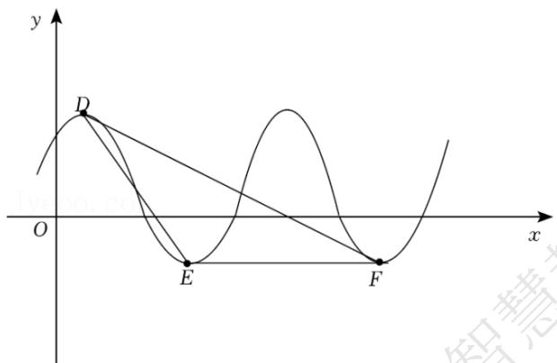

text_image

y
D
O
E
F
x

A. 0.125Hz   
B. 0.25Hz   
C. 0.4Hz   
D. 0.5Hz

2.【单选题】在信息传递中多数是以波的形式进行传递，其中必然会存在干扰信号，形如

$y = A \sin (\omega x + \varphi) \left( A > 0, \omega > 0, |\varphi| < \frac{\pi}{2} \right)$ ，某种“信号净化器”可产生形如 $y = A_{0} \sin \left( A_{0} \right)$

$(\omega_0x + \varphi_0)$ 的波，只需要调整参数 $(A_0, \omega_0, \varphi_0)$

，就可以产生特定的波（与干扰波波峰相同，方向相反的波）来“对抗”干扰．现有波形信号的部分图象，想要通过“信号净化器”过滤得到标准的正弦波（标准正弦函数图象）

，应将波形净化器的参数分别调整为（）

line

| x       | y     |
|---------|-------|
| -π      | -π/8  |
| -π/2    | -π/3  |
| 0       | 0     |
| π/2     | π/3   |
| π       | 1     |

A. $A_0 = \frac{3}{4}, \omega_0 = 4, \varphi_0 = \frac{\pi}{6}$   
B. $A_0 = -\frac{3}{4}, \omega_0 = 4, \varphi_0 = \frac{\pi}{6}$   
C. $A_0 = 1$ , $\omega_0 = 1$ , $\varphi_0 = 0$   
D. $A_0 = -1$ , $\omega_0 = 1$ , $\varphi_0 = 0$

3.【单选题】如图，某摩天轮最高点距离地面高度为120m，转盘直径为110m，开启后按逆时针方向匀速旋转，旋转一周需要30min．游客在座舱转到距离地面最近的位置进舱，开始转动tmin后距离地面的高度为Hm，则在转动一周的过程中，高度H关于时间t的函数解析式是（）

natural_image

Exterior view of a large illuminated Ferris wheel at dusk with modern high-rise buildings in the background (no signage or text visible)

A. $H = 55\cos \left(\frac{\pi}{15} t - \frac{\pi}{2}\right) + 65(0 \leq t \leq 30)$   
B. $H = 55\sin \left(\frac{\pi}{15} t - \frac{\pi}{2}\right) + 65(0 \leq t \leq 30)$   
C. $H = -55\cos \left(\frac{\pi}{10} t + \frac{\pi}{2}\right) + 65(0 \leq t \leq 30)$   
D. $H = -55\sin \left(\frac{\pi}{10} t + \frac{\pi}{2}\right) + 65(0 \leq t \leq 30)$

4.【单选题】已知函数 $f(x)=a\sin x+b\cos x(ab\neq0)$ 的图象关于 $x=\frac{\pi}{6}$ 对称，且 $f(x_{0})=\frac{8}{5}a$ ，则 $\sin\left(2x_{0}+\frac{\pi}{6}\right)$ 的值是（）

A. $-\frac{7}{25}$   
B. $-\frac{24}{25}$   
C. $\frac{7}{25}$   
D. $\frac{24}{25}$

5.【单选题】如图，弹簧挂着一个小球作上下运动，小球在 $t$ 秒时相对于平衡位置的高度 $h$ （厘米）由如下关系式确定： $h = 2\sin \left(\frac{\pi}{6} t + \varphi\right)$ ， $t \in [0, +\infty)$ ， $\Phi \in (-\pi, \pi$

）．已知当 t=2 时，小球处于平衡位置，并开始向下移动，则小球在 t=0 秒时 h 的值为（）

text_image

h > 0
h = 0
h < 0

A.-2   
B. 2   
C. $-\sqrt{3}$   
D. $\sqrt{3}$

6.【单选题】已知函数 $f(x)=A\sin(\omega x+\varphi)\left(A>0,\omega>0,|\varphi|<\frac{\pi}{2}\right)$

的图象如图所示，则下面描述不正确的是（）

line

| x | y |
|---|---|
| 0 | 1 |
| 1 | 2 |
| 2 | 5/2 |
| 3 | 1 |

A. $\omega = \frac{\pi}{3}$   
B. $\varphi = \frac{\pi}{6}$   
C. $f_{(2)} = 1$

D. $f(3) = -\frac{1}{2}$

# 二、填空题（共1题）

7.【填空题】筒车亦称为“水转筒车”，一种以流水为动力，取水灌田的工具，筒车发明于隋而盛于唐，距今已有1000多年的历史．如图，假设在水流量稳定的情况下，一个半径为3米的筒车按逆时针方向做每6分钟转一圈的匀速圆周运动，筒车的轴心O距离水面BC的高度为1.5米，设筒车上的某个盛水筒P的初始位置为点D（水面与筒车右侧的交点），从此处开始计时，t分钟时，该盛水筒距水面距离为 $H=f(t)=A\sin(\omega t+\phi)+b(A>0,\omega>0,\left|\phi\right|<\frac{\pi}{2},t\geqslant0)$ ，则 $H=f(t)=$ \_\_\_\_.

natural_image

Wooden waterwheel on a rocky cliffside (no text or symbols visible)

text_image

P
O
A
B 水面
C
D

# 高中 数学 必修 第一册

# 第五章 三角函数 5.4 三角函数的图象和性质

# 5.4.3 正切函数的性质与图象

# 一、单选题（共7题）

1.【单选题】记函数 $f(x) = \sin (\omega x + \varphi)$ （其中 $\omega > 0, |\varphi| > \frac{\pi}{2}$

）的图像为 $C$ ，已知 $C$ 的部分图像如图所示，为了得到函数 $g(x) = \sin \omega x$ ，只要把 $C$ 上所有的点（ ）

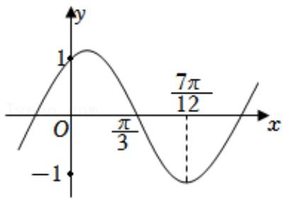

line

| x | y |
|---|---|
| 0 | -1 |
| π/3 | 1 |
| 7π/12 | -1 |

A. 向右平行移动 $\frac{\pi}{6}$ 个单位长度  
B. 向左平行移动 $\frac{\pi}{6}$ 个单位长度  
C. 向右平行移动 $\frac{\pi}{12}$ 个单位长度  
D. 向左平行移动 $\frac{\pi}{12}$ 个单位长度

2.【单选题】将函数 $f(x)=\sin\left(\frac{x}{2}+\frac{\pi}{6}\right)$

的图象上所有点的横坐标伸长为原来的2倍，再将所得图象向右平移 $\frac{\pi}{3}$ 个单位长度，得到函数 $g(x)$ 的图象，则下列说法正确的是（）

A. $g(x) = \sin\left(x - \frac{\pi}{6}\right)$   
B. $g(x)$ 在区间 $[0, 2\pi]$ 上存在零点  
C. $g(x)$ 的图象的对称中心为 $\left(4k\pi + \frac{\pi}{3}, 0\right)(k \in \mathbb{Z})$   
D. $g(x)$ 的图象的对称轴方程为 $x = 4k\pi + \frac{5\pi}{3}(k \in \mathbb{Z})$

3.【单选题】设函数 $f(x)=\sin\left(\omega x+\frac{\pi}{4}\right)+b(\omega>0)$ 的最小正周期为T，若 $\frac{2\pi}{3}<T<\pi$ ，且函数y=f(x)的图像关于点 $\left(\frac{3\pi}{2},2\right)$ 中心对称，将 $y=f(x)$ 的图像向左平移 $\varphi(\varphi>0)$ 个单位后关于y轴对称，则 $\varphi$ 的最小值为（）

A. $\frac{\pi}{2}$   
B. $\frac{\pi}{10}$   
C. $\frac{3\pi}{10}$   
D. $\pi$

4.【单选题】函数 $f(x)=\sin(\omega x+\varphi)(\omega>0,\quad0<\varphi<\pi)$

在一个周期内的图象如图所示，为了得到正弦曲线，只需把 $f(x)$ 图象上所有的点（）

line

| x | y |
|---|---|
| -π/12 | 1 |
| 5π/12 | -1 |

A. 向左平移 $\frac{\pi}{3}$ 个单位长度, 再把所得图象上所有点的横坐标缩短到原来的 $\frac{1}{2}$ , 纵坐标不变  
B. 向右平移 $\frac{\pi}{3}$ 个单位长度, 再把所得图象上所有点的横坐标伸长到原来的2倍, 纵坐标不变  
C. 向左平移 $\frac{2 \pi}{3}$ 个单位长度, 再把所得图象上所有点的横坐标缩短到原来的 $\frac{1}{2}$ , 纵坐标不变  
D. 向右平移 $\frac{2\pi}{3}$ 个单位长度, 再把所得图象上所有点的横坐标伸长到原来的2倍, 纵坐标不变

5.【单选题】已知函数 $y = A \sin (\omega x + \varphi) (A > 0, \omega > 0)$

一个周期的图象如图所示，则该函数可以是（）

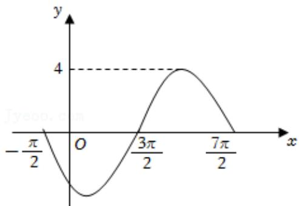

A. $y = 4 \sin \left( \frac{1}{2} x + \frac{3\pi}{4} \right)$

B. $y = 4 \sin \left( \frac{1}{2} x + \frac{5\pi}{4} \right)$   
C. $y = 4\sin \left(2x + \frac{3\pi}{4}\right)$   
D. $y = 4 \sin \left(2x + \frac{5\pi}{4}\right)$

6.【单选题】将函数 $y = \sin x + \sqrt{3}\cos x (x \in R)$

的图像向右平移 $m (m > 0)$ 个长度单位后, 所得到的图像关于 $y$ 轴对称, 则 $m$ 的最小值是 ( )

A. $\frac{\pi}{12}$   
B. $\frac{\pi}{6}$   
C. $\frac{\pi}{3}$   
D. $\frac{5\pi}{6}$

7.【单选题】函数 $f(x)=A\sin(\omega x+\varphi)(\omega>0)$

的图象按以下次序变换：①每个点的横坐标变为原来的2倍；②图象向右平移 $\frac{\pi}{6}$

个单位长度；③每个点的纵坐标变为原来的3倍．得到 $y=\sin x$ 的图象，则 $f(x)=$ （）

A. $\frac{1}{3}\sin \left(x - \frac{\pi}{3}\right)$   
B. $\frac{1}{3}\sin \left(x + \frac{\pi}{3}\right)$   
C. $\frac{1}{3}\sin \left(2x - \frac{\pi}{6}\right)$   
D. $\frac{1}{3}\sin \left(2x + \frac{\pi}{6}\right)$

# 高中 数学 必修 第一册

# 第五章 三角函数 5.4 三角函数的图象和性质

# 5.4.3 正切函数的性质与图象

# 一、单选题（共2题）

1.【单选题】函数 $f(x) = \tan \left(2x - \frac{\pi}{3}\right) - 1$ 图象的一个对称中心为（）

A. $\left(\frac{\pi}{12},-1\right)$   
B. $\left(\frac{7\pi}{12}, -1\right)$   
C. $\left(-\frac{7\pi}{12},1\right)$   
D. $\left(-\frac{\pi}{12},-1\right)$

2.【单选题】与函数 $y = \tan \left( 2x + \frac{\pi}{4} \right)$ 的图象不相交的一条直线的方程是（）

A. $x = \frac{\pi}{2}$   
B. $x = -\frac{\pi}{2}$   
C. $x = \frac{\pi}{4}$   
D. $x = \frac{\pi}{8}$

# 二、填空题（共5题）

3.【填空题】关于函数 $f(x)=\tan\left(2x-\frac{\pi}{4}\right)$ 有下列命题：

①最小正周期为 $\frac{\pi}{2}$ ;  
②定义域为 $\left\{x|x\in R,\ x\neq\frac{k\pi}{2}+\frac{\pi}{8},\ k\in Z\right\}$ ;  
③ $f(x)$ 图像的所有的对称中心为 $\left(\frac{k\pi}{4}+\frac{\pi}{8},0\right)$ ， $k\in Z;$   
④增区间为 $\left(\frac{k\pi}{2}-\frac{\pi}{8},\quad\frac{k\pi}{2}+\frac{3\pi}{8}\right),\quad k\in Z.$

正确命题的序号为 \_\_\_\_.（把正确的序号都填上）

4.【填空题】在区间（0，π）内，函数 $y = \tan x$ 与 $y = \cos x$ 图象的交点个数为 \_\_\_\_.

5.【填空题】已知函数 $y = 3\tan \omega x + 1$ 在 $\left(-\frac{\pi}{3}, \frac{\pi}{4}\right)$ 内是减函数，则 $\omega$ 的取值范围是 \_\_\_\_.

6.【填空题】不等式 $1+\tan x\geq0$ 的解集是\_\_\_\_.

7.【填空题】若函数 $y = \tan (\omega x)$ 在 $\left[-\frac{\pi}{4}, \frac{\pi}{4}\right]$ 上为严格减函数，则实数 $\omega$ 的取值范围是 \_\_\_\_.

# 高中 数学 必修 第一册

# 第五章 三角函数 5.6 函数 $y = A \sin (\omega x + \phi)$

# 一、单选题（共4题）

1.【单选题】将函数 $y = \sin 5x$ 的图象向左平移 $\frac{\pi}{6}$ 个单位后，所得图象对应的函数是（）.

A. $y = \sin\left(5x - \frac{\pi}{6}\right)$   
B. $y = \sin\left(5x - \frac{5\pi}{6}\right)$   
C. $y = \sin\left(5x + \frac{\pi}{6}\right)$   
D. $y = \sin \left(5x + \frac{5\pi}{6}\right)$

2.【单选题】为了得到函数 $y = \sin \left( 2x - \frac{\pi}{4} \right)$ 的图象，只需把函数 $y = \sin x$ 图象上所有的点（）.

A. 横坐标伸长到原来的2倍，纵坐标不变，再把所得曲线向右平移 $\frac{3\pi}{8}$ 个单位长度  
B. 横坐标伸长到原来的2倍，纵坐标不变，再把所得曲线向右平移 $\frac{3\pi}{4}$ 个单位长度  
C. 横坐标缩短到原来的 $\frac{1}{2}$ 倍, 纵坐标不变, 再把所得曲线向右平移 $\frac{\pi}{4}$ 个单位长度  
D. 横坐标缩短到原来的 $\frac{1}{2}$ 倍，纵坐标不变，再把所得曲线向右平移 $\frac{\pi}{8}$ 个单位长度

3.【单选题】把函数 $y=\sin\left(2x+\frac{\pi}{3}\right)$

图象上所有点的纵坐标不变，横坐标变为原来的2倍，得到函数 $f(x)$ 的图象；再将 $f(x)$ 图象上所有点向右平移 $\frac{\pi}{3}$ 个单位，得到函数 $g(x)$ 的图象，则 $g(x)=()$ .

A. $-sin4x$   
B. sinx   
C. $\sin\left(x+\frac{2\pi}{3}\right)$   
D. $\sin\left(4x+\frac{5\pi}{3}\right)$

4.【单选题】已知函数 $f(x)=\sin\left(2x-\frac{\pi}{3}\right)$ 的图象是由函数 $g(x)$ 的图象向左平移 $\varphi\left(0<\varphi<\frac{\pi}{2}\right)$ 个单位长度得到的，若 $g\left(\frac{\pi}{3}\right)=-f\left(\frac{\pi}{3}\right)$ ，则 $\varphi$ 的值为（）.

A. $\frac{\pi}{3}$   
B. $\frac{\pi}{4}$   
C. $\frac{\pi}{6}$   
D. $\frac{\pi}{12}$

# 二、填空题（共2题）

5.【填空题】已知函数 $g(x)=\cos\left(6x+\frac{\pi}{3}\right)$ 的图象是由 $f(x)$ 的图象向左平移 $\frac{\pi}{6}$

个单位，再将横坐标变为原来的 $\frac{1}{3}$ 倍（纵坐标不变）得到的，则 $f(x)$ 的函数解析式是\_\_\_\_.

6.【填空题】已知函数 $y = \cos \left( 6x + \frac{\pi}{3} \right)$ 的图象是由 $f(x)$ 的图象横坐标变为原来的 $\frac{1}{3}$

倍（纵坐标不变），再将其向左平移 $\frac{\pi}{6}$ 个单位得到的，则 $f(x)$ 的函数解析式是\_\_\_\_.

# 高中 数学 必修 第一册

# 第五章 三角函数 5.6 函数 $y = A \sin (\omega x + \phi)$

# 一、单选题（共6题）

1.【单选题】已知函数 $f(x) = A\sin (\omega x + \varphi)(A > 0, \omega > 0, |\varphi| < \pi)$

的部分图象如图所示，将该函数的图象沿x轴向右平移 $\frac{\pi}{4}$ 个单位长度后得到函数 $g(x)$ 的图象，则下列区间中， $g(x)$ 单调递增的区间是（）

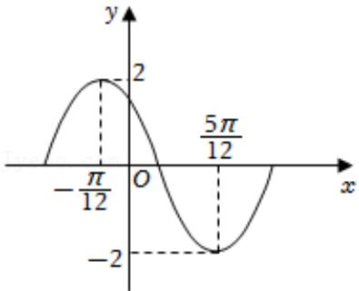

line

| x | y |
|---|---|
| -π/12 | 0 |
| 0 | 2 |
| π/12 | 0 |
| 5π/12 | -2 |

A. $\left(\frac{\pi}{2},\quad\frac{2\pi}{3}\right)$   
B. $\left(\frac{\pi}{3},\quad\frac{\pi}{2}\right)$   
C. $\left(0,\ \frac{\pi}{6}\right)$   
D. $\left(\frac{\pi}{6},\quad\frac{\pi}{3}\right)$

2.【单选题】已知函数 $f(x)=A\sin(\omega x+\varphi)\left(A>0,\omega>0,|\varphi|<\frac{\pi}{2}\right)$ 的部分图象如图所示，则函数 $f(x)$ 的解析式为（）

line

| Point | x-coordinate | y-coordinate |
|---|---|---|
| A(x₀,2) | 0.5 | 1 |
| C(0,1) | 0.3 | 0.8 |
| B(x₀+π,0) | 0.7 | 0 |

A. $f(x) = 2\sin \left(2x + \frac{\pi}{3}\right)$   
B. $f(x) = 2\sin\left(2x + \frac{\pi}{6}\right)$   
C. $f(x) = 2\sin \left(\frac{1}{2} x + \frac{\pi}{6}\right)$   
D. $f(x) = 2\sin \left(\frac{1}{2} x + \frac{2\pi}{3}\right)$

3.【单选题】函数 $y = \sin \left(2x + \frac{4\pi}{3}\right)$ 在区间 $\left[-\frac{\pi}{2}, \pi\right]$ 上的简图是（）

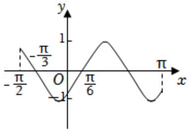

line

| x | y |
|---|---|
| -π/2 | -π/3 |
| 0 | -1 |
| π/6 | 1 |
| π | -1 |

A.

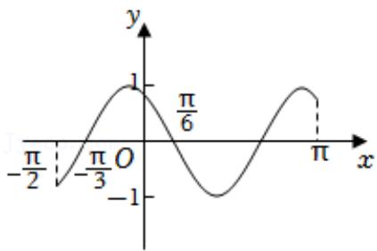

line

| x       | y     |
| ------- | ----- |
| -π/2    | -π/2  |
| -π/3    | 0     |
| 0       | 1     |
| π/6     | 0     |
| π       | -π/2  |

B.

line

| x | y |
|---|---|
| -π/2 | 1 |
| -π/6 | 0 |
| -1 | -1 |
| 0 | 0 |
| π/3 | 1 |
| π | 0 |

C.

line

| x       | y       |
| ------- | ------- |
| -π/2    | -π/6    |
| 0       | 1       |
| π/3     | -π/3    |
| π       | 1       |

D.

4.【单选题】设函数 $f(x)=\sin\left(\omega x+\frac{\pi}{6}\right)$ 在 $[-π,\pi]$ 的图象大致如图所示，则 $f(x)$ 的最小正周期为（）

text_image

-π
O
5π/9
π
x
y

A. $\frac{4\pi}{3}$

B. $\frac{3\pi}{2}$   
C. $\frac{7\pi}{6}$   
D. $\frac{10\pi}{9}$

5.【单选题】已知函数 $f(x)=Asin(\omega x+\varphi)\left(A>0,0<\omega<5\pi,|\varphi|<\frac{\pi}{2}\right)$ ，若函数 $f(x)$ 的一个零点为 $\frac{\pi}{6}$ 。其图像的一条对称轴为直线 $x=\frac{5\pi}{12}$ ，则 $\omega$ 的最小值为（）

A. 2   
B. 6   
C. 10   
D. 14

6.【单选题】已知函数 $f(x)=2\sin(\omega x+\varphi)\left(\omega>0,|\varphi|<\frac{\pi}{2}\right)$ 的部分图象大致如图所示，则下列说法错误的是（）

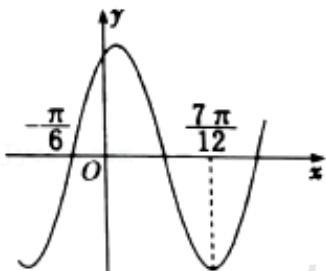

line

| x | y |
|---|---|
| -π/6 | π/6 |
| 7π/12 | π/12 |

A. 函数 $f(x)$ 的最小正周期为 $\pi$   
B. 函数 $f(x)$ 在 $\left[\frac{\pi}{3}, \frac{\pi}{2}\right]$ 上单调递减  
C. $\left(-\frac{5\pi}{12},0\right)$ 是函数 $f(x)$ 图象的一个对称中心  
D. 函数 $f(x)$ 的图象可以由函数 $y = 2\cos \left(x - \frac{\pi}{6}\right)$ 图象上各点的纵坐标不变，横坐标缩小为原来的 $\frac{1}{2}$ 得到

# 高中 数学 必修 第一册

# 第五章 三角函数 5.6 函数 $y = A \sin (\omega x + \phi)$

# 一、单选题（共3题）

1.【单选题】2022年春节期间，G市某天从8-16时的温度变化曲线（如图）近似满足函数 $f(x)=2\sqrt{2}\cos(\omega x+\varphi)(\omega>0,\ 0<\varphi<\pi,\ x\in[8,\ 16])$ 的图象．下列说法正确的是（）

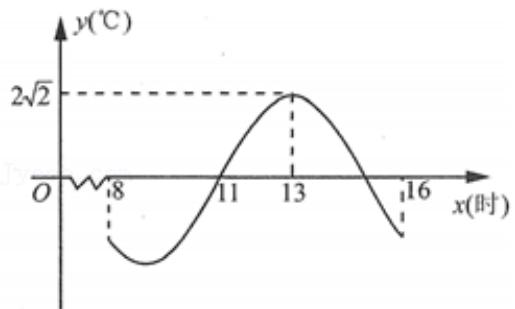

line

| x(时) | y(℃)     |
|-------|----------|
| 0     | 0        |
| 8     | -1.5     |
| 11    | 0        |
| 13    | 2√2      |
| 16    | -3       |

A. 8 - 13时这段时间温度逐渐升高  
B. 8 - 16时最大温差不超过 $5^{\circ} \mathrm{C}$   
C. 8 - 16时0℃以下的时长恰为3小时  
D. 16 时温度为 $-2^{\circ}C$

2.【单选题】已知函数 $f(x)=\sin(\pi x+\varphi)$ 在某个周期的图象如图所示，A，B分别是 $f(x)$ 图象的最高点与最低点，C是 $f(x)$ 图象与x轴的交点，则 $\tan\angle ACB=$ （）

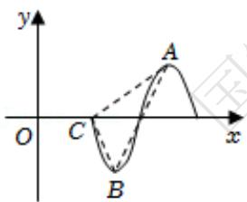

text_image

y
O C A x
B

A.-8   
B. $-\frac{7\sqrt{65}}{65}$   
C. $-\frac{4}{7}$   
D. $-\frac{\sqrt{65}}{65}$

3.【单选题】已知函数 $f(x)=A\sin(\omega x+\varphi)\left(A>0,\quad\omega>0,\quad|\varphi|<\frac{\pi}{2}\right)$ 的图象经过(0,-2)，相邻两个对称中心的距离为 $\frac{\pi}{2}$ ，且 $\forall x\in R,f(x)\leq\left|f\left(\frac{\pi}{3}\right)\right|$ ，则函数 $f(x)$ 的解析式为（）

A. $f(x) = 4\sin \left(2x - \frac{\pi}{6}\right)$   
B. $f(x) = 4\sin \left(x - \frac{\pi}{6}\right)$   
C. $f(x) = 2\sqrt{2}\sin \left(2x - \frac{\pi}{4}\right)$   
D. $f(x) = 2\sqrt{2}\sin \left(x - \frac{\pi}{4}\right)$

# 二、填空题（共3题）

4.【填空题】已知函数 $f(x)=\sqrt{3}\sin(\omega x+\varphi)\left(\omega>0,\ |\varphi|<\frac{\pi}{2}\right)$

在一个周期内的图象如图所示，其中点P，Q分别是图象的最高点和最低点，点M是图象与x轴的交点，且 $MP \perp MQ$ 。若 $f\left(\frac{1}{2}\right)=\frac{\sqrt{3}}{2}$ ，则 $\tan\varphi=$ \_\_\_\_.

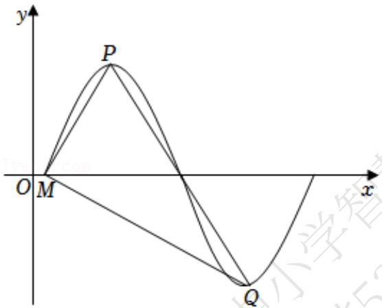

text_image

y
P
O M x
Q

5.【填空题】函数 $f(x)=A\cos(\omega x+\varphi)(A>0,\omega>0)$ 的部分图象如图所示，则 $f(1)+f(2)+f(3)+\cdots+f(2020)+f(2021)=$ \_\_\_\_.

line

| x | y |
|---|---|
| 0 | 0 |
| 2 | 2 |
| 4 | 0 |
| 6 | -2 |
| 8 | 0 |

6.【填空题】函数 $f(x)=\sin(\omega x+\varphi)\left(\omega>0,|\varphi|<\frac{\pi}{2}\right)$ 的部分图像如图所示， $BC//x$ 轴，则 $\omega=$ \_\_\_\_， $\Phi=$ \_\_\_\_.

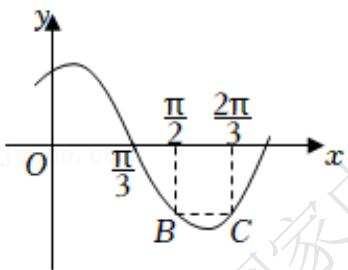

text_image

y
O
π/3
B
C
x
π/2
2π/3

# 高中 数学 必修 第一册

# 第五章 三角函数 5.7 三角函数的应用

# 一、填空题（共5题）

1.【填空题】已知函数 $f(x)=\frac{\sin^{2}x-4\sin x+9}{\sin x-2}$ ，则函数的最大值为\_\_\_\_。  
2.【填空题】函数 $f(x)=\frac{\sin x-3}{\sin x+2}$ 的值域为 \_\_\_\_。  
3.【填空题】已知函数 $f(x)=\cos^{2}x+\sin x,\quad x\in\left[\frac{\pi}{6},\quad\frac{2\pi}{3}\right]$ ，则函数的值域为\_\_\_\_。  
4.【填空题】已知函数 $f(x)=\sqrt{3}\sin^{2}x+3\sin x\cos x$ ，则函数的值域为 \_\_\_\_。  
5.【填空题】函数 $f(x)=\frac{2+2\sin x}{9+3\cos x}$ 的值域为 \_\_\_\_。

# 高中 数学 必修 第一册

# 第五章 三角函数 5.7 三角函数的应用

# 一、单选题（共2题）

1.【单选题】由于潮汐，某港口一天24h的海水深度H（单位：m）随时间t（单位：h， $0 \leq t < 24$ ）的变化近似满足关系式 $H(t) = 12 + 4\sin\left(\frac{\pi}{12}t - \frac{2}{3}\pi\right)$ ，则该港口一天内水深不小于10m的时长为（）。

A. 12h   
B. 14h   
C. 16h   
D. 18h

2.【单选题】为了研究钟表秒针针尖的运动变化规律，建立如图所示的平面直角坐标系，设秒针针尖位置为点 $P(x,y)$ ，若初始位置为点 $P_{0}\left(\frac{1}{2},\frac{\sqrt{3}}{2}\right)$ ，秒针从 $P_{0}$ （规定此时t=0）开始沿顺时针方向转动，点P的纵坐标y与时间t的函数关系式可能为（）

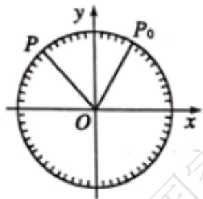

text_image

P
y
P₀
O
x

A. $y = 2\sin\left(-\frac{\pi}{30}t + \frac{\pi}{3}\right)$   
B. $y = -\sin \left(-\frac{\pi}{60} t - \frac{\pi}{3}\right)$   
C. $y = \sin \left(-\frac{\pi}{30} t + \frac{\pi}{6}\right)$   
D. $y = \cos \left(\frac{\pi}{30} t + \frac{\pi}{6}\right)$

# 二、填空题（共3题）

3.【填空题】如图所示，OA是一座垂直于地面的信号塔，O点在地面上，某人（身高不计）在地面的C点处测得信号塔顶A在南偏西70°方向，仰角为45°，他沿南偏东50°方向前进20m到点D处，测得塔顶A的仰角为30°，则塔高OA为 \_\_\_\_ m。

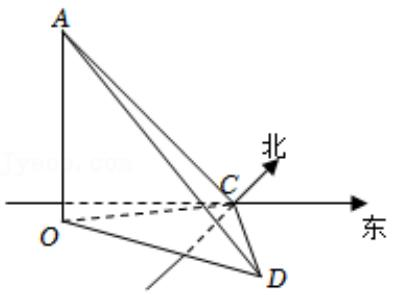

text_image

A
北
C
O
东
D

4.【填空题】在某次海军演习中，已知甲驱逐舰在航母的南偏东 $15^{\circ}$ 方向且与航母的距离为12海里，乙护卫舰在甲驱逐舰的正西方向，若测得乙护卫舰在航母的南偏西 $45^{\circ}$ 方向，则甲驱逐舰与乙护卫舰的距离为 \_\_\_\_ 海里。  
5.【填空题】筒车亦称为“水转筒车”，一种以流水为动力，取水灌田的工具，筒车发明于隋而盛于唐，距今已有1000多年的历史．如图，假设在水流量稳定的情况下，一个半径为3米的筒车按逆时针方向做每6分钟转一圈的匀速圆周运动，筒车的轴心O距离水面BC的高度为1.5米，设筒车上的某个盛水筒P的初始位置为点D（水面与筒车右侧的交点），从此处开始计时，t分钟时，该盛水筒距水面距离为 $H=f(t)=A\sin(\omega t+\varphi)+b$

$\left(A > 0, \omega > 0, |\varphi| < \frac{\pi}{2}, t \geq 0\right)$ , 则 $H = f(t) =$ \_\_\_\_。

natural_image

Wooden waterwheel on a rocky cliffside, no visible text or symbols

text_image

P
O
A
B 水面
D
C

