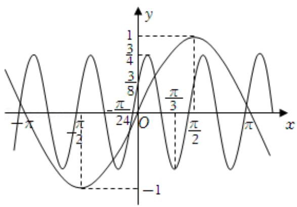
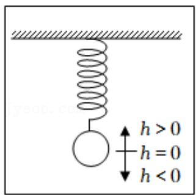
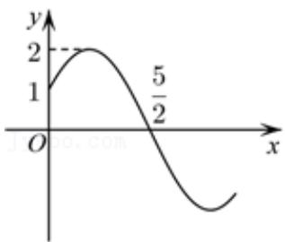
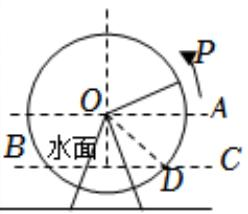

# 高中 数学 必修 第一册

# 第五章 三角函数 5.4 三角函数的图象和性质

# 5.4.3 正切函数的性质与图象

# 一、单选题（共6题）

1.【单选题】已知某简谐振动的振动方程是 $f(x)=A\sin(\omega x+\varphi)+B(A>0,\omega>0)$

，该方程的部分图象如图．经测量，振幅为 $\sqrt{3}$   
．图中的最高点D与最低点E，F为等腰三角形的顶点，则振动的频率是（）

text_image

y
D
O
E
F
x

A. 0.125Hz   
B. 0.25Hz   
C. 0.4Hz   
D. 0.5Hz

2.【单选题】在信息传递中多数是以波的形式进行传递，其中必然会存在干扰信号，形如

$y = A \sin (\omega x + \varphi) \left( A > 0, \omega > 0, |\varphi| < \frac{\pi}{2} \right),$ 某种 “信号净化器” 可产生形如 $y = A_0 \sin$

$(\omega_0x + \varphi_0)$ 的波，只需要调整参数 $(A_0, \omega_0, \varphi_0)$

，就可以产生特定的波（与干扰波波峰相同，方向相反的波）来“对抗”干扰．现有波形信号的部分图象，想要通过“信号净化器”过滤得到标准的正弦波（标准正弦函数图象）

，应将波形净化器的参数分别调整为（）

line

| x       | y     |
|---------|-------|
| -π      | -π/8  |
| -π/2    | -π/3  |
| 0       | 0     |
| π/2     | π/3   |
| π       | -π/8  |

A. $A_0 = \frac{3}{4}, \omega_0 = 4, \varphi_0 = \frac{\pi}{6}$   
B. $A_0 = -\frac{3}{4}, \omega_0 = 4, \varphi_0 = \frac{\pi}{6}$   
C. $A_0 = 1$ , $\omega_0 = 1$ , $\varphi_0 = 0$   
D. $A_0 = -1$ , $\omega_0 = 1$ , $\varphi_0 = 0$

3.【单选题】如图，某摩天轮最高点距离地面高度为 $120 \mathrm{~m}$ ，转盘直径为 $110 \mathrm{~m}$ ，开启后按逆时针方向匀速旋转，旋转一周需要 $30 \mathrm{~min}$ 。游客在座舱转到距离地面最近的位置进舱，开始转动 $t \mathrm{~min}$ 后距离地面的高度为 $H \mathrm{~m}$ ，则在转动一周的过程中，高度 $H$ 关于时间 $t$ 的函数解析式是（）

natural_image

Exterior view of a large illuminated Ferris wheel at dusk with modern high-rise buildings in the background (no signage or text visible)

A. $H = 55\cos \left(\frac{\pi}{15} t - \frac{\pi}{2}\right) + 65(0 \leq t \leq 30)$   
B. $H = 55\sin \left(\frac{\pi}{15} t - \frac{\pi}{2}\right) + 65(0 \leq t \leq 30)$   
C. $H = -55\cos \left(\frac{\pi}{10} t + \frac{\pi}{2}\right) + 65(0 \leq t \leq 30)$   
D. $H = -55\sin \left(\frac{\pi}{10} t + \frac{\pi}{2}\right) + 65(0 \leq t \leq 30)$

4.【单选题】已知函数 $f(x)=a\sin x+b\cos x(ab\neq0)$ 的图象关于 $x=\frac{\pi}{6}$ 对称，且 $f(x_{0})=\frac{8}{5}a$ ，则 $\sin\left(2x_{0}+\frac{\pi}{6}\right)$ 的值是（）

A. $-\frac{7}{25}$   
B. $-\frac{24}{25}$   
C. $\frac{7}{25}$   
D. $\frac{24}{25}$

5.【单选题】如图，弹簧挂着一个小球作上下运动，小球在 $t$ 秒时相对于平衡位置的高度 $h$ （厘米）由如下关系式确定： $h = 2\sin \left(\frac{\pi}{6} t + \varphi\right)$ ， $t \in [0, +\infty)$ ， $\Phi \in (-\pi, \pi$

）．已知当 t=2 时，小球处于平衡位置，并开始向下移动，则小球在 t=0 秒时 h 的值为（）

text_image

h > 0
h = 0
h < 0

A.-2   
B. 2   
C. $-\sqrt{3}$   
D. $\sqrt{3}$

6.【单选题】已知函数 $f(x)=A\sin(\omega x+\varphi)\left(A>0,\omega>0,|\varphi|<\frac{\pi}{2}\right)$

的图象如图所示，则下面描述不正确的是（）

line

| x | y |
|---|---|
| 0 | 1 |
| 1 | 2 |
| 2 | 5/2 |
| 3 | 1 |

A. $\omega = \frac{\pi}{3}$   
B. $\varphi = \frac{\pi}{6}$   
C. $f_{(2)} = 1$

D. $f(3) = -\frac{1}{2}$

# 二、填空题（共1题）

7.【填空题】筒车亦称为“水转筒车”，一种以流水为动力，取水灌田的工具，筒车发明于隋而盛于唐，距今已有1000多年的历史．如图，假设在水流量稳定的情况下，一个半径为3米的筒车按逆时针方向做每6分钟转一圈的匀速圆周运动，筒车的轴心O距离水面BC的高度为1.5米，设筒车上的某个盛水筒P的初始位置为点D（水面与筒车右侧的交点），从此处开始计时，t分钟时，该盛水筒距水面距离为 $H=f(t)=A\sin(\omega t+\phi)+b(A>0,\omega>0,\left|\phi\right|<\frac{\pi}{2},t\geqslant0)$ ，则 $H=f(t)=$ \_\_\_\_.

natural_image

Wooden waterwheel on a rocky cliffside (no text or symbols visible)

text_image

P
O
A
B 水面
C
D

