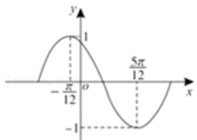

# 高中 数学 必修 第一册

# 第五章 三角函数 5.4 三角函数的图象和性质

# 5.4.3 正切函数的性质与图象

# 一、单选题（共7题）

1.【单选题】记函数 $f(x) = \sin (\omega x + \varphi)$ （其中 $\omega > 0, |\varphi| > \frac{\pi}{2}$

）的图像为 $C$ ，已知 $C$ 的部分图像如图所示，为了得到函数 $g(x) = \sin \omega x$ ，只要把 $C$ 上所有的点（ ）

line

| x | y |
|---|---|
| 0 | -1 |
| π/3 | 1 |
| 7π/12 | -1 |

A. 向右平行移动 $\frac{\pi}{6}$ 个单位长度  
B. 向左平行移动 $\frac{\pi}{6}$ 个单位长度  
C. 向右平行移动 $\frac{\pi}{12}$ 个单位长度  
D. 向左平行移动 $\frac{\pi}{12}$ 个单位长度

2.【单选题】将函数 $f(x)=\sin\left(\frac{x}{2}+\frac{\pi}{6}\right)$

的图象上所有点的横坐标伸长为原来的2倍，再将所得图象向右平移 $\frac{\pi}{3}$ 个单位长度，得到函数 $g(x)$ 的图象，则下列说法正确的是（）

A. $g(x) = \sin\left(x - \frac{\pi}{6}\right)$   
B. $g(x)$ 在区间 $[0, 2\pi]$ 上存在零点  
C. $g(x)$ 的图象的对称中心为 $\left(4k\pi + \frac{\pi}{3}, 0\right)(k \in \mathbb{Z})$   
D. $g(x)$ 的图象的对称轴方程为 $x = 4k\pi + \frac{5\pi}{3}(k \in \mathbb{Z})$

3.【单选题】设函数 $f(x)=\sin\left(\omega x+\frac{\pi}{4}\right)+b(\omega>0)$ 的最小正周期为T，若 $\frac{2\pi}{3}<T<\pi$ ，且函数y=f(x)的图像关于点 $\left(\frac{3\pi}{2},2\right)$ 中心对称，将 $y=f(x)$ 的图像向左平移 $\varphi(\varphi>0)$ 个单位后关于y轴对称，则 $\varphi$ 的最小值为（）

A. $\frac{\pi}{2}$   
B. $\frac{\pi}{10}$   
C. $\frac{3\pi}{10}$   
D. $\pi$

4.【单选题】函数 $f(x)=\sin(\omega x+\varphi)(\omega>0,\quad0<\varphi<\pi)$

在一个周期内的图象如图所示，为了得到正弦曲线，只需把 $f(x)$ 图象上所有的点（）

line

| x | y |
|---|---|
| -π/12 | 1 |
| 5π/12 | -1 |

A. 向左平移 $\frac{\pi}{3}$ 个单位长度, 再把所得图象上所有点的横坐标缩短到原来的 $\frac{1}{2}$ , 纵坐标不变  
B. 向右平移 $\frac{\pi}{3}$ 个单位长度，再把所得图象上所有点的横坐标伸长到原来的2倍，纵坐标不变  
C. 向左平移 $\frac{2 \pi}{3}$ 个单位长度, 再把所得图象上所有点的横坐标缩短到原来的 $\frac{1}{2}$ , 纵坐标不变  
D. 向右平移 $\frac{2\pi}{3}$ 个单位长度, 再把所得图象上所有点的横坐标伸长到原来的2倍, 纵坐标不变

5.【单选题】已知函数 $y = A \sin (\omega x + \varphi) (A > 0, \omega > 0)$

一个周期的图象如图所示，则该函数可以是（）

A. $y = 4 \sin \left( \frac{1}{2} x + \frac{3\pi}{4} \right)$

B. $y = 4 \sin \left( \frac{1}{2} x + \frac{5\pi}{4} \right)$   
C. $y = 4\sin \left(2x + \frac{3\pi}{4}\right)$   
D. $y = 4 \sin \left(2x + \frac{5\pi}{4}\right)$

6.【单选题】将函数 $y = \sin x + \sqrt{3}\cos x (x \in R)$

的图像向右平移 $m (m > 0)$ 个长度单位后, 所得到的图像关于 $y$ 轴对称, 则 $m$ 的最小值是 ( )

A. $\frac{\pi}{12}$   
B. $\frac{\pi}{6}$   
C. $\frac{\pi}{3}$   
D. $\frac{5\pi}{6}$

7.【单选题】函数 $f(x)=A\sin(\omega x+\varphi)(\omega>0)$

的图象按以下次序变换：①每个点的横坐标变为原来的2倍；②图象向右平移 $\frac{\pi}{6}$

个单位长度；③每个点的纵坐标变为原来的3倍．得到 $y=\sin x$ 的图象，则 $f(x)=$ （）

A. $\frac{1}{3}\sin \left(x - \frac{\pi}{3}\right)$   
B. $\frac{1}{3}\sin \left(x + \frac{\pi}{3}\right)$   
C. $\frac{1}{3} \sin \left( 2x - \frac{\pi}{6} \right)$   
D. $\frac{1}{3}\sin \left(2x + \frac{\pi}{6}\right)$