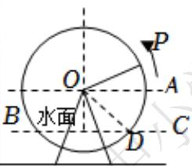

# 高中 数学 必修 第一册

# 第五章 三角函数 5.7 三角函数的应用

# 一、单选题（共2题）

1.【单选题】由于潮汐，某港口一天24h的海水深度H（单位：m）随时间t（单位：h， $0 \leq t < 24$ ）的变化近似满足关系式 $H(t) = 12 + 4\sin\left(\frac{\pi}{12}t - \frac{2}{3}\pi\right)$ ，则该港口一天内水深不小于10m的时长为（）。

A. 12h   
B. 14h   
C. 16h   
D. 18h

2.【单选题】为了研究钟表秒针针尖的运动变化规律，建立如图所示的平面直角坐标系，设秒针针尖位置为点 $P(x,y)$ ，若初始位置为点 $P_{0}\left(\frac{1}{2},\frac{\sqrt{3}}{2}\right)$ ，秒针从 $P_{0}$ （规定此时t=0）开始沿顺时针方向转动，点P的纵坐标y与时间t的函数关系式可能为（）

text_image

P
y
P₀
O
x

A. $y = 2\sin\left(-\frac{\pi}{30}t + \frac{\pi}{3}\right)$   
B. $y = -\sin \left(-\frac{\pi}{60} t - \frac{\pi}{3}\right)$   
C. $y = \sin \left(-\frac{\pi}{30} t + \frac{\pi}{6}\right)$   
D. $y = \cos \left(\frac{\pi}{30} t + \frac{\pi}{6}\right)$

# 二、填空题（共3题）

3.【填空题】如图所示，OA是一座垂直于地面的信号塔，O点在地面上，某人（身高不计）在地面的C点处测得信号塔顶A在南偏西70°方向，仰角为45°，他沿南偏东50°方向前进20m到点D处，测得塔顶A的仰角为30°，则塔高OA为 \_\_\_\_ m。

text_image

A
北
C
O
东
D

4.【填空题】在某次海军演习中，已知甲驱逐舰在航母的南偏东 $15^{\circ}$ 方向且与航母的距离为12海里，乙护卫舰在甲驱逐舰的正西方向，若测得乙护卫舰在航母的南偏西 $45^{\circ}$ 方向，则甲驱逐舰与乙护卫舰的距离为 \_\_\_\_ 海里。  
5.【填空题】筒车亦称为“水转筒车”，一种以流水为动力，取水灌田的工具，筒车发明于隋而盛于唐，距今已有1000多年的历史．如图，假设在水流量稳定的情况下，一个半径为3米的筒车按逆时针方向做每6分钟转一圈的匀速圆周运动，筒车的轴心O距离水面BC的高度为1.5米，设筒车上的某个盛水筒P的初始位置为点D（水面与筒车右侧的交点），从此处开始计时，t分钟时，该盛水筒距水面距离为 $H=f(t)=A\sin(\omega t+\varphi)+b$

$\left(A > 0, \omega > 0, |\varphi| < \frac{\pi}{2}, t \geq 0\right)$ , 则 $H = f(t) =$ \_\_\_\_。

natural_image

Wooden waterwheel on a rocky cliffside, no visible text or symbols

text_image

P
O
A
B 水面
C
D

