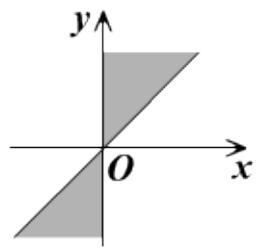

# 高中 数学 必修 第一册

# 第五章 三角函数 5.1 任意角和弧度制

# 一、单选题（共3题）

1.【单选题】已知 $\alpha$ 是第一象限角，那么 $2\alpha$ 是（）的角

A. 第一象限  
B. 第二象限  
C. 第一或第二象限  
D. 第一、二象限或y轴的非负半轴上

2.【单选题】设 $A=\{\theta|\theta$ 为锐角， $B=\{\theta|\theta$ 为小于 $90^{\circ}$ 的角， $C=\{\theta|\theta$ 为第一象限的角， $D=\{\theta|\theta$ 为小于 $90^{\circ}$ 的正角，则下列等式中成立的是（）

A. A = B   
B. B = C   
C. $A = C$   
D. A = D

3.【单选题】如果 $\theta$ 是第二象限角，那么 $\frac{\theta}{2}$ 是（）

A. 第一或第四象限角  
B. 第一或第三象限角  
C. 第二或第三象限角  
D. 第二或第四象限角

# 二、填空题（共2题）

4.【填空题】集合 $\{\alpha|k\cdot180^{\circ}+45^{\circ}\leq\alpha\leq k\cdot180^{\circ}+90^{\circ},\quad k\in Z\}$

中，角所表示的取值范围（阴影部分）正确的是 \_\_\_\_（填序号）.

text_image

y
O x

①

text_image

y
O
x

②

text_image

y
O
x

③

text_image

y
O
x

④

5.【填空题】若角 $\theta$ 的终边与角 $\frac{6\pi}{7}$ 的终边相同，则在 $[\pi, 2\pi)$ 内与角 $\frac{\theta}{3}$ 的终边相同的角是 \_\_\_\_.