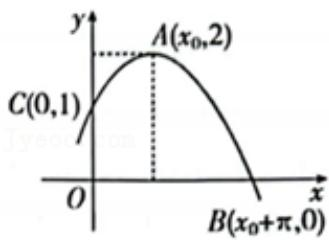
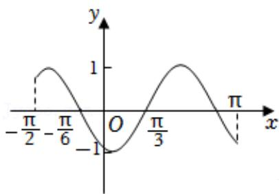
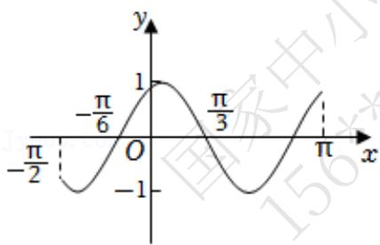
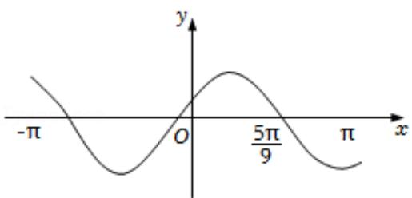

# 高中 数学 必修 第一册

# 第五章 三角函数 5.6 函数 $y = A \sin (\omega x + \phi)$

# 一、单选题（共6题）

1.【单选题】已知函数 $f(x) = A\sin (\omega x + \varphi)(A > 0, \omega > 0, |\varphi| < \pi)$

的部分图象如图所示，将该函数的图象沿x轴向右平移 $\frac{\pi}{4}$ 个单位长度后得到函数 $g(x)$ 的图象，则下列区间中， $g(x)$ 单调递增的区间是（）

line

| x | y |
|---|---|
| -π/12 | 0 |
| 0 | 2 |
| π/12 | 0 |
| 5π/12 | -2 |

A. $\left(\frac{\pi}{2},\quad\frac{2\pi}{3}\right)$   
B. $\left(\frac{\pi}{3},\quad\frac{\pi}{2}\right)$   
C. $\left(0,\ \frac{\pi}{6}\right)$   
D. $\left(\frac{\pi}{6},\quad\frac{\pi}{3}\right)$

2.【单选题】已知函数 $f(x)=A\sin(\omega x+\varphi)\left(A>0,\omega>0,|\varphi|<\frac{\pi}{2}\right)$ 的部分图象如图所示，则函数 $f(x)$ 的解析式为（）

line

| Point | x-axis (x) | y-axis (y) |
|---|---|---|
| A(x₀,2) | 0.5 | 1 |
| C(0,1) | 0.3 | 1 |
| B(x₀+π,0) | 0.4 | 0 |

A. $f(x) = 2\sin \left(2x + \frac{\pi}{3}\right)$   
B. $f(x) = 2\sin\left(2x + \frac{\pi}{6}\right)$   
C. $f(x) = 2\sin \left(\frac{1}{2} x + \frac{\pi}{6}\right)$   
D. $f(x) = 2\sin \left(\frac{1}{2} x + \frac{2\pi}{3}\right)$

3.【单选题】函数 $y = \sin \left(2x + \frac{4\pi}{3}\right)$ 在区间 $\left[-\frac{\pi}{2}, \pi\right]$ 上的简图是（）

line

| x | y |
|---|---|
| -π/2 | 1 |
| -π/3 | -π/3 |
| 0 | 0 |
| π/6 | 1 |
| π | -1 |

A.

line

| x       | y     |
| ------- | ----- |
| -π/2    | -π/3  |
| 0       | 1     |
| π/3     | -π/6  |
| π       | 1     |

B.

line

| x | y |
|---|---|
| -π/2 | 1 |
| -π/6 | 0 |
| -1 | -1 |
| 0 | 0 |
| π/3 | 1 |
| π | 0 |

C.

line

| x       | y     |
| ------- | ----- |
| -π/2    | -π/6  |
| 0       | 1     |
| π/3     | -π/3  |
| π       | 1     |

D.

4.【单选题】设函数 $f(x)=\sin\left(\omega x+\frac{\pi}{6}\right)$ 在 $[-π,\pi]$ 的图象大致如图所示，则 $f(x)$ 的最小正周期为（）

text_image

-π
O
5π/9
π
x
y

A. $\frac{4\pi}{3}$

B. $\frac{3\pi}{2}$   
C. $\frac{7\pi}{6}$   
D. $\frac{10\pi}{9}$

5.【单选题】已知函数 $f(x)=Asin(\omega x+\varphi)\left(A>0,0<\omega<5\pi,|\varphi|<\frac{\pi}{2}\right)$ ，若函数 $f(x)$ 的一个零点为 $\frac{\pi}{6}$ 。其图像的一条对称轴为直线 $x=\frac{5\pi}{12}$ ，则 $\omega$ 的最小值为（）

A. 2   
B. 6   
C. 10   
D. 14

6.【单选题】已知函数 $f(x)=2\sin(\omega x+\varphi)\left(\omega>0,|\varphi|<\frac{\pi}{2}\right)$ 的部分图象大致如图所示，则下列说法错误的是（）

line

| x | y |
|---|---|
| -π/6 | |
| 0 | |
| 7π/12 | |

A. 函数 $f(x)$ 的最小正周期为 $\pi$   
B. 函数 $f(x)$ 在 $\left[\frac{\pi}{3}, \frac{\pi}{2}\right]$ 上单调递减  
C. $\left(-\frac{5\pi}{12}, 0\right)$ 是函数 $f(x)$ 图象的一个对称中心  
D. 函数 $f(x)$ 的图象可以由函数 $y = 2\cos \left(x - \frac{\pi}{6}\right)$ 图象上各点的纵坐标不变，横坐标缩小为原来的 $\frac{1}{2}$ 得到