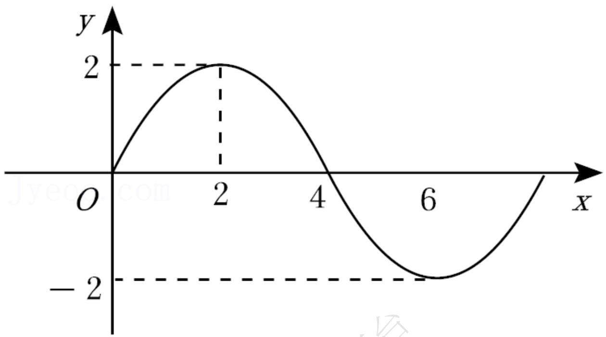
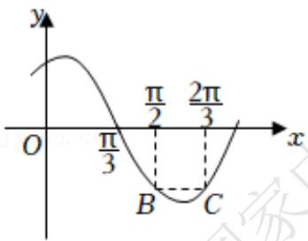

# 高中 数学 必修 第一册

# 第五章 三角函数 5.6 函数 $y = A \sin (\omega x + \phi)$

# 一、单选题（共3题）

1.【单选题】2022年春节期间，G市某天从8-16时的温度变化曲线（如图）近似满足函数 $f(x)=2\sqrt{2}\cos(\omega x+\varphi)(\omega>0,\ 0<\varphi<\pi,\ x\in[8,\ 16])$ 的图象．下列说法正确的是（）

line

| x(时) | y(℃)     |
|-------|----------|
| 0     | 0        |
| 8     | -1.5     |
| 11    | 0        |
| 13    | 2√2      |
| 16    | -3       |

A. 8 - 13时这段时间温度逐渐升高  
B. 8 - 16时最大温差不超过 $5^{\circ} \mathrm{C}$   
C. 8 - 16时0℃以下的时长恰为3小时  
D. 16 时温度为 $-2^{\circ}C$

2.【单选题】已知函数 $f(x)=\sin(\pi x+\varphi)$ 在某个周期的图象如图所示，A，B分别是 $f(x)$ 图象的最高点与最低点，C是 $f(x)$ 图象与x轴的交点，则 $\tan\angle ACB=$ （）

text_image

y
O C A x
B

A.-8   
B. $-\frac{7\sqrt{65}}{65}$   
C. $-\frac{4}{7}$   
D. $-\frac{\sqrt{65}}{65}$

3.【单选题】已知函数 $f(x)=A\sin(\omega x+\varphi)\left(A>0,\quad\omega>0,\quad|\varphi|<\frac{\pi}{2}\right)$ 的图象经过(0,-2)，相邻两个对称中心的距离为 $\frac{\pi}{2}$ ，且 $\forall x\in R,f(x)\leq\left|f\left(\frac{\pi}{3}\right)\right|$ ，则函数 $f(x)$ 的解析式为（）

A. $f(x) = 4\sin \left(2x - \frac{\pi}{6}\right)$   
B. $f(x) = 4\sin \left(x - \frac{\pi}{6}\right)$   
C. $f(x) = 2\sqrt{2}\sin \left(2x - \frac{\pi}{4}\right)$   
D. $f(x) = 2\sqrt{2}\sin \left(x - \frac{\pi}{4}\right)$

# 二、填空题（共3题）

4.【填空题】已知函数 $f(x)=\sqrt{3}\sin(\omega x+\varphi)\left(\omega>0,\ |\varphi|<\frac{\pi}{2}\right)$

在一个周期内的图象如图所示，其中点P，Q分别是图象的最高点和最低点，点M是图象与x轴的交点，且 $MP \perp MQ$ 。若 $f\left(\frac{1}{2}\right)=\frac{\sqrt{3}}{2}$ ，则 $\tan\varphi=$ \_\_\_\_.

text_image

y
P
O M x
Q

5.【填空题】函数 $f(x)=A\cos(\omega x+\varphi)(A>0,\omega>0)$ 的部分图象如图所示，则 $f(1)+f(2)+f(3)+\cdots+f(2020)+f(2021)=$ \_\_\_\_.

line

| x | y |
|---|---|
| 0 | 0 |
| 2 | 2 |
| 4 | 0 |
| 6 | -2 |
| 8 | 0 |

6.【填空题】函数 $f(x)=\sin(\omega x+\varphi)\left(\omega>0,|\varphi|<\frac{\pi}{2}\right)$ 的部分图像如图所示， $BC//x$ 轴，则 $\omega=$ \_\_\_\_， $\Phi=$ \_\_\_\_.

text_image

y
π/2 2π/3
O π/3 x
B C

