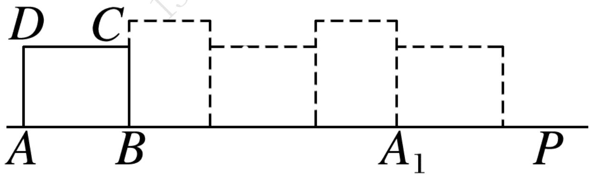

# 高中 数学 必修 第一册

# 第五章 三角函数 5.1 任意角和弧度制

# 一、单选题（共2题）

1.【单选题】已知一扇形的周长为28，则该扇形面积的最大值为（）

A. 36   
B. 42   
C. 49   
D. 56

2.【单选题】一条弧所对的圆心角是 $2 \mathrm{rad}$ , 它所对的弦长为 2 , 则这条弧的长是 ( )

A. $\frac{1}{\sin1}$   
B. $\frac{1}{\sin2}$   
C. $\frac{2}{sin2}$   
D. $\frac{2}{\sin1}$

# 二、填空题（共2题）

3.【填空题】在矩形ABCD中，AB=4，AD=3，将该矩形按照如图所示位置放置在直线AP上，然后不滑动的转动，当它转动一周时 $(A\rightarrow A_{1})$

叫做一次操作，则经过5次这样的操作，顶点A经过的路线长等于\_\_\_\_。

text_image

D C
A B A₁ P

4.【填空题】中国折扇有着深厚的文化底蕴．如图所示，在半径为20cm的半圆O中作出两个扇形OAB和OCD，用扇环形ABDC（图中阴影部分）制作折扇的扇面．记扇环形ABDC的面积为 $S_{I}$

，扇形 $OAB$ 的面积为 $S_{2}$ ，当 $\frac{S_1}{S_2} = \frac{\sqrt{5} - 1}{2}$ 时，扇形的形状较为美观，则此时扇形 $OCD$ 的半径为

natural_image

Chinese calligraphy fan with cherry blossoms and red seal, no text or symbols present

text_image

A
C
D
B
O

# 三、问答题（共1题）

5.【问答题】将下列角度化为弧度，弧度转化为角度

(1) $780^{\circ}$

(2) $-1560^{\circ}$ ,

(3) $67.5^{\circ}$ ,

(4) $-\frac{10}{3}\pi,$

(5) $\frac{\pi}{12},$

(6) $\frac{7\pi}{4}.$