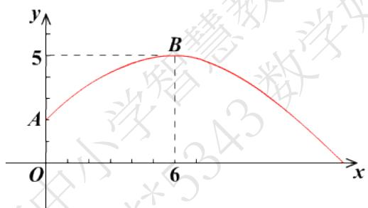

# 高中 数学 必修 第一册

# 第三章 函数的概念与性质 3.1

# 函数的概念及其表示

# 3.1.2函数的表示法

# 一、单选题（共4题）

1.【单选题】已知 $f\left(\frac{1-x}{1+x}\right)=\frac{1-x^{2}}{1+x^{2}}$ ，则 $f(x)$ 的解析式为（）

A. $f(x) = \frac{x}{1 + x^2} (x\neq -1)$   
B. $f(x) = \frac{-2x}{1 + x^2} (x\neq -1)$   
C. $f(x) = \frac{2x}{1 + x^2} (x\neq -1)$   
D. $f(x) = \frac{-x}{1 + x^2} (x\neq -1)$

2.【单选题】已知 $f\left(\frac{1}{x-1}\right)=x+1$ ，则 $f(x)$ 的解析式为()

A. $\frac{1}{x+2}(x\neq-2)$   
B. $\frac{l+x}{x}(x\neq0)$   
C. $\frac{1}{x} + 2 (x \neq 0)$   
D. $\frac{1}{x} - 1 (x \neq 0)$

3.【单选题】已知 $f\left(\frac{I}{x}\right)=\frac{I}{x+1}$ ，则 $f(x)$ 的解析式为（）

A. $f(x) = \frac{l}{1 + x}$   
B. $f(x) = \frac{l + x}{x}$   
C. $f(x)=\frac{x}{1+x}(x\neq0)$   
D. $f(x) = x + 1$

4.【单选题】已知函数 $f(x)$ 满足 $f\left(x - \frac{l}{x}\right) = x^2 + \frac{l}{x^2} (x \neq 0)$ ，则 $f(x)$ 的解析式为（）

A. $f(x) = x + \frac{1}{x}$   
B. $f(x) = x^{2} + 2$   
C. $f(x) = x^{2}$   
D. $f(x) = \left(x - \frac{1}{x}\right)^2$

# 二、填空题（共2题）

5.【填空题】设函数 $f(x)$ 对 $x \neq 0$ 的一切实数均有 $f(x) + 2f\left(\frac{2022}{x}\right) = 3x$ ，则 $f(2022)$ 等于 \_\_\_\_.  
6.【填空题】若函数 $f(x)$ 满足关系式 $f(x)+2f\left(\frac{l}{x}\right)=3x$ ，则 $f(2)$ 的值为\_\_\_\_。

# 三、复合题（共1题）

7.【复合题】在体育测试时，一名男同学掷铅球，已知铅球所经过的路径是某个二次函数图象的一部分(如图所示)，这个男同学出手处A点的坐标是 $(0,2)$ ，铅球路线的最高处B

line

| Point | x | y |
|-------|---|---|
| A     | 0 | 4 |
| B     | 6 | 5 |

点的坐标是(6, 5).

(1)【问答题】求这个二次函数的解析式;

(2)【问答题】该同学能把铅球掷出去多远(结果精确到0.01 m, $\sqrt{15} \approx 3.873$ )?

# 四、问答题（共1题）

8.【问答题】已知 $f(x)$ 是二次函数， $f(0)=1$ 且满足， $f(x+1)-f(x)=2x$ ，求 $f(x)$ 的解析式.