# 高中 数学 必修 第一册

# 第三章 函数的概念与性质 3.1

# 函数的概念及其表示

# 3.1.2 函数的表示法

# 一、单选题（共3题）

1.【单选题】设 $x \in \mathsf{R}$ ，定义符号函数 $\operatorname{sgn} x = \begin{cases} 1, & x > 0 \\ 0, & x = 0 \\ -1, & x < 0 \end{cases}$ ，则函数 $f(x) = |x| \operatorname{sgn} x$ 的图象大致是（）

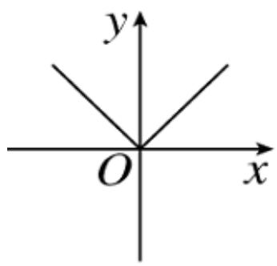

text_image

y
O
x

A.

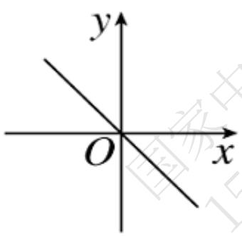

text_image

y
O
x

B.

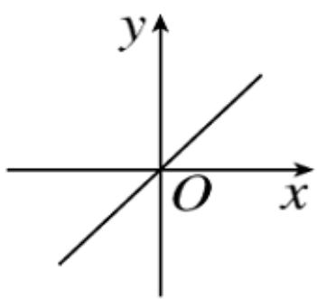

text_image

y
O x

C.

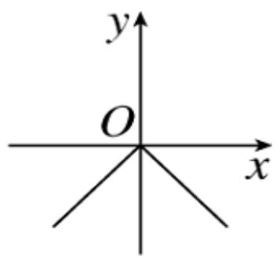

text_image

y
O
x

D.

2.【单选题】函数 $y=f(x)$ 与 $y=g(x)$ 的图象如下图，则函数 $y=f(x)\cdot g(x)$ 的图象可能是()

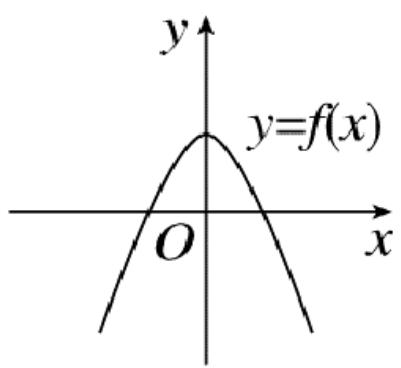

text_image

y
y=f(x)
O
x

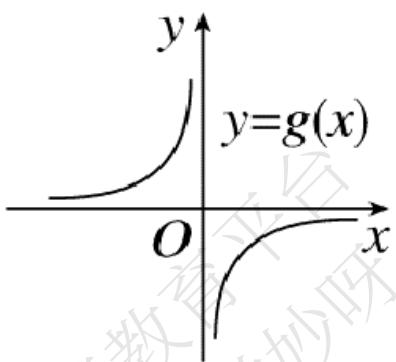

text_image

y
y=g(x)
O
x

A.   
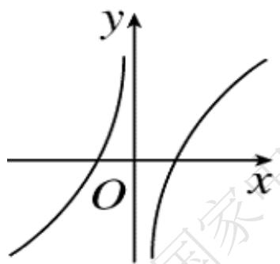

text_image

y
O
x

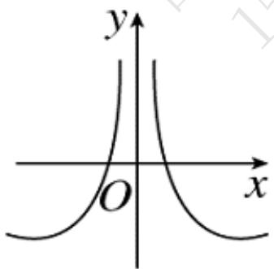

text_image

y
O
x

B.

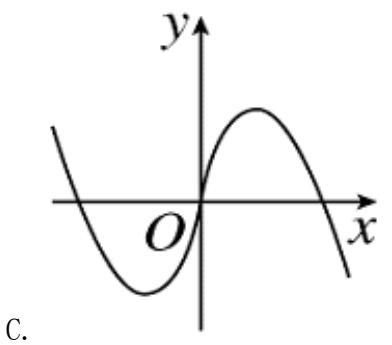

text_image

y
O
x
C.

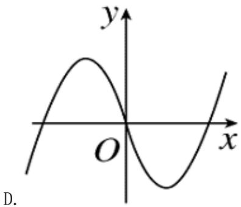

text_image

y
O
x
D.

3.【单选题】为了得到函数 $y=\log_{4}\frac{x-3}{4}$ 的图象，只需把函数 $y=\frac{1}{2}\log_{2}x$ 图象上所有的点()

A. 先向左平移3个单位长度，再向上平移1个单位长度  
B. 先向右平移3个单位长度，再向上平移1个单位长度  
C. 先向右平移3个单位长度，再向下平移1个单位长度  
D. 先向左平移3个单位长度，再向下平移1个单位长度

# 二、多选题（共2题）

4.【多选题】（多选题）已知函数 $f(x)=\left\{\begin{aligned}&|x+1|-1, &x<0\\&f(x-2), &x\geq0\end{aligned}\right.$ ，则以下结论正确的有（）

A. $f(2020) = 0$

B. 方程 $f(x)=\frac{1}{4}x-1$ 有三个实数根

C. 当 $x \in [4, 6)$ 时， $f(x) = |x - 5| - 1$

D. 若函数 $y = f(x) - t$ 在 $(-∞, 6)$ 上有 8 个零点 $x_{i} (i=1, 2, 3, \cdots, 8)$ ，则 $x_{1} f(x_{1}) + x_{2} f(x_{2}) + \cdots + x_{8} f(x_{8})$ 的取值范围为 $(-16, 0)$

5.【多选题】（多选题）一水池有2个进水口，1个出水口，每个进水口的进水速度如图甲所示，出水口的出水速度如图乙所示．某天从0 h到

h，该水池的蓄水量如图丙所示，则下列说法正确的是（）

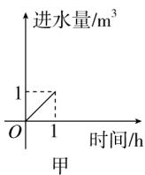

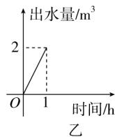

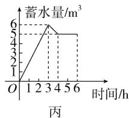

line

| 时间/h | 蓄水量/m³ |
| ------ | --------- |
| 0      | 0         |
| 1      | 1         |
| 2      | 4         |
| 3      | 6         |
| 4      | 5         |
| 5      | 5         |
| 6      | 5         |

A. 0 h到3 h只进水不出水  
B. 3 h到4 h不进水只出水   
C. 3 h到4 h有一个进水口关闭  
D. 4 h到6 h不进水不出水

# 三、填空题（共3题）

6.【填空题】若关于x的方程 $x^{2}-4|_{x}|+5=m$ 有4个互不相等的实数根，则实数m的取值范围是\_\_\_\_.  
7.【填空题】如图所示，函数图象由两条射线及抛物线的一部分组成，则函数的解析式为

$$
f (x) = \underline {{\quad}}. \quad \begin{array}{c} y \\ 2 \\ 1 \\ \hline o \end{array}
$$

8.【填空题】对于任意的实数 $x_{1}$ ， $x_{2}$ ， $\min\{x_{1}, x_{2}\}$ 表示 $x_{1}$ ， $x_{2}$ 中较小的那个数．若函数 $f(x)=2-x^{2}$ ， $g(x)=x$ ，记 $h(x)=\min\{f(x), g(x)\}$ ，则 $h(x)=1$ 时，x的值为\_\_\_\_.

# 四、复合题（共1题）

9.【复合题】已知函数 $f(x)=\left\{\begin{aligned}&3-x^{2},&x>0\\ &2,&x=0\\ &1-2x,&x<0\end{aligned}\right.$

(1)【问答题】画出函数 $f(x)$ 的图象;

(2)【问答题】求 $f(a^{2}+1)(a\in R)$ ， $f(f(3))$ 的值；

(3)【问答题】当 $f(x)\geq2$ 时，求x的取值范围.