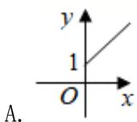
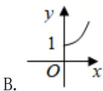
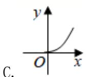
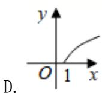

# 高中 数学 必修 第一册

# 第四章 指数函数与对数函数 4.5

# 函数的应用（二）

# 4.5.3函数模型的应用

# 一、单选题（共2题）

1.【单选题】某林区的森林蓄积量每年比上一年平均增长 $10.4\%$ ，要增长到原来的 $x$ 倍，需经过 $y$ 年，则函数 $y = f(x)$ 的图象大致为（）

2.【单选题】基本再生数 $R_{0}$ 与世代间隔 $T$

是新冠肺炎的流行病学基本参数. 基本再生数指一个感染者传染的平均人数，世代间隔指相邻两代间传染所需的平均时间. 在新冠肺炎疫情初始阶段，可以用指数模型： $I(t) = e^{rt}$

描述累计感染病例数 $I(t)$ 随时间 t （单位:天）的变化规律，指数增长率 r 与 $R_{0}$ ，T 近似满足 $R_{0}=1+rT$ 。有学者基于已有数据估计出 $R_{0}=3.28$ ，T=6

. 据此，在新冠肺炎疫情初始阶段，累计感染病例数增加 1 倍需要的时间约为 $(\ln 2 \approx 0.69)$ （）

A. 1.2天  
B. 1.8天  
C. 2.5天  
D. 3.5天

# 二、复合题（共1题）

3. 【复合题】某工厂生产过程中产生的废气必须经过过滤后才能排放, 已知在过滤过程中, 废气中的污染物含量p(单位: 毫克/升)与过滤时间t(单位: 小时)之间的关系为 $p(t) = p_{0}e^{-kt}$ (式中的e为自然对数的底数, $p_{0}$

为污染物的初始含量). 过滤 1 小时后检测, 发现污染物的含量减少了 $\frac{1}{5}$ .

(1)【问答题】求函数关系式 $p(t)$ ;

(2)【问答题】要使污染物的含量不超过初始值的 $\frac{1}{1000}$ ，至少需过滤几个小时？(参考数据： $lg2\approx0.3$ )