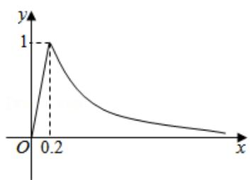

# 高中 数学 必修 第一册

# 第三章 函数的概念与性质 3.4 函数的应用（一）

# 一、单选题（共2题）

1.【单选题】某重装企业的装配分厂举行装配工人技术比赛，根据以往技术资料统计，某工人装配第n件工件所用的时间(单位：分钟) $f(n)$ 大致服从的关系为 $\mathrm{f}(n)=\sqrt{\frac{k}{\sqrt{n}}},\quad n<M$ (k，M为常数).已知该工人装配第9件工件用时20分钟，装配第M件工件用时12分钟，那么可大致推出该工人装配第4件工件所用的时间是()

A. 40分钟  
B. 35分钟  
C. 30分钟  
D. 25分钟

2.【单选题】已知a>1，且函数 $f(x)=2|x^{2}-x+a|+|x^{2}-4x+a|$ ，若对任意的 $x\in(1,a)$ 不等式 $f(x)\geq(a-1)x$ 恒成立，则实数a的取值范围为（）

A. $(1,9]$   
B. $(1,25]$   
C. [4,25]   
D. $[4, +\infty)$

# 二、多选题（共1题）

3. 【多选题】(多选)为预防流感病毒, 我校每天定时对教室进行喷洒消毒。当教室内每立方米药物含量超 $0.25 \mathrm{mg}$ 时能有效杀灭病毒。已知教室内每立方米空气中的含药量 $y$ (单位: $mg$ ) 随时间 $x$ (单位: $h$ ) 的变化情况如图所示: 在药物释放过程中, $y$ 与 $x$

成正比：药物释放完毕后，y与x的函数关系式为： $y=\frac{a}{x}$ (a为常数)，则下列说法正确的是( )

A. 当 $0 \leqslant x \leqslant 0.2$ 时， $y = 5x$   
B. 当x>0.2时， $y=\frac{1}{5x}$   
C. 教室内持续有效杀灭病毒时间为0.85小时  
D. 喷洒药物3分钟后才开始有效灭杀病毒

# 三、复合题（共4题）

4. 【复合题】某工厂去年的某产品的年产量为100万只，每只产品的销售价为10元，固定成本为8元．今年，工厂第一次投入100万元(科技成本)，并计划以后每年比上一年多投入100万元(科技成本)，预计产量年递增10万只，第n次投入后，每只产品的固定成本为 $g(n)=\frac{k}{\sqrt{n+1}}$ (k>0, k为常数， $n\in Z$ 且 $n\geq0$ )，若产品销售价保持不变，第n次投入后的年利润为 $f(n)$ 万元.

(1)【问答题】求k的值，并求出 $f(n)$ 的表达式；

(2)【问答题】问从今年算起第几年利润最高？最高利润为多少万元？

5.【复合题】为了鼓励节约用电，辽宁省实行阶梯电价制度，其中每户的用电单价与户年用电量的关系如下表所示：

<table><tr><td>分档</td><td>户年用电量(度)</td><td>用电单价(元)</td></tr><tr><td>第一阶梯</td><td>(0, 2640]</td><td>0.5</td></tr><tr><td>第二阶梯</td><td>(2640, 3720]</td><td>0.55</td></tr><tr><td>第三阶梯</td><td>(3720, +∞)</td><td>0.8</td></tr></table>

记户年用电量为x度时应缴纳的电费为 $f(x)$ 元.

(1)【问答题】写出 $f(x)$ 的解析式;

(2)【问答题】假设居住在沈阳的范伟一家2019年共用电3000度，则范伟一家2019年应缴纳电费多少元？

(3)【问答题】居住在大连的张莉一家在2019年共缴纳电费1942元，则张莉一家在2019年用了多少度电？

6.【复合题】某电子公司生产一种电子仪器的固定成本为20000元，每生产一台仪器需增加投入100元，已知总收益满足函数 $R_{(x)}=\begin{cases}400x-\frac{1}{2}x^{2},&0\leq x\leq400,\\80000,&x>400,\end{cases}$ 其中x是仪器的月产量.

(1)【问答题】将利润 $f(x)$ 表示为月产量x的函数；

(2)【问答题】当月产量为何值时，公司所获的利润最大？最大利润为多少元？（总收益＝总成本＋利润）

7.【复合题】A，B两城相距100km，拟在两城之间距A城xkm处建一发电站给A，B

两城供电，为保证城市安全，发电站距城市的距离不得小于10km

. 已知供电费用等于供电距离(单位: km)的平方与供电量(单位: 亿度)之积的0.25倍, 若每月向A城供电20亿度, 每月向B城供电10亿度.

(1)【问答题】求x的取值范围;

(2)【问答题】把月供电总费用y表示成关于x的函数；

(3)【问答题】发电站建在距A城多远处，能使月供电总费用y最少？

# 四、问答题（共6题）

8.【问答题】某报刊亭从报社买进报纸的价格是每份0.24元，卖出的价格是每份0.40元，卖不掉的报纸可以以每份0.08元的价格退回报社。在一个月(以30天计算)里，有20天每天可卖出400份，其余10天每天只能卖出250份，但每天从报社买进的报纸份数必须相同，试问报刊亭摊主应该每天从报社买进多少份报纸，才能使每月所获得利润最大，每月最多可获利多少元？

9.【问答题】建筑一个容积为800米 $^{3}$ ，深8米的长方体水池(无盖)．池壁，池底造价分别为a元/米 $^{2}$ 和2a元/米 $^{2}$ ，底面一边长为x米，总造价为y，写出y与x的函数式，问底面边长x为何值时总造价y最低，是多少？

10.【问答题】设a为实常数， $y=f_{(x)}$ 是定义在R上的奇函数，当x<0时， $f_{(x)}=9x+\frac{a^{2}}{x}+7$ ，若 $f_{(x)}\geq a+1$ 对一切 $x\geq0$ 成立，求a的取值范围.

11.【问答题】已知 $t > 0$ ，求函数 $y = \frac{t^2 - 4t + 1}{t}$ 的最小值.

12.【问答题】已知函数 $f(x)=\frac{x^{2}+2x+a}{x},x\in[1,+\infty)$ ，若 $f(x)>0$ 恒成立，求a的取值范围.

13.【问答题】已知 $a \in R$ ，函数 $f(x) = \left|x + \frac{4}{x} - a\right| + a$ 在区间 $[1,4]$ 上的最大值是5，求a的取值范围.