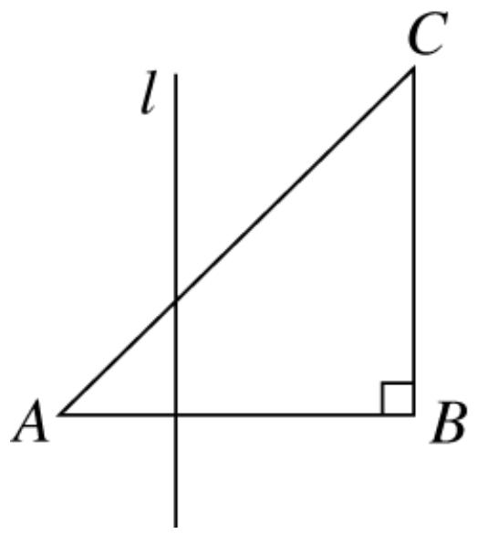
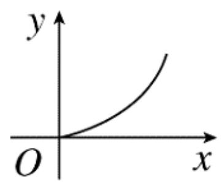
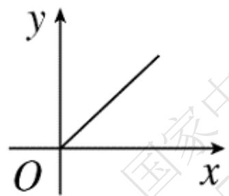
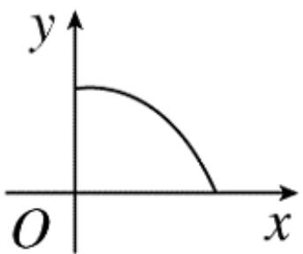
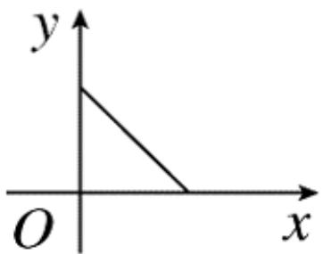
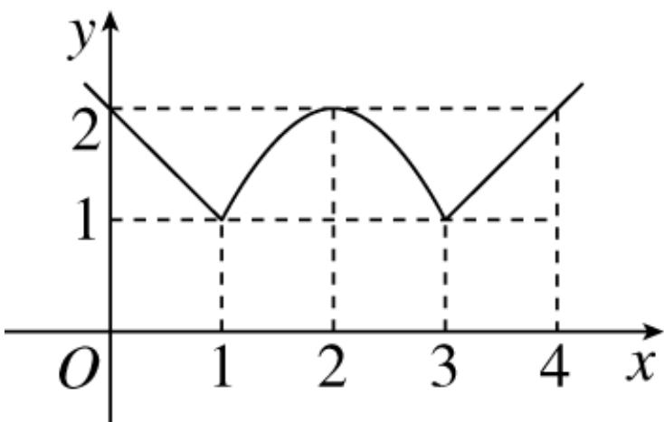
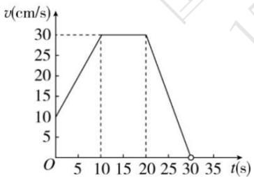

# 高中 数学 必修 第一册

# 第三章 函数的概念与性质 3.1

# 函数的概念及其表示

# 3.1.2函数的表示法

# 一、单选题（共4题）

1.【单选题】函数 $f(x)$ 与 $g(x)$ 的对应关系如下表.

<table><tr><td>x</td><td>-1</td><td>0</td><td>1</td></tr><tr><td>f(x)</td><td>1</td><td>3</td><td>2</td></tr></table>

<table><tr><td>x</td><td>1</td><td>2</td><td>3</td></tr><tr><td>g(x)</td><td>0</td><td>-1</td><td>1</td></tr></table>

则 $g(f(-1))$ 的值为（）

A. 0   
B. 3   
C. 1   
D. -1

2.【单选题】如图， $\triangle ABC$ 为等腰直角三角形，直线 $l$ 与 $AB$ 相交且 $l \perp AB$ ，设直线 $l$ 截这个三角形所得的位于直线右侧的图形面积为 $y$ ，点 $A$ 到直线1的距离为 $x$ ，则 $y = f(x)$ 的图象大致为（）

text_image

l
A
B
C

text_image

y
O
x

A.

text_image

y
O
x

B.

text_image

y
O
x

C.

text_image

y
O
x

D.

3.【单选题】已知实数 $a \neq 0$ ，函数 $f(x) = \begin{cases} 2x + a, & x < 1 \\ -x - 2a, & x \geq 1 \end{cases}$ ，若 $f(1 - a) = f(1 + a)$ ，则 $a$ 的值为（）

A. $-\frac{3}{4}$   
B. $\frac{3}{4}$   
C. $-\frac{3}{5}$   
D. $\frac{3}{5}$

4.【单选题】设函数 $f(x)=\left\{\begin{aligned}&\frac{1}{2}x-1,x\geq0\\&\frac{1}{x},&x<0\end{aligned}\right.$ ，若 $f(a)=a$ ，则实数 a 的值为（）

A. $\pm l$   
B.-1   
C. -2或-1   
D. ±1或-2

# 二、填空题（共3题）

5.【填空题】如图所示，函数图象由两条射线及抛物线的一部分组成，则函数的解析式为 $f(x) =$ \_\_\_\_.

line

| x | y |
|---|---|
| 0 | 2 |
| 1 | 1 |
| 2 | 2 |
| 3 | 1 |
| 4 | 2 |

6.【填空题】已知 $f(x)=\left\{\begin{aligned}&0,&x>0\\&-e,&x=0\\&x^{2}+1,x<0\end{aligned}\right.$ ，则 $f(f)f(\pi)(\ )$ 的值为 \_\_\_\_.  
7.【填空题】若函数 $f(x)$ 满足 $f(a+b)=\frac{f(a)+f(b)}{1-f(a)f(b)}$ ，且 $f(2)=\frac{1}{2}$ ， $f(3)=\frac{1}{3}$ ，则 $f(7)=$ \_\_\_\_.

# 三、复合题（共1题）

8.【复合题】国家以前规定个人稿费纳税的办法是：不超过 800 元的不纳税；超过800元不超过 4000 元的按超过 800 元的部分的 14% 纳税；超过 4000 元的按全部稿费的 11% 纳税。

(1)【问答题】根据上述规定建立某人所得稿费 x(元) 与纳税额 y(元) 之间的函数关系式;

(2)【问答题】某人出了一本书，共纳税 660 元，则这个人的稿费是多少元？

# 四、问答题（共3题）

9.【问答题】已知 $f(x) = \begin{cases} x + 2, & x \leq -1 \\ x^2, & -1 < x < 2 \\ 2x, & x \geq 2 \end{cases}$ ，求 $f(-\pi)$ 及 $f(f)\frac{3}{2}( )$ 的值.

10.【问答题】已知 $f(x) = \begin{cases} x + 2, & x \leq -1 \\ x^2, & -1 < x < 2 \\ 2x, & x \geq 2 \end{cases}$ ，若 $f(a^2 + 2) \geq a + 4$ ，求实数 $a$ 的取值范围.

11.【问答题】某质点

30s

内的运动速度v是时间t

的函数，它的图象如图，用解析法表示出这个函数，并求出 9s 时质点的速度.

line

| t(s) | v(cm/s) |
|---|---|
| 0 | 10 |
| 10 | 30 |
| 20 | 30 |
| 30 | 0 |

