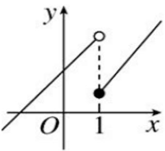
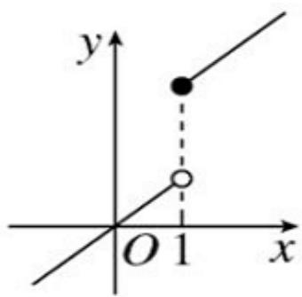
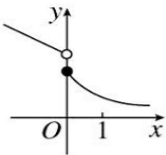
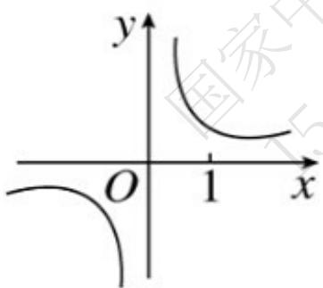

# 高中 数学 必修 第一册

# 第三章 函数的概念与性质 3.2 函数的基本性质

# 3.2.1单调性与最大（小）值 函数的单调性

# 一、单选题（共3题）

1.【单选题】若 $f(x) = \begin{cases} \frac{a}{x}, & x \geq 1 \\ -x + 3a, & x < 1 \end{cases}$ 是 $R$ 上的单调函数，则实数 $a$ 的取值范围是（）

A. $\left(-\infty,\quad\frac{1}{2}\right)$   
B. $\left(\frac{1}{2},+\infty\right)$   
C. $(-∞, \frac{1}{2}]$   
D. $\left[\frac{1}{2},+\infty\right)$

2.【单选题】已知函数 $f(x)=\frac{x}{x-a}(a\in\mathbb{R})$ ，若函数 $f(x)$ 在 $(1,+\infty)$ 上为减函数，则实数 a 的取值范围是（）

A. $(-∞, 1]$   
B. $(0, 1]$   
C. $(0, +\infty)$   
D. $[1, +\infty)$

3.【单选题】已知函数 $f(x) = 2x^{2} - kx - 4$ 在区间[-2, 4]上具有单调性，则 $k$ 的取值范围是（）

A. [-8, 16]   
B. $(-\infty, -8] \cup [16, +\infty)$   
C. $(- \infty, -8) \cup (16, +\infty)$   
D. $[16, +\infty)$

# 二、多选题（共1题）

4.【多选题】（多选题）已知四个函数的图象如图所示，其中在定义域内具有单调性的函数是（）

A.   

text_image

y
O 1 x

B.   

text_image

y
O 1 x

C.   

text_image

y
O 1 x

D.   

text_image

y
O 1 x

# 三、填空题（共1题）

5.【填空题】已知 $f(x)=\left\{\begin{aligned}&(3-a)x-4a,x<1\\ &x^{2},&\end{aligned}\right.$ 是 R 上的增函数，则实数 a 的取值范围是 \_\_\_\_.

# 四、复合题（共2题）

6.【复合题】解答题:

(1)【问答题】已知 $g(x)$ 是 $[m, n]$ 上的减函数，且 $a \leq g(x) \leq b$ ， $f(x)$ 是 $[a, b]$ 上的增函数，求证： $f(g(x))$ 在 $[m, n]$ 上是减函数.

(2)【问答题】求函数 $y=\sqrt{1-2x}$ 的单调区间.

7.【复合题】求下列函数的定义域，指出复合函数的内层函数和外层函数分别是什么，并求出单调区间.

(1)【问答题】 $y=\frac{l}{x^{2}+l}$

(2)【问答题】 $y=\sqrt{x^{2}-2x}$

# 五、问答题（共6题）

8.【问答题】如果函数 $f(x) = x^{2} + bx + c$ 对任意实数 $t$ 都有 $f(2 + t) = f(2 - t)$ ，比较 $f(1), f(2), f(4)$ 的大小.

9.【问答题】求证：函数 $f(x)=x+\frac{1}{x}$ 在区间 $(0,1)$ 上单调递减.

10.【问答题】已知函数 $f(x)$ 在区间 $(0, +\infty)$ 上单调递减，试比较 $f(a^{2} - a + 1)$ 与 $f\left(\frac{3}{4}\right)$ 的大小.

11.【问答题】已知函数 $f(x)$ 是定义在（-3, 3）上的减函数，若 $f(2x - 3) > f(x + 1)$ ，求 $x$ 的取值范围.

12.【问答题】证明：函数 $f(x) = x^3 + x$ 在 $R$ 上是增函数.

13.【问答题】已知 $y = f(x)$ 是定义在 $(-1, 1)$ 上的减函数，且 $f(1 - a) < f(a^{2} - 1)$ ，求 a 的取值范围.