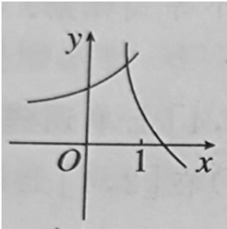
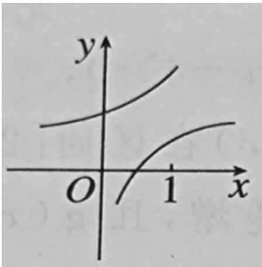
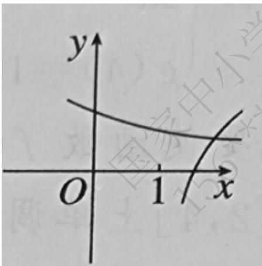
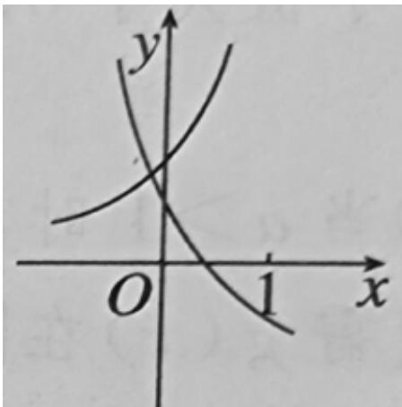
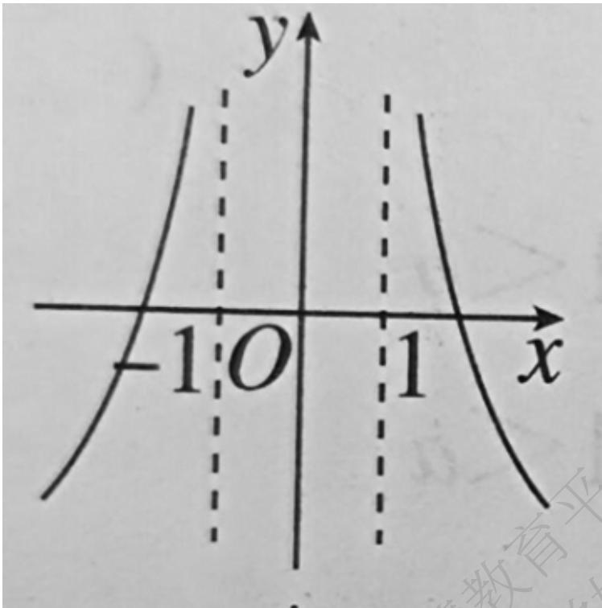
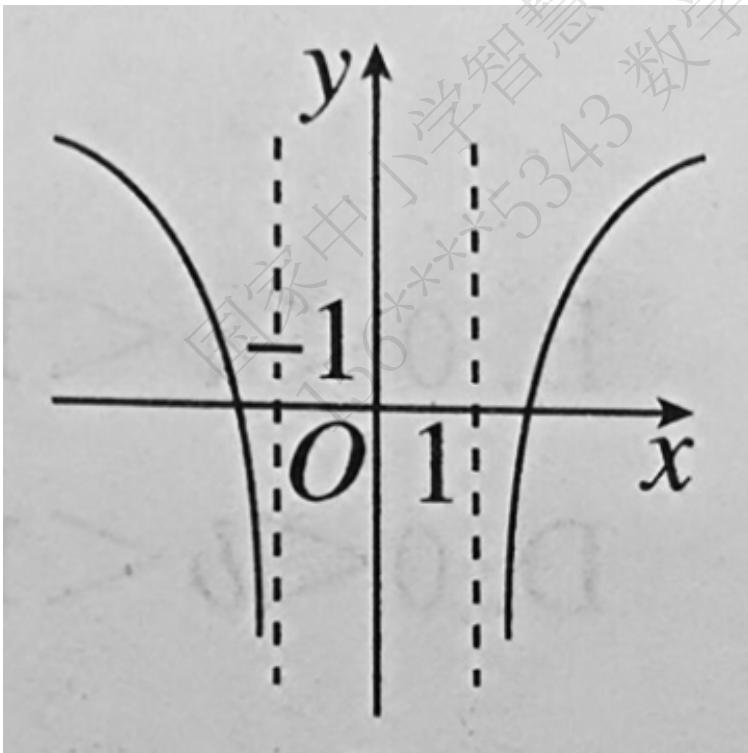
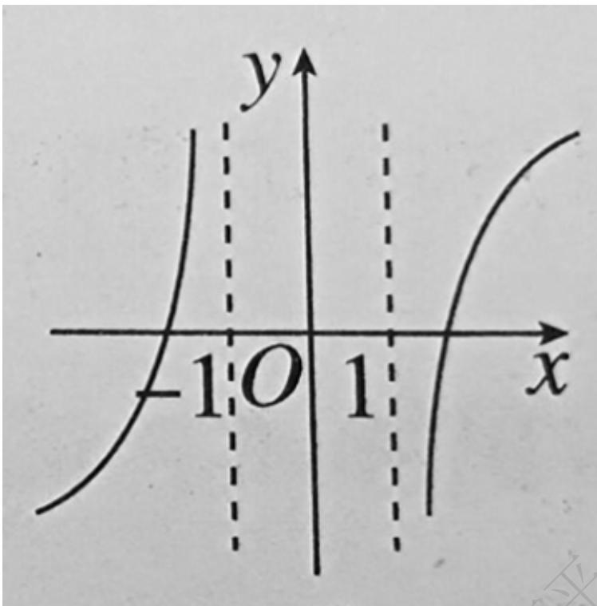
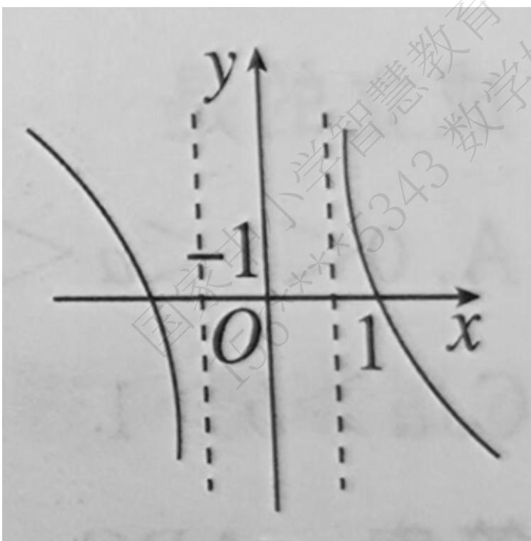
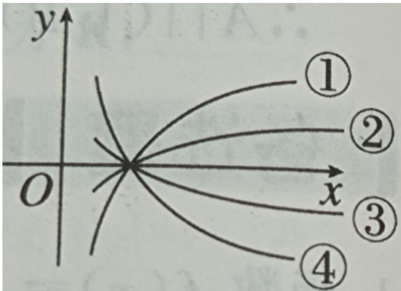

# 高中 数学 必修 第一册

# 第四章 指数函数与对数函数 4.4 对数函数

# 4.4.2 对数函数的图象和性质

# 一、单选题（共11题）

1.【单选题】 $2^{\log_3x} = \frac{l}{4}$ 的解是（ ）

A. $\frac{l}{9}$   
B. $\frac{\sqrt{3}}{2}$   
C. $\sqrt{3}$   
D. 9

2.【单选题】设 0 < a < 1，函数 $f(x) = \log_{a}(a^{2x} + 2a^{x} - 2)$ ，则使 $f(x) < 0$ 的 x 的取值范围是（）

A. $(-∞,0)$   
B. $(0, +\infty)$   
C. $(-\infty, \log_a 3)$   
D. $(\log_a^3, +\infty)$

3.【单选题】已知函数 $f(x)=\log_{a}(x^{2}+2x-3)$ ，若 $f(2)>0$ ，则此函数的单调递增区间是（）

A. $(-\infty, -3)$   
B. $(- \infty, -3) \cup (1, +\infty)$   
C. $(-\infty, -1)$   
D. $(1, +\infty)$

4.【单选题】在同一直角坐标系中，函数 $y=\frac{1}{a^{x}}$ ， $y=\log_{a}\left(x+\frac{1}{2}\right)(a>0$ 且 $a\neq1)$ 的图象可能是（）

A.   

text_image

y
O 1 x

B.   

text_image

y
O 1 x

C.   

text_image

y
O 1 x

D.   

text_image

y
O 1 x

5.【单选题】函数 $f(x) = \lg (|x| - 1)$ 的大致图象是（）

text_image

-1 O 1 x
y

A.

text_image

y
-1
O 1 x
国家中小学智慧

B.

C.   

text_image

y
-1 O 1 x

text_image

y
-1/2
O
1/2
x
国家小学智慧教育
5343数学

D.

6.【单选题】已知 $y = \left(\frac{l}{4}\right)^{x}$ 的反函数为 $y = f(x)$ . 若 $f(x_{0}) = -\frac{l}{2}$ ，则 $x_{0}$ 等于（）

A.-2   
B.-1   
C. 2   
D. $\frac{1}{2}$

7.【单选题】 $f(x)=\log_{\frac{1}{2}}(x^{2}-ax+4a)$ 在区间 $[2,+\infty)$ 上单调递减，则实数 a 的取值范围是（）

A. $(-2,4]$

B. $[-2,4]$

C. $(-∞,4]$

D. $[4, +\infty)$

8.【单选题】已知 $a=\log_{\frac{1}{2}3}^{2}$ ， $b=\log_{2}(\log_{2}3)$ ， $c=\log_{3}(\log_{3}2)$ ，则（）

A. a > b > c

B. b > a > c

C. a > c > b

D. c > a > b

9.【单选题】若 $y = \log_a(3a - 1)$ 的恒为正值，则 $a$ 的取值范围为（）

A. $\left(\frac{1}{3},+\infty\right)$

B. $\left(\frac{1}{3},\frac{2}{3}\right]$

C. $(1, +\infty)$

D. $(\frac{1}{3},\frac{2}{3})\cup (1, + \infty)$

10.【单选题】函数 $\mathbb{I}y = \log_{a}x, \mathbb{I}y = \log_{b}x, \mathbb{I}y = \log_{c}x, \mathbb{I}y = \log_{d}x$ 的图象如下图所示，则 a, b, c, d 的大小顺序是（）

text_image

y
①
②
x
O
③
④

A. $1 < d < c < a < b$   
B. c < d < 1 < a < b   
C. c < d < 1 < b < a   
D. $d <   c <   1 <   a <   b$

11.【单选题】下列函数中，既是奇函数，在定义域内又是增函数的是（）

A. $f(x) = \log_2x$   
B. $f(x) = x + 1$   
C. $f(x) = lg|x|$   
D. $f(x) = x^{\frac{l}{3}}$

# 二、多选题（共3题）

12.【多选题】（多选）已知函数 $f(x)=(\log_{2}x)^{2}-\log_{2}x^{2}-3$ ，则下列说法正确的是（）

A. $f(4) = -3$   
B. 函数 $f(x)$ 的图象与 $x$ 轴有两个交点;  
C. 函数 $y = f(x)$ 的最小值为 -4;  
D. 函数 $y = f(x)$ 的最大值为 4

13.【多选题】（多选）关于函数 $f(x)=\lg\frac{x^{2}+l}{|x|}(x\neq0)$ ，有下列结论，其中正确的是（）

A. 函数 $f(x)$ 的图象关于 y 轴对称;  
B. 函数 $f(x)$ 的最小值是 2;  
C. 函数 $f(x)$ 在 $(0, +\infty)$ 上单调递增，在 $(-∞, 0)$ 上单调递减；

D. 函数 $f(x)$ 的单调递增区间是 $(-1,0)$ 和 $(1,+\infty)$

14.【多选题】（多选）已知函数 $f(x) = \lg (x^2 + ax - a - 1)$ ，下列论述正确的是（）

A. 当 $a = 0, f(x)$ 的定义域为 $(-∞, -1) ∪ (1, +∞)$ ;  
B. $f(x)$ 一定有最小值;  
C. 当 $a = 0, f(x)$ 的值域为 R;  
D. 若 $f(x)$ 在区间 $[2, +\infty)$ 上单调递增，则实数 a 的取值范围是 $\{a | a \geq -4\}$

# 三、填空题（共6题）

15.【填空题】若函数 $y=\log_{a}(2-ax)$ 在 $[0,1]$ 上是减函数，则 a 的取值范围为 \_\_\_\_。  
16.【填空题】已知函数 $f(x)=\lg(2+x^{2})$ ，则满足不等式 $f(2x-1)<f(3)$ 的 x 的取值范围为 \_\_\_\_。  
17.【填空题】 $y=\log_{(x+2)}\sqrt{2x^{2}-3x-2}$ 的定义域为\_\_\_\_。  
18.【填空题】若不等式 $2^{x} - \log_{a} x < 0$ 在 $x \in (0, \frac{l}{2})$ 时恒成立，则实数 a 的取值范围是 \_\_\_\_。  
19.【填空题】 $y=\frac{I}{\sqrt{\log_{2}x+I}-2}$ 的定义域为\_\_\_\_。  
20.【填空题】若函数 $f(x)=\left\{\begin{aligned}(2-a)x+2a,x&<1\\1+lnx,&x\geq1\end{aligned}\right.$ 的值域为 R，则实数 a 的取值范围是 \_\_\_\_。

# 四、复合题（共8题）

21.【复合题】已知 $f(x)=\ln(ax^{2}+2ax+1)$ 的定义域为 R.

(1)【问答题】求 a 的取值范围;

(2)【问答题】若 $a \neq 0$ ，函数 $f(x)$ 在 $[-2,1]$ 上的最大值与最小值和为 $0$ ，求实数 $a$ 的值。

22.【复合题】已知函数 $f(x) = \log_a(2 + 3x) - \log_a(2 - 3x) (a > 0, a \neq 1)$

(1)【问答题】求函数 $f(x)$ 的定义域;

(2)【问答题】判断 $f(x)$ 的奇偶性，并证明；

(3)【问答题】当 $0 < a < 1$ 时，求关于 $x$ 的不等式 $f(x) \geq 0$ 的解集。

23.【复合题】已知函数 $f(x) = \ln \frac{x + 1}{x - 1}$ .

(1)【问答题】判断函数 $f(x)$ 的奇偶性，并证明你的结论；

(2)【问答题】若函数 $g(x)=\ln x-(x-1)$ 在 $(1,+\infty)$ 上单调递减。比较 $f(2)+f(4)+\cdots+f(2n)$ 与 $2n(n\in N^{*})$ 的大小关系，并说明理由。

24.【复合题】比较下列各组中两个值的大小:

(1)【问答题】 $3\log_{4}5,\quad2\log_{2}3;$

(2)【问答题】 $\log_{3}0.2,\ \log_{4}0.2$

(3)【问答题】 $\log_{3} \pi, \log_{\pi} 3$

(4)【问答题】 $\log_{0.2}0.1$ ， $0.2^{0.1}$

25.【复合题】解下列不等式:

(1)【问答题】 $\log_{\frac{I}{7}}x > \log_{\frac{I}{7}}(4 - x)$

(2)【问答题】 $\log_{x}\frac{1}{2}>1$

(3)【问答题】 $\log_{a}(2x - 5) > \log_{a}(x - 1)$

26.【复合题】设 $f(x) = \log_{\frac{l}{2}}\left(\frac{l - ax}{x - l}\right)$ 为奇函数， $a$ 为常数。

(1)【问答题】求 a 的值;

(2)【问答题】证明： $f(x)$ 在 $(1, +\infty)$ 内单调递增

(3)【问答题】若对于 $[3,4]$ 上的每一个 x 的值，不等式 $f(x) > \left(\frac{1}{2}\right)^x + m$ 恒成立，求 m 的取值范围。

27.【复合题】已知函数 $f(x)=\ln(\sqrt{1+x^{2}}+ax)$ 是奇函数.

(1)【问答题】求 a 的值;

(2)【问答题】当 a > 0 时

①判断 $f(x)$ 的单调性（不要求证明）；  
②对任意实数 $x$ ，不等式 $f(\sin^2 x + \cos x) + f(3 - 2m) < 0$ 恒成立，求正整数 $m$ 的最小值。

28.【复合题】已知函数 $f(x)=\log_{a}\frac{b-x}{3+x}$ ，其中 0<a<1,b>0，若 $f(x)$ 是奇函数。

(1)【问答题】求 b 的值并确定 $f(x)$ 的定义域;

(2)【问答题】判断函数 $f(x)$ 的单调性，并证明你的结论；

(3)【问答题】若存在 $m, n \in [-2, 2]$ ，使不等式 $f_{(m)} + f_{(n)} \geq c$ 成立，求实数 c 的取值范围。

# 五、问答题（共1题）

29.【问答题】已知 $f(x) = (2^{2022})^x, x < 0$ 。求 $f(x)$ 的反函数 $g(x)$ 及其定义域，值域。