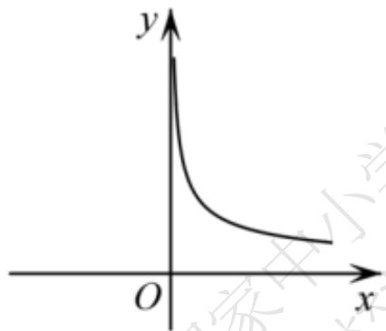
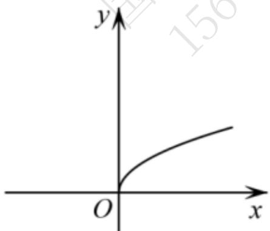
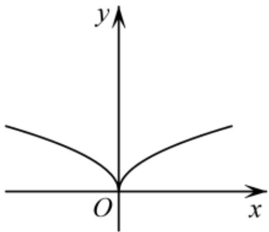
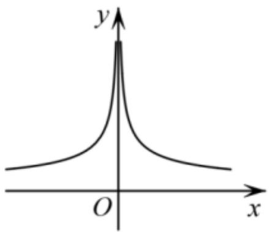
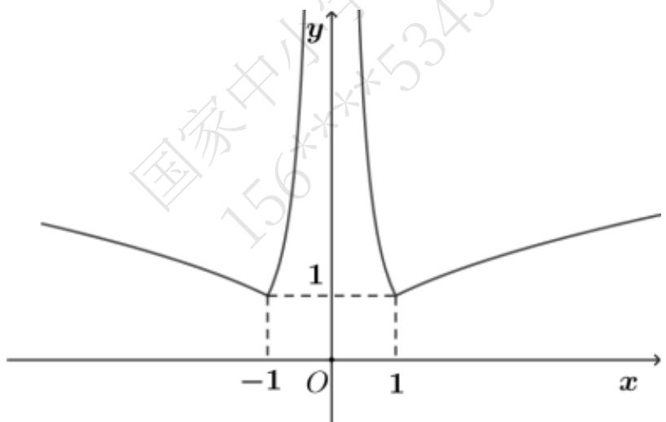
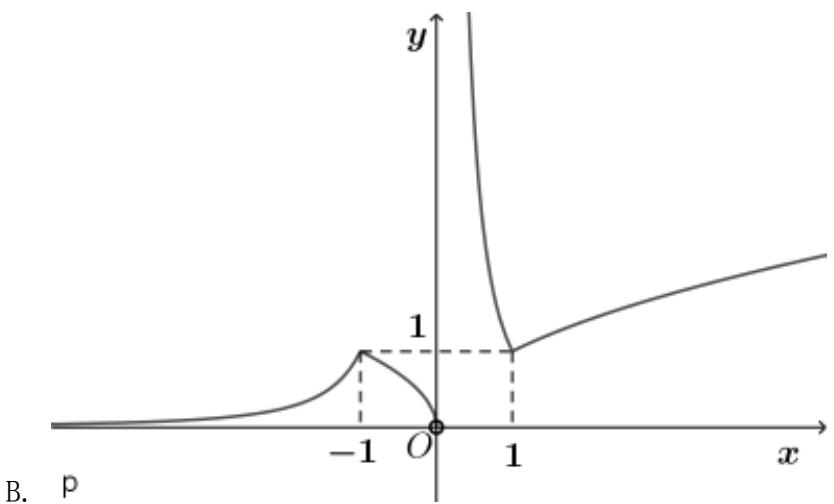
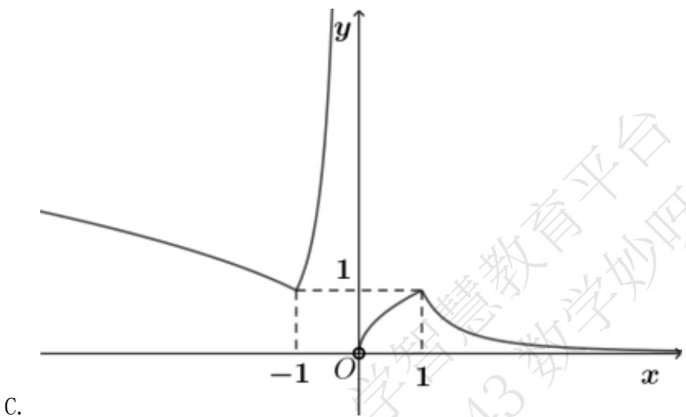
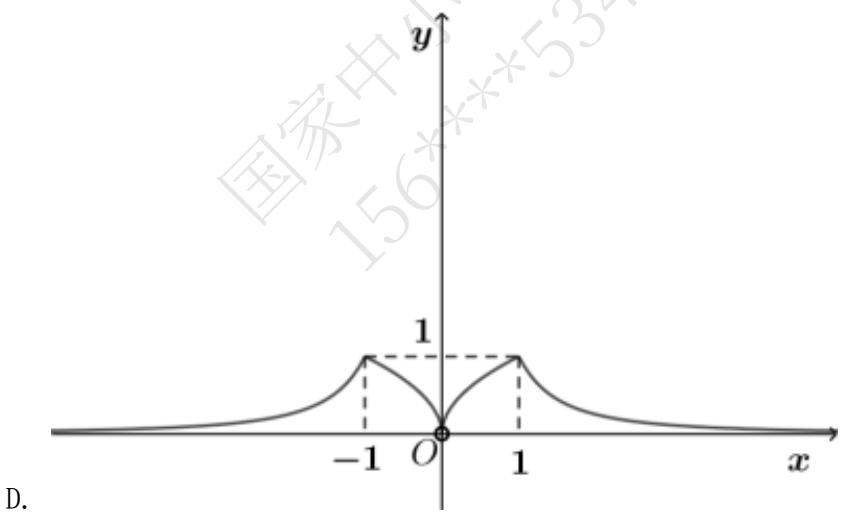

# 高中 数学 必修 第一册

# 第三章 函数的概念与性质 3.3 幂函数

# 一、单选题（共7题）

1.【单选题】已知 $f(x)=\sqrt{x}$ ，若0<a<b<1，则下列各式中正确的是()

A. $f(a) < f(b) < f\left(\frac{1}{a}\right) < f\left(\frac{1}{b}\right)$   
B. $f\left(\frac{l}{a}\right) < f\left(\frac{l}{b}\right) < f(b) < f(a)$   
C. $f(a) < f(b) < f\left(\frac{1}{b}\right) < f\left(\frac{1}{a}\right)$   
D. $f\left(\frac{l}{a}\right) < f(a) < f\left(\frac{l}{b}\right) < f(b)$   
2.【单选题】已知幂函数 $y=f(x)$ 的图象经过点 $P\left(4,\frac{l}{2}\right)$ ，则 $y=f(x)$ 的大致图象是（）

text_image

y
O
x

A.

text_image

y
O
x

B.

C.

text_image

y
O
x

D.

text_image

y
O
x

3.【单选题】对 $a, b \in R$ ，记 $max\{a, b\} = \begin{cases} a, & a \geqslant b \\ b, & a < b \end{cases}$ ，函数 $f(x) = max\{\sqrt{|x|}, x^{-2}\}$ 的图象可能是（）

text_image

y
1
-1 O 1 x
国家中心 5345

A.

text_image

y
1
-1 O 1 x
B. p

text_image

y
1
-1 O 1 x
C.

text_image

y
1
-1 O 1 x
D.
156xxxx534

4.【单选题】设 $\in \left\{-1, \frac{1}{2}, 1, 2, 3\right\}$ , 则使 $f(x) = x^a$ 为奇函数且在 $(0, +\infty)$ 上单调递减的的值的个数是（）

A. 1   
B. 2   
C. 3

D. 4

5.【单选题】设 $a=\left(\frac{3}{4}\right)^{\frac{2}{3}}$ ， $b=\left(\frac{2}{3}\right)^{\frac{3}{4}}$ ， $c=\left(\frac{2}{3}\right)^{\frac{2}{3}}$ ，则a，b，c的大小关系是

A. b < c < a   
B. a < c < b   
C. b < a < c   
D. c < b < a

6.【单选题】已知函数 $f(x)=(m^{2}-m-5)x^{m^{2}-6}$ 是幂函数，对任意 $x_{1},x_{2}\in(0,+\infty)$ ，且 $x_{1}\neq x_{2}$ ，满足 $\frac{f(x_{1})-f(x_{2})}{x_{1}-x_{2}}>0$ ，若 $a,b\in R$ ，且 $a+b>0$ ，则 $f(a)+f(b)$ 的值（）

A. 恒大于0   
B. 恒小于0   
C. 等于0   
D. 无法判断

7.【单选题】在函数① $y=\frac{l}{x}$ ，② $y=x^{2}$ ，③ $y=x+\frac{l}{x}$ ，④y=1，⑤ $y=2x^{2}$ ，⑥ $y=x^{-\frac{l}{2}}$ 中，是幂函数的是（）

A. ①②④⑤   
B.③④⑥   
C.①②⑥   
D.①②④⑤⑥

# 二、填空题（共1题）

8.【填空题】幂函数 $y=x^{a}$ 中的a的取值集合C是 $\left\{-1,0,\frac{1}{2},1,2,3\right\}$ 的子集，当幂函数的值域与定义域相同时，集合C为\_\_\_\_。

# 三、复合题（共1题）

9.【复合题】已知幂函数 $f(x)=x^{4m-m^{2}}$ （ $m\in Z$ ）的图像关于y轴对称，且 $f(2)<f(3)$ .

(1)【问答题】求m的值及函数 $f(x)$ 的解析式;

(2)【问答题】若 $f(a+2)<f(1-2a)$ ，求实数a的取值范围.

# 四、问答题（共2题）

10.【问答题】写出函数 $y=x^{\frac{5}{3}}$ 与 $y=x^{\frac{1}{5}}$ 的定义域和值域.

11.【问答题】若 $(a+1)^{-\frac{1}{2}}<(3-2a)^{-\frac{1}{2}}$ ，求a的取值范围.