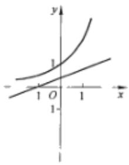
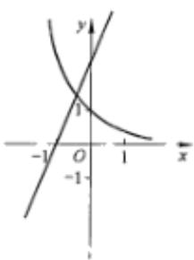
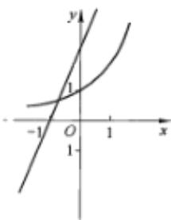
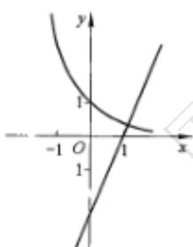
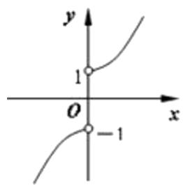
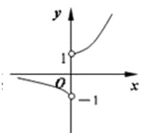
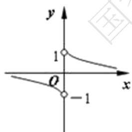
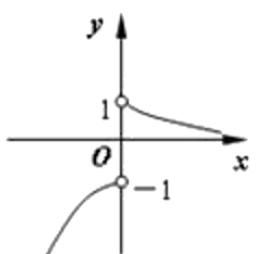

# 高中 数学 必修 第一册

# 第四章 指数函数与对数函数 4.2 指数函数

# 一、单选题（共8题）

1.【单选题】若 $a > 1$ ， $-1 < b < 0$ ，则函数 $y = a^{x} + b$ 的图象一定在（）

A. 第一、二、三象限  
B. 第一、三、四象限  
C. 第二、三、四象限  
D. 第一、二、四象限

2.【单选题】若 $\left(\frac{l}{3}\right)^{2a + 1} < \left(\frac{l}{3}\right)^{4 - a}$ ，则实数 $a$ 的取值范围是（）

A. $(1, +\infty)$   
B. $(-∞,1)$   
C. $(3, +\infty)$   
D. $(-∞,3)$

3.【单选题】若函数 $f(x)=\left\{\begin{aligned}\left(\frac{1}{2}\right)^{x},&x<1\\ a+\left(\frac{1}{4}\right)^{x},&x\geq1\end{aligned}\right.$ 的值域为 $(a,+\infty)$ ，则a的最大值为（）

A. $\frac{1}{4}$   
B. $\frac{l}{2}$   
C. 1   
D. 2

4.【单选题】已知关于x的方程 $|2^{x}-1|=a$ 有两个不等实根，则实数a的取值范围是()

A. $(-∞,0)$   
B. $(1,2)$   
C. $(0, +\infty)$   
D. $(0,1)$

5.【单选题】函数 $y = a^{x}$ 和 $y = a(x + 1)$ （其中 $a > 1$ 且 $a \neq 1$ ）的大致图象只可能是（）

text_image

y
1
- 1 O 1 x
1

A.

text_image

Graph showing two intersecting curves in the Cartesian coordinate system, with labeled x and y axes and key points at -1, 0, and 1.

B.

text_image

Graph showing two intersecting curves in the Cartesian coordinate system with labeled x and y axes.

C.

text_image

y
1
-1 O 1 x
1

D.

6.【单选题】函数 $y = \begin{cases} 3^{x - 1} - 2 (x \leqslant 1) \\ 3^{1 - x} - 2 (x > 1) \end{cases}$ 的值域是（）

A. $(-2,-1)$   
B. $(-2, +\infty)$   
C. $(-∞,-1]$   
D. $(-2,-1]$

7.【单选题】若函数 $f(x) = \begin{cases} a^x, (x \geqslant 1) \\ \left(4 - \frac{a}{2}\right)x + 2, (x < 1) \end{cases}$ 且满足对任意的实数 $x_1, x_2 (x_1 \neq x_2)$ ，都有 $\frac{f(x_1) - f(x_2)}{x_1 - x_2} > 0$ 成立，则实数 $a$ 的取值范围是（）

B. $(1,8)$   
C. $(4,8)$   
D. $[4,8)$

A. $(1, +\infty)$

8.【单选题】函数 $y=\frac{x}{|x|}a^{x}(0<a<1)$ 的图像的大致形状是()

text_image

y
1
O
-1
x

A.

text_image

y
1
O
-1
x

B.

text_image

y
1
O
-1
x

C.

text_image

y
1
O
-1
x

D.

# 二、多选题（共2题）

9.【多选题】(多选)已知函数 $f(x)=\frac{\pi^{x}-\pi^{-x}}{2}$ ， $g(x)=\frac{\pi^{x}+\pi^{-x}}{2}$ ，则 $f(x)$ ， $g(x)$ 满足()

A. $f(-x) + g(-x) = g(x) - f(x)$   
B. $f(-2) < f(3)$   
C. $f(x) - g(x) = \pi^{-x}$   
D. $f(2x) = 2f(x)g(x)$

10.【多选题】(多选)已知函数 $f(x) = e^{x} - e^{-x}$ ， $g(x) = e^{x} + e^{-x}$ ，则以下结论错误的是（）

A. 任意的 $x_{1}, x_{2} \in R$ 且 $x_{1} \neq x_{2}$ ，都有 $\frac{f(x_1) - f(x_2)}{x_1 - x_2} < 0$   
B. 任意的 $x_{1}, x_{2} \in R$ 且 $x_{1} \neq x_{2}$ ，都有 $\frac{g(x_1) - g(x_2)}{x_1 - x_2} < 0$   
C. $f(x)$ 有最小值，无最大值  
D. $g(x)$ 有最小值，无最大值

# 三、填空题（共3题）

11.【填空题】设函数 $y=\sqrt{1+2^{x}+a\cdot4^{x}}$ ，若函数在 $(-∞,1]$ 上有意义，则实数a的取值范围是\_\_\_\_  
12.【填空题】若函数 $y=2^{-x^{2}+ax-1}$ 在区间 $(-∞,3)$ 上单调递增，则实数a的取值范围是\_\_\_\_.  
13.【填空题】若函数 $y=\left(\frac{1}{2}\right)^{x}$ 在 $[-2,-1]$ 上的最大值为 m ，最小值为 n ，则 $m+n=$ \_\_\_\_.

# 四、复合题（共1题）

14.【复合题】若定义域为 $R$ 的函数 $f(x) = \frac{b - 2^x}{a + 2^x}$ 是奇函数.

(1)【问答题】求 a, b 的值;

(2)【问答题】用定义法证明 $f(x)$ 为 R 上的减函数；

(3)【问答题】若对于任意 $t \in R$ ，不等式 $f(t^{2} - 2t) < f(-2t^{2} + k)$ 恒成立，求 k 的取值范围.

# 五、问答题（共1题）

15.【问答题】如果函数 $y = a^{2x} + 2a^{x} - 1 (a > 0$ 且 $a \neq 1)$ 在 $[-1, 1]$ 上的最大值为 14，求 a 的值.