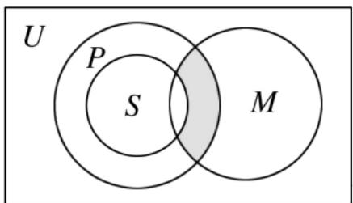

# 高中 数学 必修 第一册

# 第一章 集合与常用逻辑用语 1.3 集合的基本运算

# 一、单选题（共8题）

1.【单选题】设集合 $X = \{x\in Z| - 3 <   x <   2\}$ ， $Y = \{y\in Z| - 1\leq y\leq 3\}$ ，则 $X\cap Y =$ （

A. $\{0,1\}$   
B. $\{-1,0,1\}$   
C. $\{0,1,2\}$   
D. $\{-1,0,1,2\}$

2.【单选题】已知集合 $A=\{x\mid3<2x-1<5\}$ ， $B=\{x\mid x<m\}$ ，若 $A\cap B=\varnothing$ ，则m的取值范围为（）

A. $(-∞, 2)$   
B. $(-∞, 2]$   
C. $(3, +\infty)$   
D. $[3, +\infty)$

3.【单选题】设 $U = \mathsf{R}$ ，已知两个非空集合 $P$ ， $Q$ 满足 $(\partial_U P) \cup Q = \mathsf{R}$ ，则（）

A. $P \cap Q = R$   
B. $P \subseteq Q$   
C. $Q \subseteq P$   
D. $P \cup Q = R$

4.【单选题】满足条件的 $\{1, 2\} \cup A = \{1, 2, 3, 4\}$ , $A$ 集合的个数有（）

A. 1   
B. 2   
C. 3   
D. 4

5.【单选题】 $M=\{x|\log_{2}x<1\}$ ，集合 $N=\{x|x^{2}-1\leq0\}$ ，则 $M\cap N=$ （）

A. $\{x|1\leq x<2\}$

B. $\{x\mid-1\leq x<2\}$   
C. $\{x\mid -1 <   x\leq 1\}$   
D. $\{x|0<x\leq1\}$

6.【单选题】若集合 $A = \{x|y = \sqrt{2x - 1}\}$ ， $B = \{x|x\leq 1\}$ ，则 $A\cap B$ 是（）

A. $\left\{x\mid\frac{1}{2}\leq x\leq1\right\}$   
B. $\{x|x\leq-1\}$   
C. $\left\{x\mid -1\leq x\leq \frac{1}{2}\right\}$   
D. $\{x|x \geq 1\}$

7.【单选题】如图，U为全集，M，P，S是U的三个子集，则阴影部分所表示的集合是（）

text_image

U
P
S
M

A. $(M\cap P)\cap S$   
B. $(M\cap P)\cup S$   
C. $(M \cap P) \cap (\partial_{U} S)$   
D. $(M\cap P)\cup (\partial_U S)$

8.【单选题】已知集合 $A = \{1, 3, a^2\}$ , $B = \{1, a + 2\}$ , 若 $A \cup B = A$ , 则实数 $a$ 的值为（）

A. 2   
B. 1   
C. 1或2   
D. 1或2或-1

# 二、多选题（共3题）

9.【多选题】若X是一个集合， $\tau$ 是一个以X的某些子集为元素的集合，且满足：①X属于 $\tau$ ， $\varnothing$ 属于 $\tau$ ；② $\tau$ 中任意多个元素的并集属于 $\tau$ ；③ $\tau$ 中任意多个元素的交集属于 $\tau$ ．则称 $\tau$ 是集合X上的一个拓扑．已知集合 $X=\{a,b,c\}$ ，则下列集合 $\tau$ 是集合X上的拓扑的是（）

A. $\tau = \{\varnothing, \{a\}, \{c\}, \{a, b, c\}\}$   
B. $\tau = \{\varnothing, \{b\}, \{c\}, \{b, c\}, \{a, b, c\}\}$   
C. $\tau = \{\varnothing, \{a\}, \{a, b\}, \{a, c\}\}$   
D. $\tau = \{\varnothing, \{a, c\}, \{b, c\}, \{c\}, \{a, b, c\}\}$

10.【多选题】设集合 $M=\{x|x=6k+1,\ k\in Z\}$ ， $N=\{x|x=6k+4,\ k\in Z\}$ ， $P=\{x|x=3k-2,\ k\in Z\}$ ，则下列说法中正确的是（）

A. $M = N\subseteq P$   
B. $(M\cup N)\neq P$   
C. $M \cap N = \varnothing$   
D. $M \cup N = P$

11.【多选题】设集合 $A=\{2,4,2x\}$ ， $B=\{2,x^{2}\}$ ，且 $A\cap B=B$ ，则x的值为（）

A. 2   
B. -2   
C. 0   
D.-1

# 三、填空题（共4题）

12.【填空题】设 $A = \{1, 2, 3, 4, 5, 6\}$ , $B = \{1, 2, 7, 8\}$ 定义 $A$ 与 $B$ 的差集为 $A - B = \{x \mid x \in A \text{且} x \notin B\}$ , $A - (A - B) = \_$ .  
13. 【填空题】设全集为R，集合 $A=\{x\mid2\leq x<4\}$ ，集合 $B=\{x\mid x\leq1-2m\}$ ，若 $A\cap B\neq\varnothing$ ，则实数m的取值范围为\_\_\_\_。  
14.【填空题】某年级举行数学、物理、化学三项竞赛，共有80

名学生参赛，其中参加数学竞赛有40

人，参加物理竞赛有45人，参加化学竞赛有30人，同时参加物理、化学竞赛有15

人，同时参加数学、物理竞赛有20

人，同时参加数学、化学竞赛有10人，这个年级三个学科竞赛都参加的学生共有\_\_\_\_名.

15.【填空题】若集合 $A=\{(x,y)|x+y=0\}$ ， $B=\{(x,y)|x-2y+4=0\}$ ，C=

$\{(x, y) | y = 3x + b\}$ , 若 $(A \cap B) \subseteq C$ , 则 $b = \_$ .

# 四、复合题（共3题）

16.【复合题】已知集合 $A = \{x|3\leq 3^x\leq 27\}$ ， $B = \{x|log_2x > 1\}$

(1)【问答题】求 $A \cap B$

(2)【问答题】求 $(C_{R}B)\cup A$ ：

17.【复合题】已知集合 $A=\{x|x^{2}-3x+2=0,\ x\in R\}$ ，集合B=

$$
\{x \mid x ^ {2} - 2 (a + 1) x + a ^ {2} - 5 = 0, x \in R \}
$$

(1)【问答题】若集合 $A \cap B = \{2\}$ ，求实数a的值；

(2)【问答题】若 $A \cup B = A$ ，求实数a的取值范围.

18.【复合题】已知集合A为非空数集，定义： $S=\{x|x=a+b,\ a,\ b\in A\}$ ， $T=\{x|x=|a-b|,\ a,\ b\in A\}$ .

(1)【问答题】若集合 $A=\{1,3\}$ ，求证： $2\in S$ ，并直接写出集合T；  
(2)【问答题】若集合 $A=\{x_{1},\ x_{2},\ x_{3},\ x_{4}\}$ ， $x_{1}<x_{2}<x_{3}<x_{4}$ ，且T=A，求证： $x_{1}+x_{4}=x_{2}+x_{3}$ ;  
(3)【问答题】若集合 $A \subseteq \{x \mid 0 \leq x \leq 2021, x \in N\}$ ， $S \cap T = \varnothing$ ，记 $|A|$ 为集合A中元素的个数，求 $|A|$ 的最大值.

# 五、问答题（共2题）

19.【问答题】（2020高一上·上海期中）集合 $U = R, A = \{x \mid |x - 2| \leq x\}$ ， $B = \{x \mid \frac{1}{3 - x} \geq 1\}$ ，求： $A \cap B$   
20.【问答题】已知 $A=\{x|x^{2}-4x+3=0\}$ ， $B=\{x|ax-3=0\}$ ，且 $A\cap B=B$ ，求实数a的所有值构成的集合C.