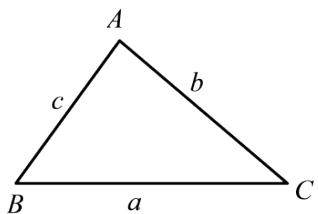
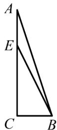

# 高中 数学 必修 第二册

# 第七章 复数 7.3\* 复数的三角表示

# 一、复合题（共1题）

1.【复合题】计算下列各式:

(1)【问答题】 $4(cos15^{\circ}+i\sin15^{\circ})(-1+i)$ ;  
(2)【问答题】 $(\cos3\theta - \mathrm{i}\sin3\theta) \div (\cos\theta - \mathrm{i}\sin\theta)$ .

# 二、问答题（共2题）

2.【问答题】利用复数证明余弦定理：如图，将三角形的三个顶点按逆时针方向分别为A，B，C，它们所对的边分别为a，b，c，证明： $a^{2}=b^{2}+c^{2}-2bccosA$ .

text_image

A
b
c
B
a
C

3.【问答题】如图，在Rt $\triangle ABC$ 中， $\angle C = \frac{\pi}{2}$ ， $BC = \frac{1}{3} AC$ ，点E在AC上，且EC = 2AE，利用复数证明： $\angle CBE + \angle CBA = \frac{3\pi}{4}$ .

