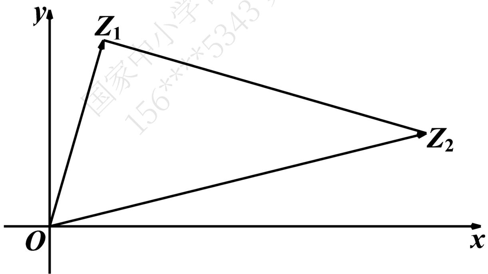

# 高中 数学 必修 第二册

# 第七章 复数 7.1 复数的概念

# 一、单选题（共1题）

1.【单选题】下列关于复数 $x + i$ （ $x \in C$ ）的说法一定正确的是（）

A. 是虚数  
B. 存在x使得 $x + i$ 是纯虚数  
C. 不是实数  
D. 实部和虚部均为1

# 二、多选题（共1题）

2.【多选题】若 $a^{2}-3a-b=(a-4)i+(4-b)i\quad(a,b\in R)$ ，则实数 $a+b$ 的值可能为（）

A. 8   
B. 4   
C. 0

D.-8

# 三、复合题（共1题）

3.【复合题】已知复数 $z=\frac{m^{2}+m-2}{m+2}+(m^{2}-2m-15)$ i（i是虚数单位）.

(1)【问答题】复数z是实数，求实数m的值；  
(2)【问答题】复数z是虚数，求实数m的取值范围；  
(3)【问答题】复数z是纯虚数，求实数m的值.

# 高中 数学 必修 第二册

# 第七章 复数 7.1 复数的概念

# 一、单选题（共1题）

1.【单选题】已知在复平面内复数z对应的点在第四象限，对应复数的模为3，且虚部为 $-\sqrt{5}$ ，则 $\overline{z}=$ （）

A. $-2 - \sqrt{5}i$

B. $2 + \sqrt{5}i$

C. $-2 + \sqrt{5}i$

D. $-\sqrt{5}-2i$

# 二、填空题（共1题）

2.【填空题】欧拉公式被称为世界上最完美的公式，欧拉公式又称为欧拉定理，是用在复分析领域的公式，欧拉公式将三角函数与复数指数函数相关联，即 $e^{i\theta} = \cos\theta + i\sin\theta$ （ $\theta \in \mathbb{R}$ ）．根据欧拉公式，若复数 $z_1 = e^{\frac{\pi}{4}i}$ ， $z_2 = e^{\frac{3\pi}{4}i}$ ，其在复平面内对应的向量分别为 $\overrightarrow{OZ_1}$ ， $\overrightarrow{OZ_2}$ ，则 $\overrightarrow{OZ_1}(\overrightarrow{OZ_1} + \overrightarrow{OZ_2}) =$ \_\_\_\_.

# 三、复合题（共1题）

3.【复合题】已知 $a\in R$ ，复数 $z=a^{2}-2a+4-(a^{2}-2a+3)$ i.问：

(1)【问答题】在复平面内，复数z对应的点位于第几象限？  
(2)【问答题】在复平面内，复数z对应的点是否在直线 $y = -x + 1$ 上？

# 四、问答题（共3题）

4.【问答题】已知O为坐标原点， $\overrightarrow{OZ_{1}}$ 对应的复数为 $-3+4i$ ， $\overrightarrow{OZ_{2}}$ 对应的复数为 $2a+i(a\in R)$ ．若 $\overrightarrow{OZ_{1}}$ 与 $\overrightarrow{OZ_{2}}$ 共线，求a的值.  
5.【问答题】若复数 $z=(a^{2}-a-6)+\frac{a+2}{2a-1}\mathrm{i}(a\in R)$ 是纯虚数，求 $z_{I}=(1-2a)+(a-1)\mathrm{i}$ 的模.  
6.【问答题】已知复数 $z=\lg(m^{2}-2m-2)+(m^{2}+3m+2)^{\mathrm{i}}$ ，若z对应的点在复平面的第二象限，试求实数m的取值范围.

# 高中 数学 必修 第二册

# 第七章 复数 7.2 复数的四则运算

# 一、填空题（共1题）

1. 【填空题】四边形ABCD是复平面内的平行四边形，三点A,B,C对应的复数分别为 $6 + 5i$ ， $-4 + 6i, l - 2i$ ，则点D对应的复数为\_\_\_\_。

# 二、复合题（共1题）

2.【复合题】计算：

(1)【问答题】 $(1-2i)+(3+4i)-(2+3i)$ ;  
(2)【问答题】 $(-3-2i)-(1-4i)+7i.$

# 三、问答题（共1题）

3.【问答题】证明复数加法的结合律.

# 高中 数学 必修 第二册

# 第七章 复数 7.2 复数的四则运算

# 一、填空题（共1题）

1.【填空题】i为虚数单位，若复数 $(1+mi)(i+2)$ 是纯虚数，则实数m等于\_\_\_\_。

# 二、复合题（共1题）

2.【复合题】已知复数 $z_{1}=2+i,\quad z_{2}=2-3i$ .

(1)【问答题】求 $\left|\frac{z_{2}}{z_{1}}\right|$ ;   
(2)【问答题】若 $|z|=5$ ，且复数z的实部为复数 $z_{1}-z_{2}$ 的虚部，求复数z.

# 三、问答题（共1题）

3.【问答题】已知复数 $z=(1-\mathrm{i})^{4}-(1+\mathrm{i})^{3}$ ，则 $|\bar{z}+2|=$

# 高中 数学 必修 第二册

# 第七章 复数 7.3\* 复数的三角表示

# 一、单选题（共1题）

1.【单选题】复数 $z = 1 - \mathrm{i}$ （i为虚数单位）的三角形式为（）

A. $z = \sqrt{2} (\cos 45^{\circ} + \mathrm{i}\cos 225^{\circ})$   
B. $z = \sqrt{2} (\cos 45^{\circ} - \mathrm{i}\sin 45^{\circ})$   
C. $z = -\sqrt{2} (\cos 135^{\circ} + \mathrm{i}\sin 135^{\circ})$   
D. $z = \sqrt{2} [cos(-45^{\circ}) + i sin(-45^{\circ})]$

# 二、填空题（共1题）

2.【填空题】复数 $z=-1+\left(\frac{1+i}{1-i}\right)^{2021}$ 的三角形式为\_\_\_\_，辐角的主值为\_\_\_\_.

# 三、复合题（共1题）

3.【复合题】分别指出下列复数的模和辐角的主值，并将复数表示成代数形式.

(1)【问答题】 $4\left(\cos\frac{\pi}{6}+\mathrm{i}\sin\frac{\pi}{6}\right)$ ;  
(2)【问答题】 $2\left(\cos\frac{\pi}{3}-\mathrm{i}\sin\frac{\pi}{3}\right)$ .

# 高中 数学 必修 第二册

# 第七章 复数 7.3\* 复数的三角表示

# 一、复合题（共1题）

1.【复合题】计算下列各式:

(1)【问答题】 $4(cos15^{\circ}+i\sin15^{\circ})(-1+i)$ ;  
(2)【问答题】 $(\cos3\theta - \mathrm{i}\sin3\theta) \div (\cos\theta - \mathrm{i}\sin\theta)$ .

# 二、问答题（共2题）

2.【问答题】利用复数证明余弦定理：如图，将三角形的三个顶点按逆时针方向分别为A，B，C，它们所对的边分别为a，b，c，证明： $a^{2}=b^{2}+c^{2}-2bccosA$ .

text_image

A
b
c
B
a
C

3.【问答题】如图，在Rt $\triangle ABC$ 中， $\angle C = \frac{\pi}{2}$ ， $BC = \frac{1}{3} AC$ ，点E在AC上，且EC = 2AE，利用复数证明： $\angle CBE + \angle CBA = \frac{3\pi}{4}$ .

# 高中 数学 必修 第二册

# 第七章 复数 7.3\* 复数的三角表示

# 一、单选题（共1题）

1.【单选题】设 $\pi < \theta < \frac{5\pi}{4}$ ，则复数 $\frac{\cos 2\theta + \mathrm{i}\sin 2\theta}{\cos\theta - \mathrm{i}\sin\theta}$ 的辐角的主值为（ ）.

A. $2 \pi - 3 \theta$

B. $3\theta - 2\pi$

C. $3\theta$

D. $3\theta - \pi$

# 二、填空题（共1题）

2.【填空题】求复数 $z=1+\cos\theta+i\sin\theta$ （ $\pi<\theta<2\pi$ ）的模是\_\_\_\_，辐角的主值是\_\_\_\_。

# 三、复合题（共1题）

3.【复合题】如图所示，若 $\overrightarrow{OZ_{1}}$ 和 $\overrightarrow{OZ_{2}}$ 分别表示复数 $z_{1}=1+2\sqrt{3}i,\quad z_{2}=7+\sqrt{3}i.$

text_image

y
Z₁
国家中小学
156**5343
Z₂
O
x

(1)【问答题】求 $\angle Z_{1}OZ_{2}$ ;   
(2)【问答题】判断 $\Delta Z_{1}OZ_{2}$ 的形状.

# 高中 数学 必修 第二册

# 第七章 复数 7.2 复数的四则运算

# 一、填空题（共1题）

1. 【填空题】若 $|z_{1} - z_{2}| = 1$ ，则称 $z_{1}$ 与 $z_{2}$ 互为“邻位复数”。已知复数 $z_{1} = a + \sqrt{3} \mathrm{i}$ 与 $z_{2} = 2 + b$ i互为“邻位复数”， $a, b \in \mathbb{R}$ ，则 $a^{2} + b^{2}$ 的最大值为 \_\_\_\_.

# 二、复合题（共2题）

2.【复合题】已知z是复数，z-3i为实数， $\frac{z-5i}{2-i}$ 为纯虚数（i为虚数单位）.

(1)【问答题】求复数z;   
(2)【问答题】求 $\frac{z}{l-i}$ 的模.

3.【复合题】已知i是虚数单位，复数 $z=m2(1+i)-m(2+3i)-4(2+i)$ ，当m分别取何实数时，z满足如下条件？

(1)【问答题】实数;   
(2)【问答题】虚数;   
(3)【问答题】纯虚数;   
(4)【问答题】零.