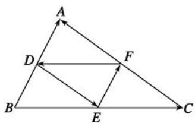

# 高中 数学 必修 第二册

# 第六章 平面向量及其应用 6.2 平面向量的运算

# 6.2.1向量的加法运算

# 一、单选题（共2题）

1.【单选题】已知D,E,F分别是 $\triangle ABC$ 边AB,BC,CA的中点，则下列等式中不正确的是( ).

text_image

A
D
F
B
E
C

A. $\overrightarrow{FD} +\overrightarrow{DA} = \overrightarrow{FA}$   
B. $\overrightarrow{FD} +\overrightarrow{EF} +\overrightarrow{DE} = \overrightarrow{BC}$   
C. $\overrightarrow{DE} +\overrightarrow{DA} = \overrightarrow{EC}$   
D. $\overrightarrow{DF} +\overrightarrow{DE} = \overrightarrow{DC}$

2.【单选题】如图所示的方格纸中有定点O,A,B,C,D,E,F，则 $\overrightarrow{OA}+\overrightarrow{OB}=(\quad)$ .

text_image

F
D
E
O
A
B
C

A. $\overrightarrow{OC}$   
B. $\overrightarrow{OD}$   
C. $\overrightarrow{FO}$   
D. $\overrightarrow{EO}$

# 二、填空题（共1题）

3.【填空题】在 $\triangle ABC$ 中，若 $|\overrightarrow{AB} +\overrightarrow{AC}| = |\overrightarrow{BC} |$ ，则 $\triangle ABC$ 的形状为