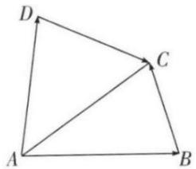

# 高中 数学 必修 第二册

# 第六章 平面向量及其应用 6.2 平面向量的运算

# 6.2.2 向量的减法运算

# 一、单选题（共1题）

1.【单选题】如图，在四边形ABCD中，设 $\overrightarrow{AB}=a,\quad\overrightarrow{AD}=b,\quad\overrightarrow{DC}=c$ ，则 $\overrightarrow{BC}$ 等于（）.

text_image

Geometric diagram of quadrilateral ABCD with diagonal AC, labeled vertices A, B, C, D

A. $a - b + c$   
B. b - a - c   
C. $a + b + c$   
D. $b - a + c$

# 二、填空题（共2题）

2.【填空题】化简以下各式:

① $\overrightarrow{AB}+\overrightarrow{BC}-\overrightarrow{AC};$   
② $\overrightarrow{AB}-\overrightarrow{AC}+\overrightarrow{BD}-\overrightarrow{CD};$   
③ $\overrightarrow{OA}-\overrightarrow{OD}+\overrightarrow{AD};$   
④ $\overrightarrow{NQ}+\overrightarrow{QP}-\overrightarrow{MN}-\overrightarrow{MP}.$

其中结果一定是零向量的有\_\_\_\_。（填写正确选项的序号）

3.【填空题】若O是 $\triangle ABC$ 所在平面内一点，且满足 $|\overrightarrow{OA} - \overrightarrow{OC}| = |\overrightarrow{OA} + \overrightarrow{OC} - 2\overrightarrow{OB}|$ ，则 $\triangle ABC$ 的形状为 \_\_\_\_.