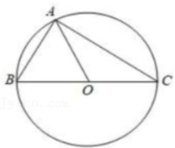

# 高中 数学 必修 第二册

# 第六章 平面向量及其应用 6.2 平面向量的运算

# 6.2.4向量的数量积

# 一、单选题（共1题）

1.【单选题】已知 $\triangle ABC$ 的外接圆圆心为 $0$ ，且 $2\overrightarrow{AO} = \overrightarrow{AB} + \overrightarrow{AC}$ ， $|\overrightarrow{AO}| = |\overrightarrow{AB}|$ ，则向量 $\overrightarrow{CA}$ 在向量 $\overrightarrow{BC}$ 上的投影向量为（ ）.

text_image

A
B
O
C

A. $-\frac{3}{4}\overrightarrow{BC}$   
B. $\frac{3}{4}\overrightarrow{BC}$   
C. $\frac{\sqrt{3}}{4}\overrightarrow{BC}$   
D. $-\frac{\sqrt{3}}{4}\overrightarrow{BC}$

# 二、填空题（共1题）

2.【填空题】已知 $|a|=6$ ，e为单位向量，若向量a与e的夹角为 $135^{\circ}$ ，则向量a在e上的投影向量为\_\_\_\_。

# 三、问答题（共1题）

3.【问答题】在 $\triangle ABC$ 中，角 $A, B, C$ 的对边分别为 $a, b, c,$ 且 $2\cos^2\frac{A - B}{2}$ $\cos B - \sin (A - B)\sin B + \cos (A + C) = -\frac{3}{5}$ ，若 $c = 4\sqrt{2}$ ，求向量 $\overrightarrow{AB}$ 在 $\overrightarrow{AC}$ 方向上的投影向量的模.