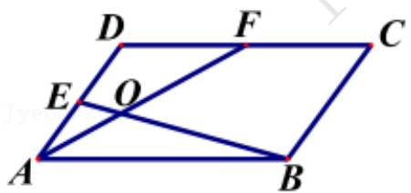

# 高中 数学 必修 第二册

# 第六章 平面向量及其应用 6.3

# 平面向量基本定理及坐标表示

# 6.3.1平面向量基本定理

# 一、多选题（共1题）

1.【多选题】(多选题)如果 $e1$ ， $e2$ 是平面 $a$

内一组不共线的向量，那么下列四组向量中，可以作为平面内所有向量的一个基底的是( )

A. $e_{1}$ 与 $e_{1}-e_{2}$   
B. $e_1 - 2e_2$ 与 $e_1 + 2e_2$   
C. $e_1 + e_2$ 与 $e_1 - e_2$   
D. $e_1 + 3e_2$ 与 $6e_{2} + 2e_{1}$

# 二、填空题（共1题）

2.【填空题】在 $\triangle ABC$ 中，点 M, N 满足 $\overrightarrow{AM} = 2\overrightarrow{MC}$ ， $\overrightarrow{BN} = \overrightarrow{NC}$ ，若 $\overrightarrow{MN} = x\overrightarrow{AB} + y\overrightarrow{AC}$ ，则 x = \_\_\_\_，y = \_\_\_\_.

# 三、复合题（共1题）

3. 【复合题】平行四边形ABCD中，E, F分别为AD, DC的中点，BE与AF相交于点O，记 $\overrightarrow{AB}=a,\quad\overrightarrow{AD}=b.$

text_image

D
F
C
E
O
A
B

(1)【问答题】用a, b表示 $\overrightarrow{BE}$ ;  
(2)【问答题】若 $\overrightarrow{AO}=\lambda\overrightarrow{AF},\quad\overrightarrow{BO}=\mu\overrightarrow{BE}$ ，求实数 $\lambda$ 和 $\mu$ 的值.