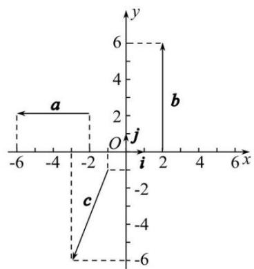

# 高中 数学 必修 第二册

# 第六章 平面向量及其应用 6.3

# 平面向量基本定理及坐标表示

# 6.3.3 平面向量加、减运算的坐标表示

# 一、单选题（共1题）

1.【单选题】已知 $a=(5,-2)$ , $b=(-4,-3)$ , $c=(x,y)$ , 若 $a+c=b$ , 则c等于（）

A. $(-9,1)$   
B. $(9,1)$   
C. $(9,-1)$   
D. $(-9,-1)$

# 二、多选题（共1题）

2.【多选题】（多选题）已知向量 $i=(1,0)$ ， $j=(0,1)$ ，对坐标平面内的任意一向量a，下列结论中正确的是（）

A. 存在唯一的一对实数x,y，使得 $a=(x,y)$   
B. 若 $a = 2i + 3j$ ，则向量a的坐标为(2,3)  
C. 若 $x, y \in \mathbb{R}$ , $a = (x, y)$ 且 $a$ 不是零向量, 则 $a$ 的起点是原点 $O$   
D. 若 $x, y \in \mathbb{R}$ , a 的起点坐标是 $(-1, 1)$ , 且 a 的终点坐标是 $(x, y)$ , 则 $a = (x + 1, y - 1)$

# 三、填空题（共2题）

3.【填空题】已知 $M(3,-2),N(-5,-1),\overrightarrow{MP}=2\overrightarrow{MN}$ ，则点P的坐标为\_\_\_\_.  
4.【填空题】如图，向量a,b,c的坐标分别是\_\_\_\_，\_\_\_\_，\_\_\_\_。

text_image

a
b
c
-6
-2
O
j
i
x
y

# 四、复合题（共1题）

5.【复合题】已知三点 $A_{(2, - 1)},B_{(3,4)},C_{(-2,0)}$ ，试求：

(1)【问答题】 $\overrightarrow{AB}-\overrightarrow{AC};$   
(2)【问答题】 $\overrightarrow{BC}+\overrightarrow{BA}.$

# 五、问答题（共1题）

6.【问答题】在直角坐标系 $xOy$ 中，向量a,b,c如图所示，且它们的长度分别为2,3,3，求它们的坐标.

text_image

b
β = 30°
1
a
α = 45°
γ = 60°
-1 o 1 x
-1
-2
c
y

