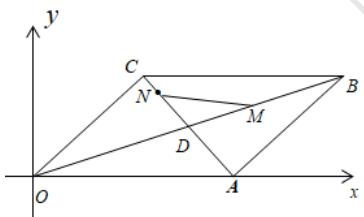

# 高中 数学 必修 第二册

# 第六章 平面向量及其应用 6.3

# 平面向量基本定理及坐标表示

# 6.3.4平面向量数乘运算的坐标表示

# 一、单选题（共1题）

1.【单选题】已知向量 $a=(3,-1)$ ， $b=(1,-2)$ ，则 $-3a+3b=$ （）

A. $(6,3)$

B. $(-6,-3)$

C. $(-6,3)$

D. $(6,-3)$

# 二、复合题（共1题）

2. 【复合题】已知点 $O(0,0), A(1,2), B(4,5)$ ， $\overrightarrow{OP} = \overrightarrow{OA} + t\overrightarrow{OB}$ ，试问：

(1)【问答题】当t为何值时，点P在x轴上？点P在y轴上？点P在第二象限？  
(2)【问答题】四边形OABP是否能构成平行四边形？若能，求出t的值；若不能，说明理由.

# 三、问答题（共1题）

3.【问答题】如图，平行四边形OABC对角线交于点D，且 $\overrightarrow{DN}=2\overrightarrow{NC},\overrightarrow{DB}=2\overrightarrow{DM}$ ，若OA=2,OC= $\sqrt{2},\angle CO_{A}=45^{\circ}$ ，试求 $\overrightarrow{MN}$ 的坐标.

text_image

y
C
N
M
D
O
A
x

