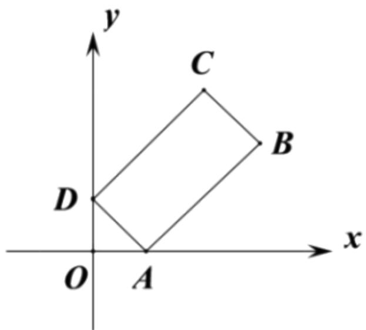

# 高中 数学 必修 第二册

# 第六章 平面向量及其应用 6.3

# 平面向量基本定理及坐标表示

# 6.3.5平面向量数量积的坐标表示

# 一、单选题（共1题）

1. 【单选题】已知 $a=(1,t)$ ， $b=(t,2)$ ， $c=(4,3)$ ，若 $(2a+b)\cdot a=1$

，则向量a在向量c方向上的投影向量为（）.

A. $\left(\frac{4}{25},\frac{3}{25}\right)$   
B. $\left(\frac{2}{5},\frac{3}{10}\right)$   
C. $\left(\frac{3}{25},\frac{1}{25}\right)$ 或 $\left(\frac{3}{5},\frac{3}{10}\right)$   
D. $\left(\frac{4}{25},\frac{3}{25}\right)$ 或 $\left(\frac{2}{5},\frac{3}{10}\right)$

# 二、填空题（共1题）

2.【填空题】向量 $a=(2,-1)$ ， $b=(1,3)$ ，则 $(a+2b)\cdot a=$ \_\_\_\_.

# 三、问答题（共1题）

3.【问答题】3. 如图在矩形ABCD中，顶点A，D分别在x轴，y

轴的正半轴上（含原点）滑动，且矩形ABCD位于第一象限，若AD=1，AB=2，O为坐标原点，试求 $\overrightarrow{OB}\cdot\overrightarrow{OC}$ 的最大值.

text_image

y
C
B
D
O A x

