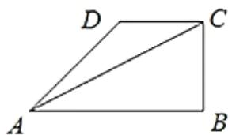

# 高中 数学 必修 第二册

# 第六章 平面向量及其应用 6.4 平面向量的应用

# 6.4.3余弦定理、正弦定理

# 一、单选题（共2题）

1.【单选题】如图，设 $\triangle ABC$ 的内角 A, B, C 的对边分别为 a, b, c， $a\cos C + c\cos A = b\sin B$ ，且 $\angle CAB = \frac{\pi}{6}$ . 若点 D 是 $\triangle ABC$ 外一点，DC = 2，DA = 3，则当四边形 ABCD 面积最大值时， $\sin D = (\quad)$ .

text_image

D
C
A
B

A. $\frac{2\sqrt{7}}{7}$   
B. $\frac{\sqrt{7}}{7}$   
C. $\frac{2\sqrt{5}}{5}$   
D. $\frac{\sqrt{5}}{5}$

2.【单选题】 $\triangle ABC$ 中三边上的高依次为 $\frac{1}{3}$ , $\frac{1}{4}$ , $\frac{1}{5}$ , 则 $\triangle ABC$ 为( ).

A. 锐角三角形  
B. 直角三角形  
C. 钝角三角形  
D. 不存在这样的三角形

# 二、复合题（共1题）

3.【复合题】在 $\triangle ABC$ 中，角 $A, B, C$ 的对边分别为 $a, b, c$ ，满足 $\frac{\cos C}{\cos B} + \cos A = 2\sqrt{2}\sin A$ .

(1)【问答题】求cosB的值;   
(2)【问答题】若 $a+c=1$ ，求b的取值范围.