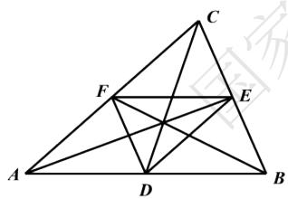

# 高中 数学 必修 第二册

# 第六章 平面向量及其应用 6.2 平面向量的运算

# 向量线性运算习题课

# 一、单选题（共1题）

1.【单选题】已知 $|\overrightarrow{BA}|=2,|\overrightarrow{AC}|=1$ ，则 $|\overrightarrow{BC}|$ 的最大值是（）.

A. 1

B. 2

C. 3

D. 4

# 二、复合题（共1题）

2.【复合题】化简：

(1)【填空题】 $(\overrightarrow{AB}+\overrightarrow{MB})+\overrightarrow{CM}+\overrightarrow{BC}=$ \_\_\_\_；  
(2)【填空题】 $\overrightarrow{AB}+\overrightarrow{DF}+\overrightarrow{CD}+\overrightarrow{FA}+\overrightarrow{BC}=$ \_\_\_\_.

# 三、问答题（共1题）

3.【问答题】如图，点D,E,F分别为 $\triangle ABC$ 的三边AB,BC,CA的中点.

text_image

Geometric diagram of triangle ABC with internal points D, E, F and connecting lines forming smaller triangles and intersecting segments.

证明：（1） $\overrightarrow{BA}+\overrightarrow{AF}=\overrightarrow{BC}+\overrightarrow{CF};$

(2) $\overrightarrow{AE} + \overrightarrow{BF} + \overrightarrow{CD} = 0.$