# 高中 数学 必修 第二册

# 第六章 平面向量及其应用 6.1 平面向量的概念

# 一、单选题（共3题）

1.【单选题】如图所示，四边形ABCD,CEFG,CGHD

是全等的菱形，则下列结论中不一定成立的是（）

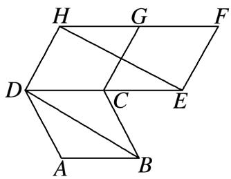

text_image

H G F
D C E
A B

A. $|\overrightarrow{AB}| = |\overrightarrow{EF}|$   
B. $\overrightarrow{AB}$ 与 $\overrightarrow{FH}$ 共线  
C. $|\overrightarrow{BD}| = |\overrightarrow{EH}|$   
D. $\overrightarrow{CD} = \overrightarrow{FG}$

2.【单选题】给出下列命题：

①相等的两个向量一定是共线向量；  
②若两个向量相等，则它们的起点和终点分别重合；  
③若向量 $\overrightarrow{AB},\overrightarrow{CD}$ 共线，则点A,B,C,D必在同一直线上；  
④若 $a\parallel b$ 且 $b\parallel c$ ，则 $a\parallel c$ .

其中正确命题的个数为（）

A. 1   
B. 2   
C. 3   
D. 4

3.【单选题】下列命题正确的个数是（）

①零向量没有方向；  
②任意两个单位向量的方向相同；  
③向量 $\overrightarrow{AB}$ 与 $\overrightarrow{BA}$ 的长度相同；  
④向量的模是正实数.

⑤若 $|a|>|b|$ ，则a>b.

A. 1

B. 2

C. 3

D. 4

# 二、多选题（共1题）

4.【多选题】下列命题是真命题的是（ ）.

A. 若 $A, B, C, D$ 在一条直线上，则 $\overrightarrow{AB}$ 与 $\overrightarrow{CD}$ 是共线向量  
B. 若 $A, B, C, D$ 不在一条直线上，则 $\overrightarrow{AB}$ 与 $\overrightarrow{CD}$ 不是共线向量  
C. 若向量 $\overrightarrow{AB}$ 与 $\overrightarrow{CD}$ 是共线向量，则 A, B, C, D 四点必在一条直线上  
D. 若向量 $\overrightarrow{AB}$ 与 $\overrightarrow{AC}$ 是共线向量，则 A, B, C 三点必在一条直线上

# 三、填空题（共2题）

5.【填空题】八卦是中国文化中的基本哲学概念，如图①是八卦模型图，其外形为图②所示的正八边形 $ABCDEFGH$ 其中点 $O$ 是正八边形的中心，记 $OA = 1$ 。在 $A, B, C, D, E, F, G, H$ 以及中心 $O$ 九个点中任意取两点分别为起点与终点的向量中，模等于1的向量有\_\_\_\_个？模等于 $\sqrt{2}$ 的向量有\_\_\_\_个？与 $\overrightarrow{AB}$ 方向相同或相反的向量共有\_\_\_\_个？

text_image

乾
艮
坤

①

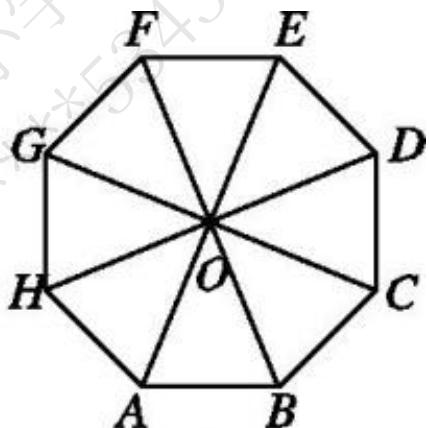

text_image

F
E
G
D
H
O
C
A
B

②

6.【填空题】已知以下物理量:

①位移；②摩擦力；③压强；④速率；⑤角度；⑥加速度.

其中不是向量的是\_\_\_\_（填序号）.

# 高中 数学 必修 第二册

# 第六章 平面向量及其应用 6.2 平面向量的运算

# 6.2.1向量的加法运算

# 一、单选题（共2题）

1.【单选题】已知D,E,F分别是 $\triangle ABC$ 边AB,BC,CA的中点，则下列等式中不正确的是( ).

text_image

A
D
F
B
E
C

A. $\overrightarrow{FD} +\overrightarrow{DA} = \overrightarrow{FA}$   
B. $\overrightarrow{FD} +\overrightarrow{EF} +\overrightarrow{DE} = \overrightarrow{BC}$   
C. $\overrightarrow{DE} +\overrightarrow{DA} = \overrightarrow{EC}$   
D. $\overrightarrow{DF} +\overrightarrow{DE} = \overrightarrow{DC}$

2.【单选题】如图所示的方格纸中有定点O,A,B,C,D,E,F，则 $\overrightarrow{OA}+\overrightarrow{OB}=$ （）.

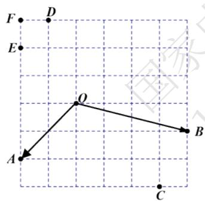

text_image

F
D
E
O
A
B
C

A. $\overrightarrow{OC}$   
B. $\overrightarrow{OD}$   
C. $\overrightarrow{FO}$   
D. $\overrightarrow{EO}$

# 二、填空题（共1题）

3.【填空题】在 $\triangle ABC$ 中，若 $|\overrightarrow{AB} + \overrightarrow{AC}| = |\overrightarrow{BC}|$ ，则 $\triangle ABC$ 的形状为 \_\_\_\_。

# 高中 数学 必修 第二册

# 第六章 平面向量及其应用 6.2 平面向量的运算

# 6.2.2 向量的减法运算

# 一、单选题（共1题）

1.【单选题】如图，在四边形ABCD中，设 $\overrightarrow{AB}=a,\quad\overrightarrow{AD}=b,\quad\overrightarrow{DC}=c$ ，则 $\overrightarrow{BC}$ 等于（）.

text_image

Geometric diagram of quadrilateral ABCD with diagonal AC, labeled vertices A, B, C, D

A. $a - b + c$   
B. b - a - c   
C. $a + b + c$   
D. $b - a + c$

# 二、填空题（共2题）

2.【填空题】化简以下各式:

① $\overrightarrow{AB}+\overrightarrow{BC}-\overrightarrow{AC};$   
② $\overrightarrow{AB}-\overrightarrow{AC}+\overrightarrow{BD}-\overrightarrow{CD};$   
③ $\overrightarrow{OA}-\overrightarrow{OD}+\overrightarrow{AD};$   
④ $\overrightarrow{NQ}+\overrightarrow{QP}-\overrightarrow{MN}-\overrightarrow{MP}.$

其中结果一定是零向量的有\_\_\_\_。（填写正确选项的序号）

3.【填空题】若O是 $\triangle ABC$ 所在平面内一点，且满足 $|\overrightarrow{OA} - \overrightarrow{OC}| = |\overrightarrow{OA} + \overrightarrow{OC} - 2\overrightarrow{OB}|$ ，则 $\triangle ABC$ 的形状为 \_\_\_\_.

# 高中 数学 必修 第二册

# 第六章 平面向量及其应用 6.2 平面向量的运算

# 6.2.3向量的数乘运算

# 一、单选题（共1题）

1.【单选题】已知 $\lambda,\mu\in R$ ，下面式子正确的是（）.

A. $\lambda a$ 与 $a$ 同向  
B. 0a = 0   
C. $(\lambda + \mu)\mathbf{a} = \lambda \mathbf{a} + \mu \mathbf{a}$   
D. 若 $\mathsf{b} = \lambda \mathsf{a}$ , 则 $|b| = \lambda |a|$

# 二、填空题（共1题）

2.【填空题】化简： $\frac{1}{3}\left[\frac{1}{2}(2a+8b)-(4a-2b)\right]=$ \_\_\_\_.

# 三、问答题（共1题）

3.【问答题】已知a,b是两个不共线的向量，向量b-ta， $\frac{1}{2}a-\frac{3}{2}b$ 共线，求实数t的值.

# 高中 数学 必修 第二册

# 第六章 平面向量及其应用 6.2 平面向量的运算

# 向量线性运算习题课

# 一、单选题（共1题）

1.【单选题】已知 $|\overrightarrow{BA}|=2,|\overrightarrow{AC}|=1$ ，则 $|\overrightarrow{BC}|$ 的最大值是（）.

A. 1

B. 2

C. 3

D. 4

# 二、复合题（共1题）

2.【复合题】化简：

(1)【填空题】 $(\overrightarrow{AB}+\overrightarrow{MB})+\overrightarrow{CM}+\overrightarrow{BC}=$ \_\_\_\_；  
(2)【填空题】 $\overrightarrow{AB}+\overrightarrow{DF}+\overrightarrow{CD}+\overrightarrow{FA}+\overrightarrow{BC}=$ \_\_\_\_.

# 三、问答题（共1题）

3.【问答题】如图，点D,E,F分别为 $\triangle ABC$ 的三边AB,BC,CA的中点.

text_image

Geometric diagram of triangle ABC with internal points D, E, F and connecting lines forming smaller triangles and intersecting segments.

证明：（1） $\overrightarrow{BA}+\overrightarrow{AF}=\overrightarrow{BC}+\overrightarrow{CF};$

(2) $\overrightarrow{AE} + \overrightarrow{BF} + \overrightarrow{CD} = 0.$

# 高中 数学 必修 第二册

# 第六章 平面向量及其应用 6.2 平面向量的运算

# 6.2.4向量的数量积

# 一、单选题（共1题）

1.【单选题】已知 $|a|=1$ ， $|b|=\sqrt{2}$ ，且a-b与a垂直，则a与b的夹角为（）.

A. $30^{\circ}$

B. $60^{\circ}$

C. $45^{\circ}$

D. $90^{\circ}$

# 二、复合题（共1题）

2.【复合题】已知 $|a|=2,\quad|b|=3$ ，向量a与b的夹角为 $\frac{2\pi}{3}$ .

(1)【问答题】求 $|a - b|$ ;

(2)【问答题】若 $2a + b$ 与 $ma + 4b$ 垂直，求实数m的值.

# 三、问答题（共1题）

3.【问答题】已知平面向量 $|a|=2,\quad|b|=1$ ，若对任意的实数 $\lambda,\quad|a-\lambda b|$ 的最小值为 $\sqrt{3}$ ，求 $|a-b|$ .

# 高中 数学 必修 第二册

# 第六章 平面向量及其应用 6.2 平面向量的运算

# 6.2.4向量的数量积

# 一、单选题（共1题）

1. 【单选题】在边长为1的等边 $\triangle ABC$ 中，设 $\overrightarrow{BC} = a, \overrightarrow{CA} = b, \overrightarrow{AB} = c$ ，则 $a \cdot b + b \cdot c + c \cdot a$ 等于（）.

A. $-\frac{3}{2}$ B. 0 C. $\frac{3}{2}$ D. 3

# 二、填空题（共1题）

2.【填空题】一个物体在大小为10N的力F的作用下产生的位移S的大小为50m，且力F所做的功 $W=250\sqrt{2}J$ ，则F与S的夹角等于\_\_\_\_。

# 三、复合题（共1题）

3.【复合题】若a，b是平面内两个非零向量，它们的夹角为θ，则

(1)【填空题】当 $a \cdot b = |a||b|$ 时， $\theta =$ \_\_\_\_；  
(2)【填空题】当 $a \cdot b = 0$ 时， $\theta =$ \_\_\_\_；  
(3)【填空题】当 $a \cdot b = -|a||b|$ 时， $\theta =$ \_\_\_\_.

# 高中 数学 必修 第二册

# 第六章 平面向量及其应用 6.2 平面向量的运算

# 6.2.4向量的数量积

# 一、单选题（共1题）

1.【单选题】已知 $\triangle ABC$ 的外接圆圆心为 $0$ ，且 $2\overrightarrow{AO} = \overrightarrow{AB} + \overrightarrow{AC}$ ， $|\overrightarrow{AO}| = |\overrightarrow{AB}|$ ，则向量 $\overrightarrow{CA}$ 在向量 $\overrightarrow{BC}$ 上的投影向量为（ ）.

text_image

A
B
O
C

A. $-\frac{3}{4}\overrightarrow{BC}$   
B. $\frac{3}{4}\overrightarrow{BC}$   
C. $\frac{\sqrt{3}}{4}\overrightarrow{BC}$   
D. $-\frac{\sqrt{3}}{4}\overrightarrow{BC}$

# 二、填空题（共1题）

2.【填空题】已知 $|a|=6$ ，e为单位向量，若向量a与e的夹角为 $135^{\circ}$ ，则向量a在e上的投影向量为\_\_\_\_。

# 三、问答题（共1题）

3.【问答题】在 $\triangle ABC$ 中，角 $A, B, C$ 的对边分别为 $a, b, c,$ 且 $2\cos^2\frac{A - B}{2}$ $\cos B - \sin (A - B)\sin B + \cos (A + C) = -\frac{3}{5}$ ，若 $c = 4\sqrt{2}$ ，求向量 $\overrightarrow{AB}$ 在 $\overrightarrow{AC}$ 方向上的投影向量的模.

# 高中 数学 必修 第二册

# 第六章 平面向量及其应用 6.3

# 平面向量基本定理及坐标表示

# 6.3.1 平面向量基本定理

# 一、多选题（共1题）

1.【多选题】(多选题)如果 $e1$ ， $e2$ 是平面 $a$

内一组不共线的向量，那么下列四组向量中，可以作为平面内所有向量的一个基底的是( )

A. $e_{1}$ 与 $e_{1}-e_{2}$   
B. $e_1 - 2e_2$ 与 $e_1 + 2e_2$   
C. $e_1 + e_2$ 与 $e_1 - e_2$   
D. $e_1 + 3e_2$ 与 $6e_{2} + 2e_{1}$

# 二、填空题（共1题）

2.【填空题】在 $\triangle ABC$ 中，点 M, N 满足 $\overrightarrow{AM} = 2\overrightarrow{MC}$ ， $\overrightarrow{BN} = \overrightarrow{NC}$ ，若 $\overrightarrow{MN} = x\overrightarrow{AB} + y\overrightarrow{AC}$ ，则 x = \_\_\_\_，y = \_\_\_\_.

# 三、复合题（共1题）

3. 【复合题】平行四边形ABCD中，E, F分别为AD, DC的中点，BE与AF相交于点O，记 $\overrightarrow{AB}=a,\quad\overrightarrow{AD}=b.$

text_image

D
F
C
E
O
A
B

(1)【问答题】用a, b表示 $\overrightarrow{BE}$ ;  
(2)【问答题】若 $\overrightarrow{AO}=\lambda\overrightarrow{AF},\quad\overrightarrow{BO}=\mu\overrightarrow{BE}$ ，求实数 $\lambda$ 和 $\mu$ 的值.

# 高中 数学 必修 第二册

# 第六章 平面向量及其应用 6.3

# 平面向量基本定理及坐标表示

# 6.3.3 平面向量加、减运算的坐标表示

# 一、单选题（共1题）

1.【单选题】已知 $a=(5,-2)$ , $b=(-4,-3)$ , $c=(x,y)$ , 若 $a+c=b$ , 则c等于（）

A. $(-9,1)$   
B. $(9,1)$   
C. $(9,-1)$   
D. $(-9,-1)$

# 二、多选题（共1题）

2.【多选题】（多选题）已知向量 $i=(1,0)$ ， $j=(0,1)$ ，对坐标平面内的任意一向量a，下列结论中正确的是（）

A. 存在唯一的一对实数x,y，使得 $a=(x,y)$   
B. 若 $a = 2i + 3j$ ，则向量a的坐标为(2,3)  
C. 若 $x, y \in \mathbb{R}$ , $a = (x, y)$ 且 $a$ 不是零向量, 则 $a$ 的起点是原点 $O$   
D. 若 $x, y \in \mathbb{R}$ , a 的起点坐标是 $(-1, 1)$ , 且 a 的终点坐标是 $(x, y)$ , 则 $a = (x + 1, y - 1)$

# 三、填空题（共2题）

3.【填空题】已知 $M(3,-2),N(-5,-1),\overrightarrow{MP}=2\overrightarrow{MN}$ ，则点P的坐标为\_\_\_\_.  
4.【填空题】如图，向量a,b,c的坐标分别是\_\_\_\_，\_\_\_\_，\_\_\_\_。

text_image

a
b
c
i
j
O
x
y

# 四、复合题（共1题）

5.【复合题】已知三点 $A_{(2, - 1)},B_{(3,4)},C_{(-2,0)}$ ，试求：

(1)【问答题】 $\overrightarrow{AB}-\overrightarrow{AC};$   
(2)【问答题】 $\overrightarrow{BC}+\overrightarrow{BA}.$

# 五、问答题（共1题）

6.【问答题】在直角坐标系 $xOy$ 中，向量a,b,c如图所示，且它们的长度分别为2,3,3，求它们的坐标.

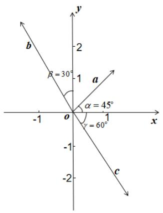

text_image

b
β = 30°
1
a
α = 45°
γ = 60°
-1 o 1 x
-1
-2
c
y

# 高中 数学 必修 第二册

# 第六章 平面向量及其应用 6.3

# 平面向量基本定理及坐标表示

# 6.3.4平面向量数乘运算的坐标表示

# 一、单选题（共1题）

1.【单选题】已知向量 $a=(3,-1)$ ， $b=(1,-2)$ ，则 $-3a+3b=$ （）

A. $(6,3)$

B. $(-6,-3)$

C. $(-6,3)$

D. $(6,-3)$

# 二、复合题（共1题）

2. 【复合题】已知点 $O(0,0), A(1,2), B(4,5)$ ， $\overrightarrow{OP} = \overrightarrow{OA} + t\overrightarrow{OB}$ ，试问：

(1)【问答题】当t为何值时，点P在x轴上？点P在y轴上？点P在第二象限？  
(2)【问答题】四边形OABP是否能构成平行四边形？若能，求出t的值；若不能，说明理由.

# 三、问答题（共1题）

3.【问答题】如图，平行四边形OABC对角线交于点D，且 $\overrightarrow{DN}=2\overrightarrow{NC},\overrightarrow{DB}=2\overrightarrow{DM}$ ，若OA=2,OC= $\sqrt{2},\angle CO_{A}=45^{\circ}$ ，试求 $\overrightarrow{MN}$ 的坐标.

text_image

y
C
N
M
D
O
A
x

# 高中 数学 必修 第二册

# 第六章 平面向量及其应用 6.3

# 平面向量基本定理及坐标表示

# 6.3.4平面向量数乘运算的坐标表示

# 一、单选题（共2题）

1.【单选题】向量 $a=(1,0)$ ， $b=(2,1)$ ， $c=(x,2)$ ，若 $a-\frac{2}{3}b$ 与c共线，则x=（）

A.-3   
B.-2   
C. -1   
D. 1

2. 【单选题】设 $\overrightarrow{OA} = (1, -2)$ , $\overrightarrow{OB} = (a, -1)$ , $\overrightarrow{OC} = (-b, 0)$ ，其中 a > 0, b > 0, O 为坐标原点，若 A, B, C 三点共线，则 $\frac{2}{a} + \frac{4}{b}$ 的最小值为（）

A. 12   
B. 16   
C. 18   
D. 19

# 二、复合题（共1题）

3.【复合题】已知 $e_{1}$ ， $e_{2}$ 是平面内两个不共线的非零向量， $\overrightarrow{AB}=2e_{1}+e_{2}$ ， $\overrightarrow{BE}=-e_{1}+\lambda e_{2}$ ， $\overrightarrow{EC}=-2e_{1}+e_{2}$ ，且A，E，C三点共线.

(1)【问答题】求实数 $\lambda$ 的值;  
(2)【问答题】若 $e_{1}=(1,0)$ ， $e_{2}=(0,1)$ ，求 $\overrightarrow{BC}$ 的坐标；  
(3)【问答题】已知点 $D(3,5)$ ，在（2）的条件下，若四边形ABCD为平行四边形，求点A的坐标.

# 高中 数学 必修 第二册

# 第六章 平面向量及其应用 6.3

# 平面向量基本定理及坐标表示

# 6.3.5平面向量数量积的坐标表示

# 一、单选题（共1题）

1. 【单选题】已知 $a=(1,t)$ ， $b=(t,2)$ ， $c=(4,3)$ ，若 $(2a+b)\cdot a=1$

，则向量a在向量c方向上的投影向量为（）.

A. $\left(\frac{4}{25},\frac{3}{25}\right)$   
B. $\left(\frac{2}{5},\frac{3}{10}\right)$   
C. $\left(\frac{3}{25},\frac{1}{25}\right)$ 或 $\left(\frac{3}{5},\frac{3}{10}\right)$   
D. $\left(\frac{4}{25},\frac{3}{25}\right)$ 或 $\left(\frac{2}{5},\frac{3}{10}\right)$

# 二、填空题（共1题）

2.【填空题】向量 $a=(2,-1)$ ， $b=(1,3)$ ，则 $(a+2b)\cdot a=$ \_\_\_\_.

# 三、问答题（共1题）

3.【问答题】3. 如图在矩形ABCD中，顶点A，D分别在x轴，y

轴的正半轴上（含原点）滑动，且矩形ABCD位于第一象限，若AD=1，AB=2，O为坐标原点，试求 $\overrightarrow{OB}\cdot\overrightarrow{OC}$ 的最大值.

text_image

y
C
B
D
O A x

# 高中 数学 必修 第二册

# 第六章 平面向量及其应用 6.3

# 平面向量基本定理及坐标表示

# 6.3.5平面向量数量积的坐标表示

# 一、单选题（共1题）

1.【单选题】若 $a = (-2, 1)$ , $b = (1, -1)$ , 则 $|a - 2b| = (\quad)$

A. 2

B. $\sqrt{3}$

C. $\sqrt{5}$

D. 5

# 二、填空题（共1题）

2.【填空题】已知非零向量a，b满足 $|a|+|b|=4$ ， $|2a-b|=2$ ，则 $|a+2b|$ 的最小值为\_\_\_\_。

# 三、复合题（共1题）

3.【复合题】已知向量 $m=(cosx,sinx)$ 和 $n=(\sqrt{2}-sinx,cosx)$ .

(1)【问答题】设 $f(x)=m\cdot n$ ，求函数 $y=f(\frac{\pi}{3}-2x)$ 的单调区间

(2)【问答题】若 $x\in[\pi,2\pi]$ ，求 $|m-n|$ 的最大值.

# 高中 数学 必修 第二册

# 第六章 平面向量及其应用 6.3

# 平面向量基本定理及坐标表示

# 平面向量习题课

# 一、单选题（共1题）

1.【单选题】设 $a = (\sqrt{3}, I)$ ， $b = (-3, \sqrt{3})$ ，则 $a$ 与 $b$ 的夹角为（）

A. $\frac{\pi}{3}$

B. $\frac{\pi}{2}$

C. $\frac{2\pi}{3}$

D. $\frac{3\pi}{4}$

# 二、多选题（共1题）

2.【多选题】（多选题）已知平面向量 $\overrightarrow{AB}=(-1,k)$ ， $\overrightarrow{AC}=(2,1)$ ，若 $\triangle ABC$ 是直角三角形，则k的可能取值是（）

A.-2

B. 2

C. 5

D. 7

# 三、复合题（共3题）

3.【复合题】在直角坐标系中，O是坐标原点，向量 $\overrightarrow{OA}=(3,1)$ ， $\overrightarrow{OB}=(2,-1)$ ， $\overrightarrow{OC}=(m,n)$ ，其中m>0,n>0。

(1)【问答题】若 $\overrightarrow{AB}\perp\overrightarrow{AC}$ ，求 $\frac{l}{m+1}+\frac{l}{n}$ 的最小值；

(2)【问答题】若 $\overrightarrow{OB}$ 与 $\overrightarrow{OC}$ 的夹角不超过 $45^{\circ}$ ，求 $\frac{n}{m}$ 的取值范围.

4.【复合题】已知向量 $\overrightarrow{AB} = (x,m)$ ， $\overrightarrow{AC} = (3x - 2,x + 2)$ .

(1)【问答题】若当x=2时， $\angle BAC=\frac{\pi}{2}$ ，则实数m的值为

(2)【问答题】若存在正数x，使得 $\overrightarrow{AB}$ 与 $\overrightarrow{AC}$ 共线，则实数m的取值范围是

5.【复合题】在平面直角坐标系中，O为坐标原点，已知向量 $a=(2,-1)$ ，点 $A(0,8)$ .

(1)【问答题】已知 $C(3,5)$ ，若四边形OABC为平行四边形，求 $\overrightarrow{AB}$ 与 $\overrightarrow{BC}$ 夹角的余弦值；  
(2)【问答题】若 $M(t, k \sin \theta) (0 \leq \theta \leq \frac{\pi}{2})$ ，且向量 $\overrightarrow{AM}$ 与向量 $a$ 共线，令 $f(\theta) = t \sin \theta$ ，当 $k > 4$ ，且 $f(\theta)$ 取最大值为4时，求 $\overrightarrow{OA} \cdot \overrightarrow{OM}$ .

# 四、问答题（共1题）

6. 【问答题】已知 $a=(1,2)$ ， $b=(\lambda,3)$ ，向量a与向量b夹角为锐角，则 $\lambda$ 的取值范围为

# 高中 数学 必修 第二册

# 第六章 平面向量及其应用 6.4 平面向量的应用

# 6.4.1 平面几何中的向量方法

# 一、单选题（共2题）

1.【单选题】已知在平面直角坐标系中， $A(1,1)$ ， $B(3,2)$ ， $C(4,4)$ ， $D(2,3)$ ，则四边形ABCD是（ ）.

A. 菱形  
B. 矩形  
C. 直角梯形  
D. 等腰梯形

2.【单选题】已知非零向量 $\overrightarrow{AB}$ 与 $\overrightarrow{AC}$ 满足 $(\overrightarrow{AB} + \overrightarrow{AC}) \cdot (\overrightarrow{AB} - \overrightarrow{AC}) = 0$ ，且 $\frac{\overrightarrow{AB}}{|\overrightarrow{AB}|} \frac{\overrightarrow{AC}}{|\overrightarrow{AC}|} = \frac{1}{2}$ ，则 $\triangle ABC$ 为（ ）.

A. 三边均不相等的三角形  
B. 直角三角形  
C. 等腰非等边三角形  
D. 等边三角形

# 二、填空题（共1题）

3.【填空题】下面有三个命题：

①若 $\overrightarrow{OA}=(3,-4)$ ， $\overrightarrow{OB}=(6,-3)$ ， $\overrightarrow{OC}=(5-m,3-m)$ ， $\angle ABC$ 为锐角，则实数m的取值范围是 $m>\frac{3}{4}$ ;  
②点O在 $\triangle ABC$ 所在的平面内，若 $\overrightarrow{OA} \cdot \overrightarrow{OB} = \overrightarrow{OB} \cdot \overrightarrow{OC} = \overrightarrow{OA} \cdot \overrightarrow{OC}$ ，则点O为 $\triangle ABC$ 的垂心；  
③已知 $O$ 为 $\triangle ABC$ 内部一点，且 $\overrightarrow{OA} +\overrightarrow{OB} +\sqrt{2OC} = 0,$ $|\overrightarrow{OA}| = |\overrightarrow{OB}| = |\overrightarrow{OC}| = 1$ ，则 $\triangle ABC$ 的面积为 $\frac{\sqrt{2} + 1}{2}$

其中真命题的序号是\_\_\_\_。

# 高中 数学 必修 第二册

# 第六章 平面向量及其应用 6.4 平面向量的应用

# 6.4.2 向量在物理中的应用举例

# 一、单选题（共1题）

1.【单选题】如图，物体受到一个水平向右的力 $F_{1}$ 及与它成 $60^{\circ}$ 角的另一个力 $F_{2}$ 的作用. 已知 $F_{1}$ 的大小为2N，它们的合力F与水平方向成 $30^{\circ}$ 角，则 $F_{2}$ 的大小为（）.

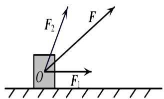

text_image

F₂
F
O
F₁

A. 3N   
B. $\sqrt{3}N$   
C. $2 \mathrm{~N}$   
D. $\frac{1}{2}N$

# 二、问答题（共2题）

2.【问答题】如图，在倾角 $30^{\circ}$ ，高2m的坡面上，有一个质量为3kg

的物体沿坡面下滑，物体受到的摩擦力大小是它对坡面压力大小的 $\frac{1}{3}$ . 若重力加速度g=10 N/kg，求物体从坡顶B处滑落到坡低A

处的过程中，物体所受各力对物体所做的功分别是多少？

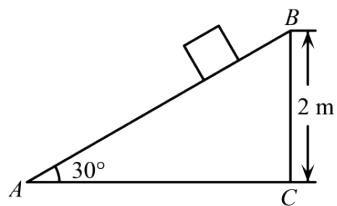

text_image

A 30°
B
2 m
C

3.【问答题】如图，无弹性细绳OA，OB的一端分别固定在房顶的A处，与墙壁的B处，同样的细绳OC下端系着一个重物，所受的拉力是4N，此时 $\angle AOB = 120^{\circ}$ ， $OB \perp OC$ ，则细绳OA受到房顶的拉力是多少？

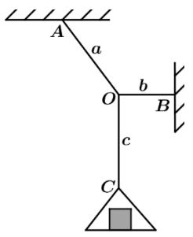

text_image

A
a
b
O
c
B
C

# 高中 数学 必修 第二册

# 第六章 平面向量及其应用 6.4 平面向量的应用

# 6.4.3余弦定理、正弦定理

# 一、单选题（共1题）

1.【单选题】 $\triangle ABC$ 的三个内角 $A, B, C$ 所对边的长分别为 $a, b, c$ . 设向量 $\overrightarrow{MN} = (a + c, b)$ , $\overrightarrow{PQ} = (b + a, c - a)$ . 若 $\overrightarrow{MN}//\overrightarrow{PQ}$ , 则角 $C$ 的大小为（ ）.

A. $\frac{\pi}{6}$   
B. $\frac{\pi}{3}$   
C. $\frac{\pi}{2}$   
D. $\frac{2\pi}{3}$

# 二、填空题（共2题）

2.【填空题】在 $\triangle ABC$ 中， $B = 45^{\circ}$ ，BC 边上的高线 $AD = \frac{1}{3} BC$ ，则 $\cos\angle BAC =$ \_\_\_\_ .  
3.【填空题】在 $\triangle ABC$ 中， $BC = 2, AC = \frac{3}{2} BC, cosC = \frac{1}{4}$ ，则 AB = \_\_\_\_.

# 高中 数学 必修 第二册

# 第六章 平面向量及其应用 6.4 平面向量的应用

# 6.4.3余弦定理、正弦定理

# 一、单选题（共2题）

1.【单选题】 $\triangle ABC$ 的内角 $A, B, C$ 的对边分别为 $a, b, c$ . 若 $(a+b+c)(a-b+c)=3ac, 2\cos C\sin A=\sin B$ , 则 $\triangle ABC$ 为（）.

A. 等边三角形  
B. 等腰三角形  
C. 直角三角形  
D. 等腰直角三角形

2.【单选题】已知锐角三角形的三边长分别为1, 2, m, 则实数m的取值范围是（）.

A. $(1,3)$   
B. $(\sqrt{3},\sqrt{5})$   
C. $(2,\sqrt{5})$   
D. $(2,4)$

# 二、填空题（共1题）

3.【填空题】如图，在梯形ABCD中， $AB \parallel CD$ ，AB = 33，CD = 21，AD = 14，BC = 10，则对角线BD = \_\_\_\_.

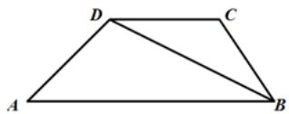

natural_image

Geometric diagram of a quadrilateral ABCD with diagonal BD, no text or symbols present

# 高中 数学 必修 第二册

# 第六章 平面向量及其应用 6.4 平面向量的应用

# 6.4.3余弦定理、正弦定理

# 一、单选题（共2题）

1.【单选题】若满足 $\angle ABC = \frac{\pi}{3}$ , $AC = \sqrt{3}$ , $BC = m$ 的 $\triangle ABC$ 恰有一解, 则实数 $m$ 的取值范围是 ( ).

A. $(0,\sqrt{3}] \cup \{2\}$

B. $(0,\sqrt{3})$

C. $(0,2)$

D. $(0,2]$

2.【单选题】在 $\triangle ABC$ 中，角 A, B, C 的对边分别为 a, b, c，若 $\frac{c}{a} = cosB$ ，则该三角形是（）.

A. 锐角三角形

B. 直角三角形

C. 钝角三角形

D. 等腰三角形

# 二、填空题（共1题）

3.【填空题】在 $\triangle ABC$ 中，已知 $A = 120^{\circ}$ ，且 AC = 2k, AB = 3k (k > 0)，则 $\sin C =$ \_\_\_\_.

# 高中 数学 必修 第二册

# 第六章 平面向量及其应用 6.4 平面向量的应用

# 6.4.3余弦定理、正弦定理

# 一、单选题（共1题）

1.【单选题】已知 $\triangle ABC$ 中，角 $A, B, C$ 的对边分别为 $a, b, c$ ，若 $2b\cos C - 2c\cos B = a$ ， $b = \sqrt{2}c$ ，则 $\cos C = (\quad)$ .

A. $\frac{3}{4}$   
B. $\frac{3}{5}$   
C. $\frac{2}{5}$   
D. $\frac{1}{4}$

# 二、填空题（共2题）

2.【填空题】在 $\triangle ABC$ 中，角 A, B, C 的对边分别为 a, b, c， $A = 60^{\circ}$ ， $a = \sqrt{6}$ ，b = 2，则角 C = \_\_\_\_.  
3.【填空题】已知平面四边形ABCD的面积为6，AB=4，AD=3，BC=5，CD=6，则 $cos(A+C)=$ \_\_\_\_.

# 高中 数学 必修 第二册

# 第六章 平面向量及其应用 6.4 平面向量的应用

# 6.4.3余弦定理、正弦定理

# 一、单选题（共2题）

1. 【单选题】如图，设 $\triangle ABC$ 的内角 A, B, C 的对边分别为 a, b, c, $a\cos C + c\cos A = b\sin B$ ，且 $\angle CAB = \frac{\pi}{6}$ . 若点 D 是 $\triangle ABC$ 外一点，DC = 2, DA = 3，则当四边形 ABCD 面积最大值时， $\sin D = (\quad)$ .

text_image

D
C
A
B

A. $\frac{2\sqrt{7}}{7}$   
B. $\frac{\sqrt{7}}{7}$   
C. $\frac{2\sqrt{5}}{5}$   
D. $\frac{\sqrt{5}}{5}$

2.【单选题】 $\triangle ABC$ 中三边上的高依次为 $\frac{1}{3}$ , $\frac{1}{4}$ , $\frac{1}{5}$ , 则 $\triangle ABC$ 为( ).

A. 锐角三角形  
B. 直角三角形  
C. 钝角三角形  
D. 不存在这样的三角形

# 二、复合题（共1题）

3.【复合题】在 $\triangle ABC$ 中，角 $A, B, C$ 的对边分别为 $a, b, c$ ，满足 $\frac{\cos C}{\cos B} + \cos A = 2\sqrt{2}\sin A$ .

(1)【问答题】求cosB的值;   
(2)【问答题】若 $a+c=1$ ，求b的取值范围.

# 高中 数学 必修 第二册

# 第六章 平面向量及其应用 6.4 平面向量的应用

# 6.4.3余弦定理、正弦定理

# 一、填空题（共1题）

1. 【填空题】如图所示，为了测量A，B两处亭子间的距离，湖岸边现有相距100米的甲、乙两位测量人员，甲测量员在D处测量发现A亭子位于西偏北75°

，B 亭子位于东北方向，乙测量员在 C 处测量发现 B 亭子位于正北方向，A 亭子位于西偏北 $30^{\circ}$ 方向，则 A，B 两亭子间的距离为 \_\_\_\_。

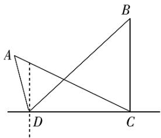

text_image

Geometric diagram showing triangle ABC with point D on the baseline and dashed line from A to D

# 二、复合题（共1题）

2.【复合题】如图，位于A处的指挥中心获悉：在其正东方向相距20海里的B

处有一艘渔船遇险，在原地等待营救．指挥中心立即把消息告知在其南偏西 $30^{\circ}$ ，相距10海里的C处的乙船，现乙船朝北偏东 $\theta$ 的方向沿直线CB前往B处救援.

(1)【问答题】求C,B两点间的距离;   
(2)【问答题】求 $\cos\theta$ 的值.

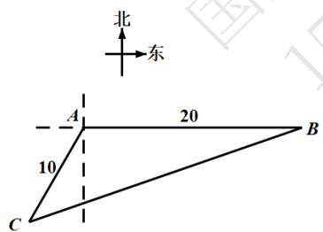

text_image

北
东
A
20
10
B
C

# 三、问答题（共1题）

3.【问答题】如图，一辆汽车在一条水平的公路上向正西方向行驶，到A

处时测得公路北侧一山顶D在西偏北 $30^{\circ}$ 的方向上，行驶1200m后到达B处，并在B处测得山顶D在西偏北 $75^{\circ}$ 的方向上，且仰角为 $30^{\circ}$ ，求此山的高度CD。

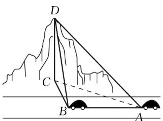

text_image

D
C
B
A

# 高中 数学 必修 第二册

# 第六章 平面向量及其应用 6.4 平面向量的应用

# 6.4.3余弦定理、正弦定理

# 一、填空题（共2题）

1.【填空题】在锐角三角形 $\triangle ABC$ 中，边 a, b 是方程 $x^{2}-2\sqrt{3}x+2=0$ 的两根，且角 A, B 满足 $2\sin(A+B)-\sqrt{3}=0$ ，则边 c= \_\_\_\_.  
2.【填空题】在 $\triangle ABC$ 中，角 A, B, C 所对的边分别为 a, b, c，若 $b = 4, \cos B = \frac{1}{3}$ ，且 $\triangle ABC$ 的周长为 $4\sqrt{3} + 4$ ，则 $\triangle ABC$ 的面积为 \_\_\_\_.

# 二、复合题（共1题）

3.【复合题】已知在 $\triangle ABC$ 中，角 A, B, C 所对的边分别为 a, b, c，且 $b \sin A = \sqrt{3} a \cos B$ .

(1)【问答题】求角B的大小;  
(2)【问答题】若 $b=\sqrt{3}$ ，求 $a+c$ 的取值范围.

# 高中 数学 必修 第二册

# 第六章 平面向量及其应用 6.4 平面向量的应用

# 平面向量的综合问题

# 一、单选题（共1题）

1. 【单选题】已知正方形ABCD的边长为2，MN是它的内切圆的一条弦，点P

为正方形四条边上的动点，当弦MN的长度最大时， $\overrightarrow{PM}\cdot\overrightarrow{PN}$ 的取值范围是（）.

A. $[0,1]$

B. $[0,\sqrt{2}]$

C. $[1,2]$

D. $[-1,1]$

# 二、填空题（共1题）

2.【填空题】已知向量 $a, b, |a| = \sqrt{6}, b(3,4)$ ，若 $agb = -\frac{5}{4}$ ，则 $|3a - 2b| =$

# 三、复合题（共1题）

3.【复合题】在 $\triangle ABC$ 中，角 $A, B, C$ 的对边分别为 $a, b, c$ ，已知 $\cos A = \frac{3}{5}$ .

(1)【问答题】若 $\Delta ABC$ 的面积为3，求 $\overrightarrow{AB} \cdot \overrightarrow{AC}$ 的值；  
(2)【问答题】设 $m=(2\sin\frac{B}{2},1),n=(cosB,\cos\frac{B}{2})$ ，且 $m//n$ ，求 $\sin(B-2C)$ 的值.

# 高中 数学 必修 第二册

# 第六章 平面向量及其应用 6.4 平面向量的应用

# 解三角形的综合问题

# 一、单选题（共1题）

1.【单选题】在 $\triangle ABC$ 中，角 A, B, C 所对的边分别为 a, b, c，若 $b = 2\sqrt{2}$ ， $c = a\cos B + \frac{1}{2}b$ ，且 $\overrightarrow{AB} \cdot \overrightarrow{AC} = 4$ ，则 $\triangle ABC$ 的形状为（）.

A. 直角三角形  
B. 等腰非等边三角形  
C. 等边三角形  
D. 钝角三角形

# 二、填空题（共1题）

2.【填空题】已知在 $\triangle ABC$ 中，角 A, B, C 的对边分别为 a, b, c，若 $a = 2\sqrt{5}, c = 2\sqrt{2}$ ，且 $asinB + bcosA = 0$ ，则边 b = \_\_\_\_.

# 三、复合题（共1题）

3. 【复合题】在 $\triangle ABC$ 中，角 A, B, C 的对边分别为 a, b, c，且 $(\sin A + \sin B)(a - b) + b \sin C = c \sin C$

(1)【问答题】求角A的大小;  
(2)【问答题】若 $\triangle ABC$ 为锐角三角形，且 c = 1，求 $\triangle ABC$ 面积的取值范围.

# 高中 数学 必修 第二册

# 第六章 平面向量及其应用 复习参考题6

# 一、单选题（共1题）

1.【单选题】某地为响应国家关于生态文明建设的号召，大力开展“青山绿水”工程，造福于民，拟对该地某湖泊进行治理。在治理前，需测量该湖泊的相关数据。如图所示，测得 $\angle A = 23^{\circ}$ ， $\angle C = 120^{\circ}$ ， $AC = 60\sqrt{3}$ 米，则A,B间的直线距离约为（参考数据 $\sin 37^{\circ} \approx 0.6$ ）（）.

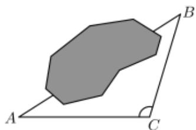

natural_image

Geometric diagram showing a polygon ABC with an extended line to point C, no text or symbols present.

A. 60米  
B. 120米  
C. 150米  
D. 300米

# 二、填空题（共1题）

2.【填空题】下列命题中:

① $a \parallel$ 存在唯一的实数 $\lambda \in R$ ，使得 $b = \lambda a$ ;  
②e为单位向量，且 $a//e$ ，则 $a=\pm|a|e;$   
③a与b共线，b与c共线，则a与c共线；  
④若 $agb = bgc$ ，且 $b \neq 0$ ，则a = c.

其中正确命题的序号是\_\_\_\_。

# 三、复合题（共1题）

3.【复合题】如图，在直角 $\triangle ABC$ 中，点 $D$ 为斜边 $BC$ 的靠近点 $B$ 的三等分点，点 $E$ 为 $AD$ 的中点， $|\overrightarrow{AB}| = 3, |\overrightarrow{AC}| = 6$ .

(1)【问答题】用 $\overrightarrow{AB},\overrightarrow{AC}$ 表示 $\overrightarrow{AD}$ 和 $\overrightarrow{EB};$   
(2)【问答题】求向量 $\overrightarrow{EB}$ 与 $\overrightarrow{EC}$ 夹角的余弦值.