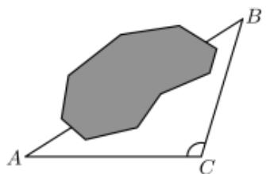

# 高中 数学 必修 第二册

# 第六章 平面向量及其应用 复习参考题6

# 一、单选题（共1题）

1.【单选题】某地为响应国家关于生态文明建设的号召，大力开展“青山绿水”工程，造福于民，拟对该地某湖泊进行治理。在治理前，需测量该湖泊的相关数据。如图所示，测得 $\angle A = 23^{\circ}$ ， $\angle C = 120^{\circ}$ ， $AC = 60\sqrt{3}$ 米，则A,B间的直线距离约为（参考数据 $\sin 37^{\circ} \approx 0.6$ ）（）.

natural_image

Geometric diagram showing a polygon ABC with an extended line to point C, no text or symbols present.

A. 60米  
B. 120米  
C. 150米  
D. 300米

# 二、填空题（共1题）

2.【填空题】下列命题中:

① $a \parallel$ 存在唯一的实数 $\lambda \in R$ ，使得 $b = \lambda a$ ;  
②e为单位向量，且 $a//e$ ，则 $a=\pm|a|e;$   
③a与b共线，b与c共线，则a与c共线；  
④若 $agb = bgc$ ，且 $b \neq 0$ ，则a = c.

其中正确命题的序号是\_\_\_\_。

# 三、复合题（共1题）

3.【复合题】如图，在直角 $\triangle ABC$ 中，点 $D$ 为斜边 $BC$ 的靠近点 $B$ 的三等分点，点 $E$ 为 $AD$ 的中点， $|\overrightarrow{AB}| = 3, |\overrightarrow{AC}| = 6$ .

(1)【问答题】用 $\overrightarrow{AB},\overrightarrow{AC}$ 表示 $\overrightarrow{AD}$ 和 $\overrightarrow{EB};$   
(2)【问答题】求向量 $\overrightarrow{EB}$ 与 $\overrightarrow{EC}$ 夹角的余弦值.