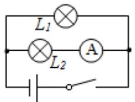
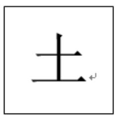
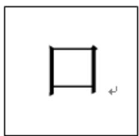
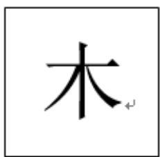

# 高中 数学 必修 第二册

# 第十章 概率 10.1 随机事件与概率

# 10.1.1有限样本空间与随机事件

# (答案解析)

# 一、填空题（共1题）

1. 【填空题】笼子中有4只鸡和3只兔依次取出一只, 直到3只兔全部取出, 记录剩下动物的脚数, 则该试验的样本空间为\_\_\_\_; 如果将三只兔子中的某一只起名为 “长耳朵”, 这时再将4只鸡和3只兔依次取出一只, 直到 “长耳朵” 被取出, 记录剩下动物的脚数, 则该试验的样本空间为 \_\_\_\_.

【正确答案】第一问样本空间为 $\{0, 2, 4, 6, 8\}$ 、第二问样本空间为 $\{0, 2, 4, 6, 8, 10, 12, 14, 16\}$ .

【更多习题信息】

难易度：偏难

知识点：随机试验、样本空间

【智慧中小学APP扫码查看完整解析】

text_image

QR code with a blue logo in the center, likely linking to a digital resource or website.

# 二、复合题（共3题）

2.【复合题】如图，一个电路中有两个小灯泡和一个安培表，这三个电子设备可能正常，也可能不正常，把这个电路是否为通路看成一个随机现象，观察这个电路中三个电子设备是否正常.

text_image

L₁
L₂
A

(1)【问答题】选择适当的方式，写出试验的样本空间；  
(2)【问答题】当闭合开关时，用集合表示下列事件：

$$
A = “ L _ {l} \mathrm{亮起} ”;
$$

$$
B = “ L _ {1} \mathrm{和} L _ {2} \mathrm{同时亮起} ”;;
$$

$$
C = “ L _ {2} \text {亮起但安培表不通} ”;
$$

【正确答案】

(1)【问答题】 $\Omega = \{(0,0,0),(1,0,0),(0,1,0),(0,0,1),(1,1,0),(1,0,1),(0,1,1),(1,1,1)\}$   
(2)【问答题】 $A=\{(1,0,0),(1,1,0),(1,0,1),(1,1,1)\}$ ; $B=\{(1,1,1)\}$ ; $C=\varphi$

【更多习题信息】

难易度：适中

知识点：样本空间、列举法

【智慧中小学APP扫码查看完整解析】

text_image

QR code with a blue logo in the center, likely linking to a digital resource or website.

3. 【复合题】设有一列北上的火车，已知由南至北分别有10个不同的停靠站点（含首发站与终点站）。若甲在第3站买票，乙在第6站买票，设样本空间 $\Omega$

表示火车所有可能停靠的站，令A表示甲可能到达的站点的集合，B

表示乙可能到达的站点的集合.

(1)【问答题】写出该事件的样本空间 $\Omega$ ;   
(2)【问答题】写出事件A，事件B包含的样本点的集合；

(3)【问答题】铁路局需为该列车准备多少种北上的车票？

# 【正确答案】

(1)【问答题】 $\Omega = \{S_1, S_2, S_3, S_4, S_5, S_6, S_7, S_8, S_9, S_{10}\}$   
(2)【问答题】 $A=\{S_{4},S_{5},S_{6},S_{7},S_{8},S_{9},S_{10}\}$ ; $B=\{S_{7},S_{8},S_{9},S_{10}\}$ ;  
(3)【问答题】铁路局需要准备从 $S_{1}$ 站发车的车票共计9种，从 $S_{2}$

站发车的车票共计8种，……，从 $S_{9}$ 站发车的车票1种，合计共 $9+8+\cdots+2+1=45$ （种）.

【更多习题信息】

难易度：简单

知识点：样本空间、列举法、随机事件

【智慧中小学APP扫码查看完整解析】

text_image

QR code with a blue logo in the center, likely linking to a digital resource or website.

4.【复合题】抛掷一对骰子，要求“点数之和是偶数”的概率.

(1)【问答题】写出这个试验的样本空间;  
(2)【问答题】小刘同学觉得可以建立简化的样本空间为

1. 小刘同学觉得可以建立简化的样本空间为 $\Omega =$

{(偶, 偶), (偶, 奇), (奇, 偶), (奇, 奇)}, 并将 $\Omega$

中的每一个元素看成试验的基本结果，这4个结果也是等可能的，从而求得“点数之和是偶数”的概率为 $\frac{1}{2}$ . 请问小刘建立的样本空间合适吗？

，并将 $\Omega$

中的每一个元素看成试验的基本结果，这4个结果也是等可能的，从而求得“点数之和是偶

数”的概率为 $\frac{1}{2}$ . 请问小刘建立的样本空间合适吗?

【正确答案】

(1)【问答题】 $\Omega = \{$

(1,1),(1,2),(1,3),(1,4)(1,5),(1,6),(2,1),(2,2),(2,3),(2,4)(2,5),(2,6),(3,1),(3,2),(3,3),(3,4)(3,5),(3,6),(4,1),(4,2)

$\} (4,3),(4,4)(4,5),(4,6),(5,1),(5,2),(5,3),(5,4)(5,5),(5,6),(6,1),(6,2),(6,3),(6,4)(6,5),(6,6)$

(2)【问答题】不合适.

【更多习题信息】

难易度：适中

知识点：样本空间、列举法

【智慧中小学APP扫码查看完整解析】

text_image

QR code with a blue logo in the center, likely linking to a digital resource or website.

# 三、问答题（共1题）

5.【问答题】汉字是世界上最古老的文字之一，字形结构体现着人类追求均衡对称、和谐稳定的天性.如图所示，这三个汉字可以看成轴对称图形.

text_image

土

text_image

口

text_image

木

小刘和小张利用 “土” “口” “木” 三个字设计了一个游戏，将三个汉字分别写在背面都相同的三张卡片上，背面朝上。规则如下：洗匀后抽出一张，放回洗匀后再抽一张，若两次抽出的汉字能构成上下结构的汉字（如 “土” “土” 构成 “圭”），则小刘获胜，否则小张获胜。你认为这个游戏公平吗？请说明理由。

【正确答案】该游戏并不公平.

【更多习题信息】

难易度：偏难

知识点：表格列出样本空间、树形图

【智慧中小学APP扫码查看完整解析】

text_image

QR code with a blue logo in the center, likely linking to a digital resource or website.

