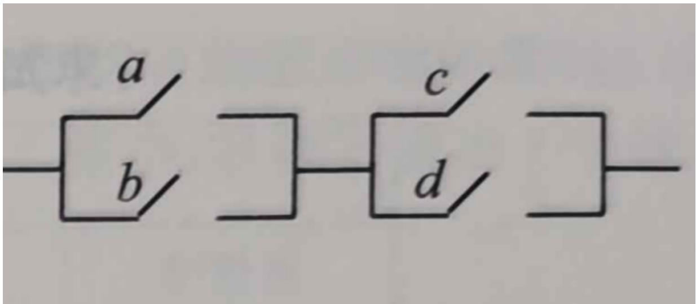

# 高中 数学 必修 第二册

# 第十章 概率 10.1 随机事件与概率

# 10.1.2事件的关系与运算

# 一、单选题（共2题）

1.【单选题】抽查10件产品，记事件 $M =$ “至少有两件次品”，则 $M$ 的对立事件为（）

A. 至多有两件次品  
B. 至多有一件次品  
C. 至多有两件正品  
D. 至少有两件正品

2.【单选题】下列事件中，是互斥事件但不是对立事件的是（）

A. 从装有2个红球和2个黑球的口袋内任取2个球，恰有一个黑球与至少有一个红球是互斥事件  
B. 掷一枚骰子，向上点数为奇数与向上点数为偶数  
C. 统计一个班的数学成绩，平均分不低于90分与平均分不高于90分  
D. 某人连续投篮三次，恰有两次命中与至多命中一次

# 二、填空题（共1题）

3.【填空题】小刘同学上学要经过三个十字路口，每个路口遇到红、绿灯的可能性都相等。事件A表示“第二个路口是红灯”，事件B表示“第三个路口是红灯”，事件C表示“至少遇到两个绿灯”，则 $A \cap B$ 包含的样本点有\_\_\_\_个，事件 $A \cap B$ 与C的关系是\_\_\_\_。

# 三、复合题（共2题）

4.【复合题】如图：a,b,c,d

是4个当前处于断开状态的开关，此后每个开关可能闭合,也可能断开.把这个电路是否接通看成是一个随机现象，设事件A = “a接通”, B = “b接通”, C = “c接通”, D = “d接通”。

text_image

a
b
c
d

(1)【问答题】写出试验的样本空间；  
(2)【问答题】用集合表示事件 $A \cap B, (A \cup C) \cap D;$   
(3)【问答题】用集合表示事件 $(\bar{A}\cap\bar{C})\cup\bar{D}$ ，并观察 $(A\cup C)\cap D$ 与 $(\bar{A}\cap\bar{C})\cup\bar{D}$ 有什么关系.

5.【复合题】小刘同学需要布置教室，她用班委会已经购买的三种不同的颜料给大小相同的三张卡片随机涂色，每张卡片只涂一种颜色.设事件A=“三张卡片的颜色全不相同”，事件B=“三张卡片的颜色不全相同”，事件C=“其中两张卡片的颜色相同”，事件D=“三张卡片的颜色全相同”.

(1)【问答题】写出试验的样本空间；  
(2)【问答题】用集合的形式表示事件A,B,C,D  
(3)【问答题】事件B与事件C有什么关系?事件A和B的交事件与事件D有什么关系?并说明理由.