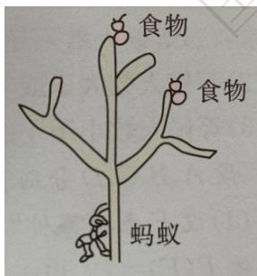

# 高中 数学 必修 第二册

# 第十章 概率 10.1 随机事件与概率

# 10.1.4 概率的基本性质

# 一、单选题（共2题）

1. 【单选题】若随机事件A,B互斥，A,B发生的概率均不等于0，且 $P(A)=2-a,\quad P(B)=4a-5$ ，则实数a取值范围是（）

A. $\left(\frac{5}{4},2\right)$   
B. $\left(\frac{5}{4},\frac{3}{2}\right)$   
C. $\left[\frac{5}{4},\frac{3}{2}\right]$   
D. $\left(\frac{5}{4},\frac{4}{3}\right]$

2.【单选题】（多选）某学校成立了数学、英语、音乐3个课外兴趣小组,3个小组分别有39,32,33个成员,一些成员参加了不止一个小组,具体情况如图所示.现随机选取一个成员,则( )

other

| Category | Count |
| -------- | ----- |
| English   | 6人   |
| Music    | 8人   |
| English   | 7人   |
| Music    | 10人  |
| English   | 11人  |
| Music    | 8人   |
| English   | 10人  |
| English   | 10人 数学 |
| Music    | 10人 数学 |
| English   | 10人 数学 |
| Music    | 10人 数学 |
| English   | 10人 数学 |
| English   | 10人 数学 |
| English   | 10人 数学 |
| English   | 10人 数学 |
| English   | 10人 数学 |
| English   | 10人 数学 |
| English   | 10人 数学 |
| English   | 10人 数学 |
| English   | 10人 数学 |
| English   & Music | 10人 数学 |
| English   & Music | 10人 数学 |
| English   & Music | 10人 数学 |
| English   & Music | 10人 数学 |
| English   & Music | 10人 数学 |
| English   & Music | 10人 数学 |
| English   & Music | 10人 数学 |
| English   & Music | 10人 数学 |
|
| English   & Music | 10人 数学 |
| English   & Music | 10人 数学 |
| English   & Music | 10人 数学 |
| English   & Music | 10人 数学 |
| English   & Music | 10人 数学 |
| English   & Music | 10人 数学 |
| English   & Music | 10人 数学 |
| English   & Music | 15人 数学 |
| English   & Music | 15人 数学 |
| English   & Music | 15人 数学 |
| English   & Music | 15人 数学 |
| English   & Music | 15人 数学 |
| English   & Music | 15人 数学 |
| English   & Music | 15人 数学 |
| English   & Music | 15人 数学 |
| English   & Musical | 15人 数学 |
| English   & Musical | 15人 数学 |
| English   & Musical | 15人 数学 |
| English   & Musical | 15人 数学 |
| English   & Musical | 15人 数学 |
| English   & Musical | 15人 数学 |
| English   & Musical | 15人 数学 |
| English   & Musical | 15人 数学 |
|
| English   & Musical | 15人 数学 |
| English   & Musical | 15人 数学 |
| English   & Musical | 15人 数学 |
| English   & Musical | 15人 数学 |
| English   & Musical | 15人 数学 |
| English   & Musical | 15人 数学 |
|
| English   & Musical | 15人 数学 |
|
| English   & Musical | 15人 数学 |
|
| English   & Musical | 15人 数学 |
|
| English   & Musical | 15人 数学 |
|
| English   & Musical | 15人 数学 |
|
| English   & Musical | 15人 数学 |
|
| English   & Musical | 15人 数学 |
|
| Spanish   | 6人 英语 |
| Spanish   | 7人 音乐 |
| Spanish   | 8人 音乐 |
| Spanish   | 9人 音乐 |
| Spanish   | 10人 音乐 |
| Spanish   | 11人 音乐 |
| Spanish   | 12人 音乐 |
| Spanish   | 13人 音乐 |
| Spanish   | 14人 音乐 |
| Spanish   | 15人 音乐 |
| Spanish   | 16人 音乐 |
| Spanish   | 17人 音乐 |
| Spanish   | 18人 音乐 |
| Spanish   | 20人 音乐 |
| Spanish   | 22人 音乐 |
| Spanish   | 24人 音乐 |
| Spanish   | 26人 音乐 |
| Spanish   | 28人 音乐 |
| Spanish   | 30人 音乐 |
| Spanish   | 32人 音乐 |
| Spanish   | 34人 音乐 |
| Spanish   | 36人 音乐 |
| Spanish   | 38人 音乐 |
| Spanish   | 40人 音乐 |
| Spanish   | 42人 音乐 |
| Spanish   | 44人 音乐 |
| Spanish   | 46人 音乐 |
| Spanish   | 48人 音乐 |
| Spanish   | 50人 音乐 |
|
| Spanish   | 52人 音乐 |
|
| Spanish   | 54人 音乐 |
|
| Spanish   | 56人 音乐 |
|
| Spanish   | 58人 音乐 |
|
| Spanish   | 60人 音乐 |
|
| Spanish   | 62人 音乐 |
|
| Spanish   | 64人 音乐 |
|
| Spanish   | 66人 音乐 |
|
| Spanish   | 68人 音乐 |
|
| Spanish   | 70人 音乐 |
|
| Spanish   | 72人 音乐 |
|
| Spanish   | 74人 音乐 |
|
| Spanish   | 76人 音乐 |
|
| Spanish   | 78人 音乐 |
|
| Spanish   | 80人 音乐 |
|
| Spanish   | 82人 音乐 |
|
| Spanish   | 84人 音乐 |
|
| Spanish   | 86人 音乐 |
|
| Spanish   | 88人 音乐 |
|
| Spanish   | 90人 音乐 |
|
| Spanish   | 92人 音乐 |
|
| Spanish   | 94人 音乐 |
|
| Spanish   | 96人 音乐 |
|
| Spanish   | 98人 音乐 |
|
| Spanish   | 100人 数学 (Total) |

A. 他只属于音乐小组的概率为 $\frac{1}{13}$   
B.他只属于英语小组的概率为 $\frac{8}{15}$   
C.他属于至少2个小组的概率为  
D.他属于不超过2个小组的概率为 $\frac{13}{15}$

# 二、复合题（共2题）

3.【复合题】在数学考试中，小明的成绩（取整数）不低于90分的概率是0.18，在80\~89分（包括89分）的概率是0.51，在70\~79分（包括79分）的概率是0.15，在60\~69分（包括69分）的概率是0.09，在60分以下的概率是0.07.

(1)【问答题】小明在数学考试中成绩不低于70分的概率;   
(2)【问答题】小明数学考试及格（60分及以上）的概率.

4.【复合题】回答下列问题:

(1)【问答题】甲，乙两射手同时射击一目标，甲的命中概率为0.65，乙的命中概率为0.60，那么能否得出结论：目标被命中的概率等于 $0.65+0.60=1.25$ ，为什么？  
(2)【问答题】一射手命中靶的内圈的概率是0.25，命中靶的其余部分的概率是0.50，那么能否得出结论：目标被命中的概率等于 $0.25+0.50=0.75$ ，为什么？  
(3)【问答题】两人各掷一枚硬币，“同时出现正面”的概率可以算得为 $\frac{1}{2^{2}}$

.由于“不出现正面”是上述事件的对立事件，所以它的概率等于 $1-\frac{1}{2^{2}}=\frac{3}{4}$

.这样做对吗？说明道理.

# 三、问答题（共2题）

5.【问答题】甲、乙、丙、丁四人参加 $4 \times 100$ 米接力赛，他们跑每一棒的概率均为 $\frac{1}{4}$ .
求甲跑第一棒或乙跑第四棒的概率.  
6.【问答题】一只蚂蚁在如图所示的树杈上寻觅食物，假定蚂蚁在每个岔路口都会等可能地随机地选择一条路径，则它能获得食物的概率是多少？

text_image

食物
食物
蚂蚁

