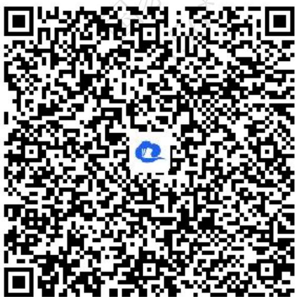
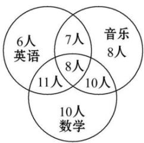
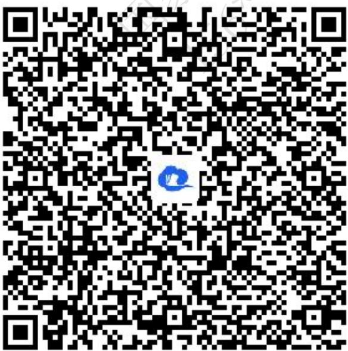
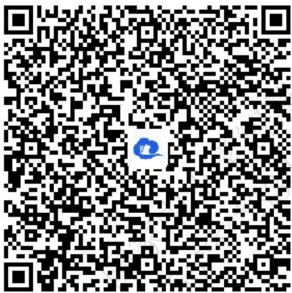
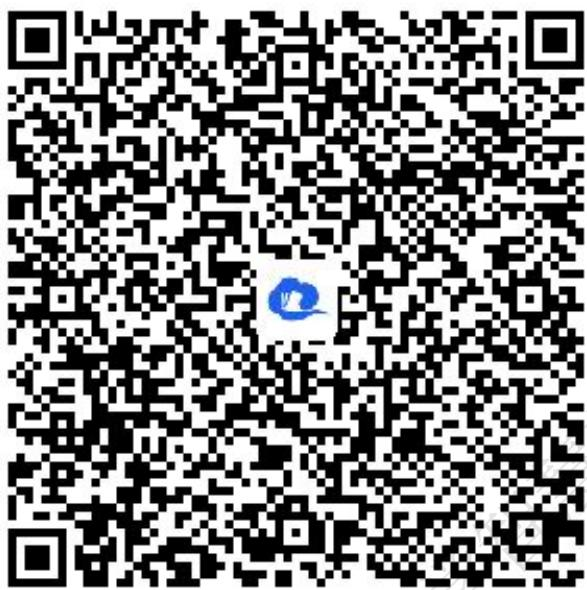
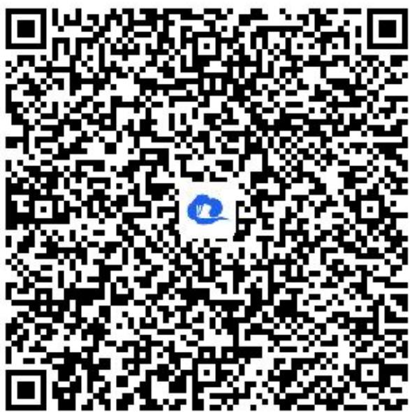
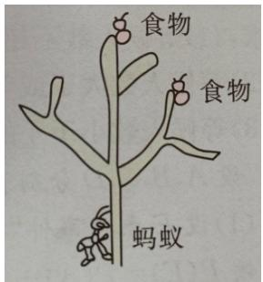
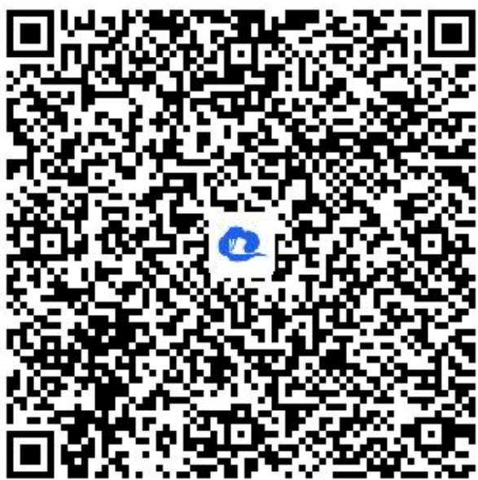

# 高中 数学 必修 第二册

# 第十章 概率 10.1 随机事件与概率

# 10.1.4 概率的基本性质

# (答案解析)

# 一、单选题（共2题）

1. 【单选题】若随机事件A,B互斥，A,B发生的概率均不等于0，且 $P(A)=2-a,\quad P(B)=4a-5$ ，则实数a取值范围是（）

A. $\left(\frac{5}{4},2\right)$   
B. $\left(\frac{5}{4},\frac{3}{2}\right)$   
C. $\left[\frac{5}{4},\frac{3}{2}\right]$   
D. $\left(\frac{5}{4},\frac{4}{3}\right]$

【正确答案】D

【更多习题信息】

难易度：适中

知识点：概率的基本 性质

【智慧中小学APP扫码查看完整解析】

text_image

QR code with a blue logo in the center, likely linking to a digital resource or website.

2.【多选题】（多选）某学校成立了数学、英语、音乐3个课外兴趣小组, 3个小组分别有39, 32, 33个成员, 一些成员参加了不止一个小组, 具体情况如图所示. 现随机选取一个成员, 则( )

other

| Category | Count |
| -------- | ----- |
| English   | 6人   |
| Music    | 8人   |
| English   | 7人   |
| Music    | 10人  |
| English   | 11人  |
| Music    | 10人  |
| English   | 11人  |
| Music    | 10人  |
| English   | 11人  |
| English   | 10人  |
| English   | 11人  |
| English   | 10人  |
| English   | 11人  |
| English   | 10人  |
| English   | 11人  |
| English   | 10人  |
| English   | 11人  |
| English   | 10人  |
| English   | 11人  |
| English -  | 10人  |
| English -  | 10人  |
| English -  | 10人  |
| English -  | 10人  |
| English -  | 10人  |
| English -  | 10人  |
| English -  | 10人  |
| English -  | 10人  |
| English -  | 10人  |
| English -  | 10A   |
| English -  | 10A   |
| English -  | 10A   |
| English -  | 10A   |
| English -  | 10A   |
| English -  | 10A   |
| English -  | 10A   |
| English -  | 10A   |
| English -  | 10A   |
| English -  | 10A   |

A. 他只属于音乐小组的概率为 $\frac{1}{13}$   
B. 他只属于英语小组的概率为 $\frac{8}{15}$   
C. 他属于至少2个小组的概率为 $\frac{3}{5}$   
13 D. 他属于不超过2个小组的概率为 15

【正确答案】CD

【更多习题信息】

难易度：偏难

知识点：互斥事件求概率、利用对立事件求概率

【智慧中小学APP扫码查看完整解析】

text_image

QR code with a blue logo in the center, likely linking to a digital resource or website.

# 二、复合题（共2题）

3.【复合题】在数学考试中，小明的成绩（取整数）不低于90分的概率是0.18，在80\~89分（包括89分）的概率是0.51，在70\~79分（包括79分）的概率是0.15，在60\~69分（包括69分）的概率是0.09，在60分以下的概率是0.07.

(1)【问答题】小明在数学考试中成绩不低于70分的概率;   
(2)【问答题】小明数学考试及格（60分及以上）的概率.

【正确答案】

(1)【问答题】0.84   
(2)【问答题】0.93

【更多习题信息】

难易度：适中

知识点：互斥事件 求概率、对立事件 求概率

【智慧中小学APP扫码查看完整解析】

text_image

QR code with a blue logo in the center, likely linking to a digital resource or website.

4.【复合题】回答下列问题:

(1)【问答题】甲，乙两射手同时射击一目标，甲的命中概率为0.65，乙的命中概率为0.60，那么能否得出结论：目标被命中的概率等于 $0.65+0.60=1.25$ ，为什么？  
(2)【问答题】一射手命中靶的内圈的概率是0.25，命中靶的其余部分的概率是0.50，那么能否得出结论：目标被命中的概率等于 $0.25+0.50=0.75$ ，为什么？  
(3)【问答题】两人各掷一枚硬币，“同时出现正面”的概率可以算得为 $\frac{1}{2^2}$ . 由于“不出现正面”是上述事件的对立事件，所以它的概率等于 $1 - \frac{1}{2^2} = \frac{3}{4}$ . 这样做对吗？说明道理.

【正确答案】

(1)【问答题】不对   
(2)【问答题】能  
(3)【问答题】不对

【更多习题信息】

难易度：简单

知识点：互斥事件判定、对立事件判定

【智慧中小学APP扫码查看完整解析】

text_image

QR code with a blue logo in the center, likely linking to a digital resource or website.

# 三、问答题（共2题）

5.【问答题】甲、乙、丙、丁四人参加 $4 \times 100$ 米接力赛，他们跑每一棒的概率均为 $\frac{1}{4}$ . 求甲跑第一棒或乙跑第四棒的概率.

【正确答案】 $\frac{5}{12}$

【更多习题信息】

难易度：适中

知识点：互斥事件 求概率、对立事件 求概率

【智慧中小学APP扫码查看完整解析】

text_image

QR code with a blue logo in the center, likely linking to a digital resource or website.

6.【问答题】一只蚂蚁在如图所示的树杈上寻觅食物，假定蚂蚁在每个岔路口都会等可能地随机地选择一条路径，则它能获得食物的概率是多少？

text_image

食物
食物
蚂蚁

【正确答案】 $\frac{l}{3}$

【更多习题信息】

难易度：适中

知识点：古典概型问题

【智慧中小学APP扫码查看完整解析】

text_image

QR code with a blue logo in the center, likely linking to a digital resource or website.

