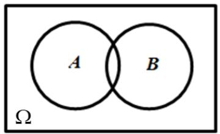

# 高中 数学 必修 第二册

# 第十章 概率 10.2 事件的相互独立性

# (答案解析)

# 一、单选题（共2题）

1.【单选题】抛掷一枚均匀的骰子两次，在下列事件中，与事件“第一次得到6点”不互相独立的事件是（）

A. “两次得到的点数和是12”  
B. “第二次得到6点”  
C. “第二次得到的点数不超过3点”  
D. “第二次得到的点数是奇数”

【正确答案】A

【更多习题信息】

难易度：简单

知识点：“两个事件 相互独立性的概念”

【智慧中小学APP扫码查看完整解析】

text_image

QR code with a blue logo in the center, likely linking to a digital resource or website.

2.【单选题】已知一个古典概型的样本空间 $\Omega$ 和事件 $A, B$ ，如图所示，其中 $n(\Omega) = 12, n(A) = 6, n(B) = 4, n(A \cup B) = 8$ ，则事件 $A$ 与事件 $\overline{B}$

text_image

A
B
Ω

A. 是互斥事件，不是独立事件  
B. 不是互斥事件，是独立事件  
C. 既是互斥事件，也是独立事件  
D. 既不是互斥事件，也不是独立事件

【正确答案】B

【更多习题信息】

难易度：偏难

知识点：两个事件相互独立性的概念、互斥与相互独立的区分

【智慧中小学APP扫码查看完整解析】

text_image

QR code with a blue circular logo in the center, likely linking to a digital resource or website.

# 二、多选题（共1题）

3.【多选题】（多选题）甲罐中有3个红球、2个白球，乙罐中有4个红球、1个白球，先从甲罐中随机取出1个球放入乙罐，分别以 $A_{1},A_{2}$

表示由甲罐中取出的球是红球、白球的事件，再从乙罐中随机取出1个球，以B

表示从乙罐中取出的球是红球的事件，下列命题正确的是（）

A. $P(B) = \frac{23}{30}$   
B. 事件 $B$ 与事件 $A_{I}$ 相互独立

C. 事件B与事件 $A_{2}$ 相互独立  
D. $A_{1}, A_{2}$ 互斥

【正确答案】AD

【更多习题信息】

难易度：偏难

知识点：两个事件相互独立性的概念、互斥与相互独立的区分

【智慧中小学APP扫码查看完整解析】

text_image

QR code with a blue logo in the center, likely linking to a digital resource or website.

# 三、填空题（共1题）

4.【填空题】2.给出下列各对事件，其中是相互独立事件的为\_\_\_\_（填序号）.

(1)甲组有3名男生，2名女生；乙组有2名男生，3名女生.现从甲、乙两组中各选1名参加演讲比赛，“从甲组中选出1名男生”与“从乙组中选出1名女生”；  
(2)容器内装有5个白乒乓球和3个黄乒乓球，球除颜色外没有其他差异，“从8个球中任意取出1个，取出的是白球”与“再从剩下的7个球中任意取出1个，取出的是白球”；  
(3)掷一枚骰子一次，“出现偶数点”与“出现3点或6点”.

【正确答案】(1)(3)

【更多习题信息】

难易度：适中

知识点：“两个事件 相互独立的概念”

【智慧中小学APP扫码查看完整解析】

text_image

QR code with a blue logo in the center, likely linking to a digital resource or website.

# 四、复合题（共2题）

5.【复合题】下列每对事件中，哪些是互斥事件，哪些是相互独立事件？

(1)【问答题】袋中有3白、2黑共5个大小相同的小球，依次有放回地摸球两次，事件M：“第一次摸到白球”，事件N：“第二次摸到白球”；  
(2)【问答题】袋中有3白、2黑共5个大小相同的小球，依次不放回地摸球两次，事件M：“第一次摸到白球”，事件N：“第二次摸到白球”.

【正确答案】

(1)【问答题】相互独立事件;   
(2)【问答题】既不是互斥事件又不是相互独立事件.

【更多习题信息】

难易度：简单

知识点：两个事件相互独立性的概念、互斥与 独立事件

【智慧中小学APP扫码查看完整解析】

text_image

QR code with a blue logo in the center, likely linking to a digital resource or website.

6. 【复合题】假定生男孩和生女孩是等可能的，令 $A = \{ \text{一个家庭中既有男孩又有女孩} \}$ ， $B = \{ \text{一个家庭中最多有一个女孩} \}$ 。对下述两种情形，讨论 $A$ 与 $B$ 的独立性。

(1)【问答题】家庭中有两个小孩;  
(2)【问答题】

1. 家庭中有三个小孩.

【正确答案】

(1)【问答题】不相互独立;   
(2)【问答题】相互独立.

【更多习题信息】

难易度：简单

知识点：“两个事件 相互独立性的概念”

【智慧中小学APP扫码查看完整解析】

text_image

QR code with a blue logo in the center, likely linking to a digital resource or website.

