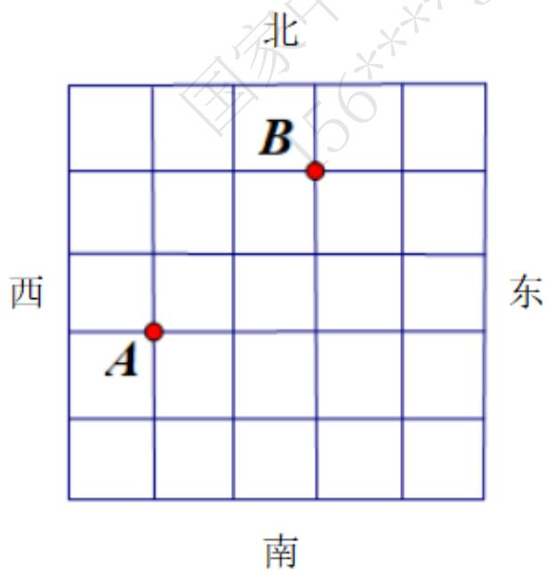
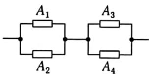

# 高中 数学 必修 第二册

# 第十章 概率 10.2 事件的相互独立性

# 一、单选题（共1题）

1.【单选题】中秋节放假，甲、乙、丙回老家过节的概率分别为 $\frac{1}{3}$ ， $\frac{1}{4}$ ， $\frac{1}{5}$

假定3人的行动相互之间没有影响, 那么这段时间内至少有1人回老家过节的概率为 ( )

A. $\frac{59}{60}$   
B. $\frac{3}{5}$   
C. $\frac{1}{2}$   
D. $\frac{1}{60}$

# 二、复合题（共4题）

2.【复合题】如图是一个方形迷宫，甲、乙两人分别位于迷宫的A,B

两处，两人同时以每一分钟一格的速度向东、西、南、北四个方向行走，已知甲向东、西行走的概率都为 $\frac{1}{4}$ ，向南、北行走的概率分别为 $\frac{1}{6}$ 和p

，乙向东、南、西、北四个方向行走的概率均为q.

text_image

北
B
西
东
A
南

(1) 求 P 和 q 的值;

问最少几分钟，甲、乙二人相遇？并求出最短时间内可以相遇的概率.

(1)【问答题】求p和q的值;   
(2)【问答题】

1. 问最少几分钟，甲、乙二人相遇？并求出最短时间内可以相遇的概率.

3.【复合题】一个通讯小组有两套设备，只要其中有一套设备能正常工作，就能进行通讯，每套设备由三个部件组成，只要其中一个部件出故障，这套设备就不能正常工作。如果在某一时间段内每个部件不出故障的概率为 $P$ ，计算在这段时间内：

(1)【问答题】恰有一套设备能正常工作的概率;  
(2)【问答题】能进行通讯的概率.

4.【复合题】某种有奖销售的饮料，瓶盖内印有“奖励一瓶”或“谢谢购买”字样，购买一瓶若其瓶盖内印有“奖励一瓶”字样即为中奖，中奖概率为 $\frac{1}{6}$ ，甲、乙、丙三位同学每人购买了一瓶该饮料.

(1)【问答题】求三位同学都没有中奖的概率;  
(2)【问答题】求三位同学中至少有两位没有中奖的概率.

5.【复合题】某公司招聘员工，指定三门考试课程，有两种考试方案.

方案一：在三门课程中，至少有两门及格为考试通过；

方案二：在三门课程中，随机选取两门，这两门都及格为考试通过.

假设某应聘者对三门指定课程考试及格的概率分别是a,b,c

，且三门课程考试是否及格相互之间没有影响.

(1)【问答题】

1. 分别求该应聘者用方案一和方案二时，考试通过的概率；

(2)【问答题】试比较应聘者在上述两种方案下考试通过的概率的大小（说明理由）.

# 三、问答题（共1题）

6.【问答题】如下图，设每个电子元件能正常工作的概率均为 $p(0 < p < 1)$

，问甲、乙哪一种系统可靠性更大？

text_image

A₁ A₂
A₃ A₄

甲

text_image

A₁
A₂
A₃
A₄

乙