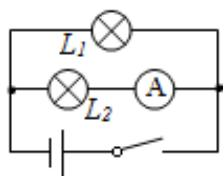
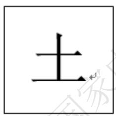
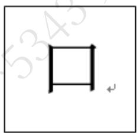
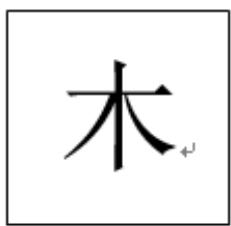
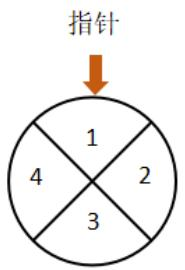
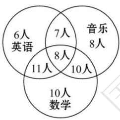
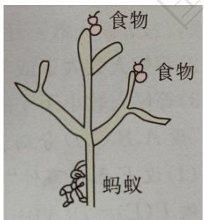
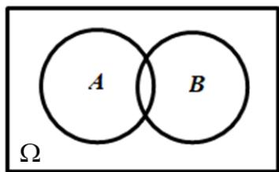
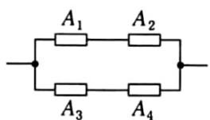

# 高中 数学 必修 第二册

# 第十章 概率 10.1 随机事件与概率

# 10.1.1有限样本空间与随机事件

# 一、填空题（共1题）

1.【填空题】笼子中有4只鸡和3只兔依次取出一只,直到3只兔全部取出,记录剩下动物的脚数,则该试验的样本空间为\_\_\_\_;如果将三只兔子中的某一只起名为“长耳朵”,这时再将4只鸡和3只兔依次取出一只,直到“长耳朵”被取出,记录剩下动物的脚数,则该试验的样本空间为\_\_\_\_.

# 二、复合题（共3题）

2. 【复合题】如图，一个电路中有两个小灯泡和一个安培表，这三个电子设备可能正常，也可能不正常，把这个电路是否为通路看成一个随机现象，观察这个电路中三个电子设备是否正常.

text_image

L₁
L₂ A

(1)【问答题】选择适当的方式，写出试验的样本空间；  
(2)【问答题】当闭合开关时，用集合表示下列事件：

$A = "L_{l}$ 亮起";

$B = "L_{1} \text{和} L_{2} \text{同时亮起}";$

$C = "L_{l}$ 亮起但安培表不通";

3.【复合题】设有一列北上的火车, 已知由南至北分别有10个不同的停靠站点 (含首发站与终点站). 若甲在第3站买票, 乙在第6站买票, 设样本空间 $\Omega$

表示火车所有可能停靠的站，令A表示甲可能到达的站点的集合，B

表示乙可能到达的站点的集合.

(1)【问答题】写出该事件的样本空间 $\Omega;$   
(2)【问答题】写出事件A，事件B包含的样本点的集合；  
(3)【问答题】铁路局需为该列车准备多少种北上的车票?

4.【复合题】抛掷一对骰子，要求“点数之和是偶数”的概率.

(1)【问答题】写出这个试验的样本空间;  
(2)【问答题】小刘同学觉得可以建立简化的样本空间为

1. 小刘同学觉得可以建立简化的样本空间为 $\Omega =$

{(偶, 偶), (偶, 奇), (奇, 偶), (奇, 奇)}, 并将 $\Omega$

中的每一个元素看成试验的基本结果，这4个结果也是等可能的，从而求得“点数之和是偶数”的概率为 $\frac{1}{2}$ . 请问小刘建立的样本空间合适吗？

，并将 $\Omega$

中的每一个元素看成试验的基本结果，这4个结果也是等可能的，从而求得“点数之和是偶数”的概率为 $\frac{1}{2}$ . 请问小刘建立的样本空间合适吗?

# 三、问答题（共1题）

5.【问答题】汉字是世界上最古老的文字之一，字形结构体现着人类追求均衡对称、和谐稳定的天性.如图所示，这三个汉字可以看成轴对称图形.

text_image

土

text_image

口

text_image

木

小刘和小张利用 “土” “口” “木” 三个字设计了一个游戏，将三个汉字分别写在背面都相同的三张卡片上，背面朝上。规则如下：洗匀后抽出一张，放回洗匀后再抽一张，若两次抽出的汉字能构成上下结构的汉字（如 “土” “土” 构成 “圭”），则小刘获胜，否则小张获胜。你认为这个游戏公平吗？请说明理由。

# 高中 数学 必修 第二册

# 第十章 概率 10.1 随机事件与概率

# 10.1.2事件的关系与运算

# 一、单选题（共2题）

1.【单选题】抽查10件产品，记事件 $M =$ “至少有两件次品”，则 $M$ 的对立事件为（）

A. 至多有两件次品  
B. 至多有一件次品  
C. 至多有两件正品  
D. 至少有两件正品

2.【单选题】下列事件中，是互斥事件但不是对立事件的是（）

A. 从装有2个红球和2个黑球的口袋内任取2个球，恰有一个黑球与至少有一个红球是互斥事件  
B. 掷一枚骰子，向上点数为奇数与向上点数为偶数  
C. 统计一个班的数学成绩，平均分不低于90分与平均分不高于90分  
D. 某人连续投篮三次，恰有两次命中与至多命中一次

# 二、填空题（共1题）

3.【填空题】小刘同学上学要经过三个十字路口，每个路口遇到红、绿灯的可能性都相等。事件A表示“第二个路口是红灯”，事件B表示“第三个路口是红灯”，事件C表示“至少遇到两个绿灯”，则 $A \cap B$ 包含的样本点有\_\_\_\_个，事件 $A \cap B$ 与C的关系是\_\_\_\_。

# 三、复合题（共2题）

4.【复合题】如图：a,b,c,d

是4个当前处于断开状态的开关，此后每个开关可能闭合, 也可能断开. 把这个电路是否接通看成是一个随机现象，设事件 $A = \text{“}a$ 接通", $B = \text{“}b$ 接通", $C = \text{“}c$ 接通", $D = \text{“}d$ 接通”。

text_image

a
b
c
d

(1)【问答题】写出试验的样本空间；  
(2)【问答题】用集合表示事件 $A \cap B, (A \cup C) \cap D;$   
(3)【问答题】用集合表示事件 $(\bar{A}\cap\bar{C})\cup\bar{D}$ ，并观察 $(A\cup C)\cap D$ 与 $(\bar{A}\cap\bar{C})\cup\bar{D}$ 有什么关系.

5.【复合题】小刘同学需要布置教室，她用班委会已经购买的三种不同的颜料给大小相同的三张卡片随机涂色，每张卡片只涂一种颜色.设事件A=“三张卡片的颜色全不相同”，事件B=“三张卡片的颜色不全相同”，事件C=“其中两张卡片的颜色相同”，事件D=“三张卡片的颜色全相同”.

(1)【问答题】写出试验的样本空间；  
(2)【问答题】用集合的形式表示事件A,B,C,D  
(3)【问答题】事件B与事件C有什么关系?事件A和B的交事件与事件D有什么关系?并说明理由.

# 高中 数学 必修 第二册

# 第十章 概率 10.1 随机事件与概率

# 10.1.3古典概型

# 一、复合题（共4题）

1.【复合题】两件正品 $a_{1},a_{2}$ 和一件次品 $b_{1}$

的三件产品中每次任取一件，每次取出后不放回，连续取两次.

(1)【问答题】取出的两件产品中恰有一件次品的概率;  
(2)【问答题】如果将“每次取出后不放回”这一条件换成“每次取出后放回”，则取出的两件产品中恰有一件次品的概率是多少？

2.【复合题】袋中有大小相同的5个白球，3个黑球和3个红球，每球有一个区别于其他球的编号，从中摸出一个球.

(1)【问答题】有多少种不同的摸法？如果把每个球的编号看作一个基本事件建立概率模型，该模型是不是古典概型？  
(2)【问答题】若按球的颜色为划分基本事件的依据，有多少个基本事件？以这些基本事件建立概率模型，该模型是不是古典概型？

3.【复合题】有8名奥运会志愿者，其中志愿者 $A_{1},A_{2},A_{3}$ ，通晓日语， $B_{1},B_{2},B_{3}$ ，通晓俄语， $C_{1},C_{2}$ ，通晓韩语，从中选出通晓日语、俄语和韩语的志愿者各1名，组成一个小组.

(1)【问答题】求 $A_{I}$ 被选中的概率;  
(2)【问答题】求 $B_{1}$ 和 $C_{1}$ 不全被选中的概率.

4. 【复合题】某儿童乐园在六一儿童节推出了一项趣味活动，参加活动的儿童需转动如图所示的转盘两次，每次转动后，待转盘停止转动时，记录指针所指区域中的数。设两次记录的数分别为x,y，奖励规则如下：若 $xy \leq 3$ ，则奖励玩具一个；若 $xy \geq 8$

，则奖励水杯一个；其余情况奖励饮料一瓶。

pie

| Category | Value |
|---|---|
| 1 | 1 |
| 2 | 2 |
| 3 | 3 |
| 4 | 4 |

假设转盘质地均匀，四个区域划分均匀. 小亮准备参加此项活动.

(1)【问答题】求小亮获得玩具的概率;   
(2)【问答题】请比较小亮获得饮料和水杯哪个概率更大?   
(3)【问答题】小亮获得玩具或水杯的概率.

# 二、问答题（共2题）

5.【问答题】甲，乙，丙，丁4个人到电影院看电影，只剩下编号1,2,3的三个座位，于是四人抽签决定谁坐在几号座位（抽到空签的人离开），求甲抽到2号座位的概率.

6.【问答题】盒中有大小、形状相同的5个白球和2个黑球，从中任取三球,计算取出的是两个白球和一个黑球的概率.

# 高中 数学 必修 第二册

# 第十章 概率 10.1 随机事件与概率

# 10.1.4 概率的基本性质

# 一、单选题（共2题）

1. 【单选题】若随机事件A,B互斥，A,B发生的概率均不等于0，且 $P(A)=2-a,\quad P(B)=4a-5$ ，则实数a取值范围是（）

A. $\left(\frac{5}{4},2\right)$   
B. $\left(\frac{5}{4},\frac{3}{2}\right)$   
C. $\left[\frac{5}{4},\frac{3}{2}\right]$   
D. $\left(\frac{5}{4},\frac{4}{3}\right]$

2.【单选题】（多选）某学校成立了数学、英语、音乐3个课外兴趣小组,3个小组分别有39,32,33个成员,一些成员参加了不止一个小组,具体情况如图所示.现随机选取一个成员,则( )

other

| Category | Count |
| -------- | ----- |
| English   | 6人   |
| Music    | 8人   |
| English   | 7人   |
| Music    | 10人  |
| English   | 11人  |
| Music    | 8人   |
| English   | 10人  |
| English   | 10人 数学 |
| Music    | 10人 数学 |
| English   | 10人 数学 |
| Music    | 10人 数学 |
| English   | 10人 数学 |
| English   | 10人 数学 |
| English   | 10人 数学 |
| English   | 10人 数学 |
| English   | 10人 数学 |
| English   | 10人 数学 |
| English   | 10人 数学 |
| English   | 10人 数学 |
| English   | 10人 数学 |
| English   & Music | 10人 数学 |
| English   & Music | 10人 数学 |
| English   & Music | 10人 数学 |
| English   & Music | 10人 数学 |
| English   & Music | 10人 数学 |
| English   & Music | 10人 数学 |
| English   & Music | 10人 数学 |
| English   & Music | 10人 数学 |
|
| English   & Music | 10人 数学 |
| English   & Music | 10人 数学 |
| English   & Music | 10人 数学 |
| English   & Music | 10人 数学 |
| English   & Music | 10人 数学 |
| English   & Music | 10人 数学 |
| English   & Music | 10人 数学 |
| English   & Music | 15人 数学 |
| English   & Music | 15人 数学 |
| English   & Music | 15人 数学 |
| English   & Music | 15人 数学 |
| English   & Music | 15人 数学 |
| English   & Music | 15人 数学 |
| English   & Music | 15人 数学 |
| English   & Music | 15人 数学 |
| English   & Musical | 15人 数学 |
| English   & Musical | 15人 数学 |
| English   & Musical | 15人 数学 |
| English   & Musical | 15人 数学 |
| English   & Musical | 15人 数学 |
| English   & Musical | 15人 数学 |
| English   & Musical | 15人 数学 |
| English   & Musical | 15人 数学 |
|
| English   & Musical | 15人 数学 |
| English   & Musical | 15人 数学 |
| English   & Musical | 15人 数学 |
| English   & Musical | 15人 数学 |
| English   & Musical | 15人 数学 |
| English   & Musical | 15人 数学 |
|
| English   & Musical | 15人 数学 |
|
| English   & Musical | 15人 数学 |
|
| English   & Musical | 15人 数学 |
|
| English   & Musical | 15人 数学 |
|
| English   & Musical | 15人 数学 |
|
| English   & Musical | 15人 数学 |
|
| English   & Musical | 15人 数学 |
|
| Spanish   | 6人 英语 |
| Spanish   | 7人 音乐 |
| Spanish   | 8人 音乐 |
| Spanish   | 9人 音乐 |
| Spanish   | 10人 音乐 |
| Spanish   | 11人 音乐 |
| Spanish   | 12人 音乐 |
| Spanish   | 13人 音乐 |
| Spanish   | 14人 音乐 |
| Spanish   | 15人 音乐 |
| Spanish   | 16人 音乐 |
| Spanish   | 17人 音乐 |
| Spanish   | 18人 音乐 |
| Spanish   | 20人 音乐 |
| Spanish   | 22人 音乐 |
| Spanish   | 24人 音乐 |
| Spanish   | 26人 音乐 |
| Spanish   | 28人 音乐 |
| Spanish   | 30人 音乐 |
| Spanish   | 32人 音乐 |
| Spanish   | 34人 音乐 |
| Spanish   | 36人 音乐 |
| Spanish   | 38人 音乐 |
| Spanish   | 40人 音乐 |
| Spanish   | 42人 音乐 |
| Spanish   | 44人 音乐 |
| Spanish   | 46人 音乐 |
| Spanish   | 48人 音乐 |
| Spanish   | 50人 音乐 |
| Spanish   | 52人 音乐 |
| Spanish   | 54人 音乐 |
| Spanish   | 56人 音乐 |
| Spanish   | 58人 音乐 |
| Spanish   | 60人 音乐 |
|
| Spanish   | 62人 音乐 |
| Spanish   | 64人 音乐 |
| Spanish   | 66人 音乐 |
| Spanish   | 68人 音乐 |
| Spanish   | 70人 音乐 |
|
| Spanish   | 72人 音乐 |
|
| Spanish   | 74人 音乐 |
|
| Spanish   | 76人 音乐 |
|
| Spanish   | 78人 音乐 |
|
| Spanish   | 80人 音乐 |
|
| Spanish   | 82人 音乐 |
|
| Spanish   | 84人 音乐 |
|
| Spanish   | 86人 音乐 |
|
| Spanish   | 88人 音乐 |
|
| Spanish   | 90人 音乐 |
|
| Spanish   | 92人 音乐 |
|
| Spanish   | 94人 音乐 |
|
| Spanish   | 96人 音乐 |
|
| Spanish   | 98人 音乐 |
|
| Spanish   | 100人 数学 (Multiple) |

A. 他只属于音乐小组的概率为 $\frac{1}{13}$   
B.他只属于英语小组的概率为 $\frac{8}{15}$   
C.他属于至少2个小组的概率为  
13
D. 他属于不超过2个小组的概率为15

# 二、复合题（共2题）

3.【复合题】在数学考试中，小明的成绩（取整数）不低于90分的概率是0.18，在80\~89分（包括89分）的概率是0.51，在70\~79分（包括79分）的概率是0.15，在60\~69分（包括69分）的概率是0.09，在60分以下的概率是0.07.

(1)【问答题】小明在数学考试中成绩不低于70分的概率;   
(2)【问答题】小明数学考试及格（60分及以上）的概率.

4.【复合题】回答下列问题:

(1)【问答题】甲，乙两射手同时射击一目标，甲的命中概率为0.65，乙的命中概率为0.60，那么能否得出结论：目标被命中的概率等于 $0.65+0.60=1.25$ ，为什么？  
(2)【问答题】一射手命中靶的内圈的概率是0.25，命中靶的其余部分的概率是0.50，那么能否得出结论：目标被命中的概率等于 $0.25+0.50=0.75$ ，为什么？  
(3)【问答题】两人各掷一枚硬币，“同时出现正面”的概率可以算得为 $\frac{1}{2^{2}}$

.由于“不出现正面”是上述事件的对立事件，所以它的概率等于 $1-\frac{1}{2^{2}}=\frac{3}{4}$

.这样做对吗？说明道理.

# 三、问答题（共2题）

5.【问答题】甲、乙、丙、丁四人参加 $4 \times 100$ 米接力赛，他们跑每一棒的概率均为 $\frac{1}{4}$ .
求甲跑第一棒或乙跑第四棒的概率.  
6.【问答题】一只蚂蚁在如图所示的树杈上寻觅食物，假定蚂蚁在每个岔路口都会等可能地随机地选择一条路径，则它能获得食物的概率是多少？

text_image

食物
食物
蚂蚁

# 高中 数学 必修 第二册

# 第十章 概率 10.2 事件的相互独立性

# 一、单选题（共2题）

1.【单选题】抛掷一枚均匀的骰子两次，在下列事件中，与事件“第一次得到6点”不互相独立的事件是（）

A. “两次得到的点数和是12”  
B. “第二次得到6点”  
C. “第二次得到的点数不超过3点”  
D. “第二次得到的点数是奇数”

2.【单选题】已知一个古典概型的样本空间 $\Omega$ 和事件 $A, B$ ，如图所示，其中 $n(\Omega) = 12, n(A) = 6, n(B) = 4, n(A \cup B) = 8$ ，则事件 $A$ 与事件 $\overline{B}$

text_image

A
B
Ω

A. 是互斥事件，不是独立事件  
B. 不是互斥事件，是独立事件  
C. 既是互斥事件，也是独立事件  
D. 既不是互斥事件，也不是独立事件

# 二、多选题（共1题）

3.【多选题】（多选题）甲罐中有3个红球、2个白球，乙罐中有4个红球、1个白球，先从甲罐中随机取出1个球放入乙罐，分别以 $A_{1},A_{2}$

表示由甲罐中取出的球是红球、白球的事件，再从乙罐中随机取出1个球，以B表示从乙罐中取出的球是红球的事件，下列命题正确的是（）

A. $P(B) = \frac{23}{30}$   
B. 事件 $B$ 与事件 $A_{I}$ 相互独立  
C. 事件B与事件 $A_{2}$ 相互独立  
D. $A_{1}, A_{2}$ 互斥

# 三、填空题（共1题）

4.【填空题】2.给出下列各对事件，其中是相互独立事件的为\_\_\_\_（填序号）.

(1)甲组有3名男生，2名女生；乙组有2名男生，3名女生.现从甲、乙两组中各选1名参加演讲比赛，“从甲组中选出1名男生”与“从乙组中选出1名女生”；  
(2)容器内装有5个白乒乓球和3个黄乒乓球，球除颜色外没有其他差异，“从8个球中任意取出1个，取出的是白球”与“再从剩下的7个球中任意取出1个，取出的是白球”；  
(3)掷一枚骰子一次，“出现偶数点”与“出现3点或6点”.

# 四、复合题（共2题）

5.【复合题】下列每对事件中，哪些是互斥事件，哪些是相互独立事件？

(1)【问答题】袋中有3白、2黑共5个大小相同的小球，依次有放回地摸球两次，事件M：“第一次摸到白球”，事件N：“第二次摸到白球”；  
(2)【问答题】袋中有3白、2黑共5个大小相同的小球，依次不放回地摸球两次，事件M：“第一次摸到白球”，事件N：“第二次摸到白球”.

6. 【复合题】假定生男孩和生女孩是等可能的，令 $A = \{ \text{一个家庭中既有男孩又有女孩} \}$ ， $B = \{ \text{一个家庭中最多有一个女孩} \}$ 。对下述两种情形，讨论 $A$ 与 $B$ 的独立性。

(1)【问答题】家庭中有两个小孩;

(2)【问答题】

1. 家庭中有三个小孩.

# 高中 数学 必修 第二册

# 第十章 概率 10.2 事件的相互独立性

# 一、单选题（共1题）

1.【单选题】中秋节放假，甲、乙、丙回老家过节的概率分别为 $\frac{1}{3}$ ， $\frac{1}{4}$ ， $\frac{1}{5}$

假定3人的行动相互之间没有影响, 那么这段时间内至少有1人回老家过节的概率为 ( )

A. $\frac{59}{60}$   
B. $\frac{3}{5}$   
C. $\frac{1}{2}$   
D. $\frac{1}{60}$

# 二、复合题（共4题）

2.【复合题】如图是一个方形迷宫，甲、乙两人分别位于迷宫的A,B

两处，两人同时以每一分钟一格的速度向东、西、南、北四个方向行走，已知甲向东、西行走的概率都为 $\frac{1}{4}$ ，向南、北行走的概率分别为 $\frac{1}{6}$ 和p

，乙向东、南、西、北四个方向行走的概率均为q.

text_image

北
B
西
东
A
南

(1) 求 P 和 q 的值;

问最少几分钟，甲、乙二人相遇？并求出最短时间内可以相遇的概率.

(1)【问答题】求p和q的值;   
(2)【问答题】

1. 问最少几分钟，甲、乙二人相遇？并求出最短时间内可以相遇的概率.

3.【复合题】一个通讯小组有两套设备，只要其中有一套设备能正常工作，就能进行通讯，每套设备由三个部件组成，只要其中一个部件出故障，这套设备就不能正常工作。如果在某一时间段内每个部件不出故障的概率为 $P$ ，计算在这段时间内：

(1)【问答题】恰有一套设备能正常工作的概率;  
(2)【问答题】能进行通讯的概率.

4.【复合题】某种有奖销售的饮料，瓶盖内印有“奖励一瓶”或“谢谢购买”字样，购买一瓶若其瓶盖内印有“奖励一瓶”字样即为中奖，中奖概率为 $\frac{1}{6}$ ，甲、乙、丙三位同学每人购买了一瓶该饮料.

(1)【问答题】求三位同学都没有中奖的概率;  
(2)【问答题】求三位同学中至少有两位没有中奖的概率.

5.【复合题】某公司招聘员工，指定三门考试课程，有两种考试方案.

方案一：在三门课程中，至少有两门及格为考试通过；

方案二：在三门课程中，随机选取两门，这两门都及格为考试通过.

假设某应聘者对三门指定课程考试及格的概率分别是a,b,c

，且三门课程考试是否及格相互之间没有影响.

(1)【问答题】

1. 分别求该应聘者用方案一和方案二时，考试通过的概率；

(2)【问答题】试比较应聘者在上述两种方案下考试通过的概率的大小（说明理由）.

# 三、问答题（共1题）

6.【问答题】如下图，设每个电子元件能正常工作的概率均为 $p(0 < p < 1)$

，问甲、乙哪一种系统可靠性更大？

text_image

A₁ A₂
A₃ A₄

甲

text_image

A₁
A₂
A₃
A₄

乙

# 高中 数学 必修 第二册

# 第十章 概率 10.3 频率与概率

# 一、单选题（共1题）

1.【单选题】以下是表述“频率”与“概率”的语句:

①在大量重复试验中，事件出现的频率与其概率很接近；  
②当重复试验次数无限时，概率可以作为当试验次数无限增大时频率的极限；  
③大量重复试验中，计算频率通常是可以估计概率的；  
④任何事件的概率总是在 $(0,1)$ 之间；  
⑤频率是客观存在的，与试验次数无关；  
⑥概率是随机的，在试验前不能确定.

其中正确的个数为（）

A. 1   
B. 3   
C. 4   
D. 5

# 二、多选题（共1题）

2.【多选题】（多选）下列说法错误的是（）

A. 甲、乙二人比赛，甲胜的概率为 $\frac{3}{5}$ ，则比赛5场，甲胜3场  
B. 某医院治疗一种疾病的治愈率为 $10\%$ ，前9个病人没有治愈，则第10个病人一定治愈  
C. 随机试验的频率与概率相等   
D. 天气预报中，预报明天降水概率为 $90\%$ ，是指降水的可能性是 $90\%$

# 三、复合题（共1题）

3.【复合题】某射击运动员为备战比赛，在相同条件下进行射击训练，结果如下：

<table><tr><td>射击次数n</td><td>10</td><td>20</td><td>50</td><td>100</td><td>200</td><td>500</td></tr><tr><td>击中靶心次数m</td><td>8</td><td>19</td><td>44</td><td>92</td><td>178</td><td>455</td></tr><tr><td>击中靶心的频率</td><td>0.8</td><td>0.95</td><td>0.88</td><td>0.92</td><td>0.89</td><td>0.91</td></tr></table>

(1)【问答题】该射击运动员射击一次，击中靶心的概率大约是多少？

(2)【问答题】假设该射击运动员射击了300次，则击中靶心的次数大约是多少？  
(3)【问答题】假如该射击运动员射击了300次，前270次都击中靶心，那么后30次一定都击不中靶心吗？  
(4)【问答题】假如该射击运动员射击了10次，前9次中有8次击中靶心，那么第10次一定击中靶心吗？

# 四、问答题（共3题）

4. 【问答题】为了估计某自然区天鹅的数量，可以使用以下方法：先从该保护区中捕出一定数量的天鹅，如200只，给每只天鹅作上记号且不影响其存活，然后放回保护区，经过适当的时间，让它们和保护区中其余的天鹅充分混合，再从保护区中捕出一定数量的天鹅，如150只. 查看其中有记号的天鹅，设有20只，试根据上述数据，估计该自然保护区中天鹅的数量.  
5.【问答题】如果连续10次掷一枚骰子，结果都是出现1点.你认为这枚骰子的质地均匀吗？为什么？  
6.【问答题】操作1：将1000粒黑芝麻与1000粒白芝麻放入一个容器中，并搅拌均匀，再用小杯从容器中取出一杯芝麻，计算黑芝麻的频率.

操作2：将1500粒黑芝麻与500粒白芝麻放入一个容器中，并搅拌均匀，再用小杯从容器中取出一杯芝麻，计算黑芝麻的频率.

通过两次操作，你是否有所发现？若有一袋芝麻，由黑、白两种芝麻混合而成，你用什么方法估计其中黑芝麻所占的百分比？

# 高中 数学 必修 第二册

# 第十章 概率 10.3 频率与概率

# 一、单选题（共1题）

1. 【单选题】袋中有4个黑球，6个白球，除颜色外完全相同，从中有放回地取出一球，连取三次，观察球的颜色。用计算机产生0到9的数字进行模拟试验，用0, 1, 2, 3

代表黑球，4, 5, 6, 7, 8, 9代表白球，在下列随机数中表示结果为二白一黑的组数为（）

160 288 905 467 589 239 079 148 357

A. 3
B. 4
C. 5
D. 6

# 二、填空题（共2题）

2. 【填空题】在用随机(整数)模拟求“有4个男生和5个女生，从中取4个，求选出2个男生2个女生”的概率时，可让计算机产生1-9的随机整数，并用1-4代表男生，用5-

9代表女生. 因为是选出4个, 所以每4个随机数作为一组. 若得到的一组随机数为 “4678”, 则它代表的含义是\_\_\_\_.

3.【填空题】袋子中有四个小球，分别写有“中华民族”四个字，有放回地从中任取一个小球，直到“中”“华”两个字都取到才停止。用随机模拟的方法估计恰好抽取三次停止的概率，利用电脑随机产生0到3之间取整数值的随机数，分别用0,1,2,3

代表 “中 华 民 族” 这四个字，以每三个随机数为一组，表示取球三次的结果，经随机模拟产生了以下20组随机数：

232 321 230 123 021 132 220 001 120 332
231 130 133 231 011 320 122 110 233 301

由此可以估计，恰好抽取三次就停止的概率为\_\_\_\_。

# 三、问答题（共2题）

4. 【问答题】从7名男生3名女生中选3人参加活动，用随机模拟法估算选出的3名同学中既有男生又有女生的概率.

\-

# 随机数表

<table><tr><td>03 47 43 73 86</td><td>36 96 47 36 61</td><td>46 98 63 71 62</td><td>33 26 16 80 45</td><td>60 11 14 10 95</td></tr><tr><td>97 74 24 67 62</td><td>42 81 14 57 20</td><td>42 53 32 37 32</td><td>27 07 36 07 51</td><td>24 51 79 89 73</td></tr><tr><td>16 76 62 27 66</td><td>56 50 26 71 07</td><td>32 90 79 78 53</td><td>13 55 38 58 59</td><td>88 97 54 14 10</td></tr><tr><td>12 56 85 99 26</td><td>96 96 68 27 31</td><td>05 03 72 93 15</td><td>57 12 10 14 21</td><td>88 26 49 81 76</td></tr><tr><td>55 59 56 35 64</td><td>38 54 82 46 22</td><td>31 62 43 09 90</td><td>06 18 44 32 53</td><td>23 83 01 30 30</td></tr><tr><td>16 22 77 94 39</td><td>49 54 43 54 82</td><td>17 37 93 23 78</td><td>87 35 20 96 43</td><td>84 26 34 91 64</td></tr><tr><td>84 42 17 53 31</td><td>57 24 55 06 88</td><td>77 04 74 47 67</td><td>21 76 33 50 25</td><td>83 92 12 06 76</td></tr><tr><td>63 01 63 78 59</td><td>16 95 55 67 19</td><td>98 10 50 71 75</td><td>12 86 73 58 07</td><td>44 39 52 38 79</td></tr><tr><td>33 21 12 34 29</td><td>78 64 56 07 82</td><td>52 42 07 44 38</td><td>15 51 00 13 42</td><td>99 66 02 79 54</td></tr><tr><td>57 60 86 32 44</td><td>09 47 27 96 54</td><td>49 17 46 09 62</td><td>90 52 84 77 27</td><td>08 02 73 43 28</td></tr><tr><td>18 18 07 92 45</td><td>44 17 16 58 09</td><td>79 83 86 19 62</td><td>06 76 50 03 10</td><td>55 23 64 05 05</td></tr><tr><td>26 62 38 97 75</td><td>84 16 07 44 99</td><td>83 11 46 32 24</td><td>20 14 85 88 45</td><td>10 93 72 88 71</td></tr><tr><td>23 42 40 64 74</td><td>82 97 77 77 81</td><td>07 45 32 14 08</td><td>32 98 94 07 72</td><td>93 85 79 10 75</td></tr><tr><td>52 36 28 19 95</td><td>50 92 26 11 97</td><td>00 56 76 31 38</td><td>80 22 02 53 53</td><td>86 60 42 04 53</td></tr><tr><td>37 85 94 35 12</td><td>83 39 50 08 30</td><td>42 34 07 96 88</td><td>54 42 06 87 98</td><td>35 85 29 48 39</td></tr></table>

5.【问答题】盒中有大小 形状相同的6个白球和4个黑球，每次从中摸一个球，摸到后记录颜色放回，连续摸5次. 设事件A=“至少有两个白球”，设计一种试验方法，模拟20次，估计事件A发生的概率.