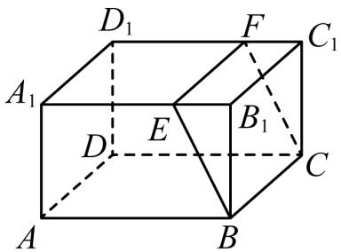
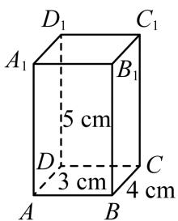

# 高中 数学 必修 第二册

# 第八章 立体几何初步 8.1 基本立体图形

# 一、复合题（共2题）

1.【复合题】判断下列命题是否正确，正确的在括号内画“√”，错误的画“×”。

(1)【判断题】长方体是直棱柱，四棱柱是长方体。（）  
(2)【判断题】棱锥的底面是多边形，其余各面为具有一个公共顶点的三角形。（）  
(3)【判断题】有两个面互相平行，其余四个面都是等腰梯形的六面体为棱台。（）

2.【复合题】如图为长方体 $ABCD-A_{1}B_{1}C_{1}D_{1}$

text_image

D₁
F
C₁
A₁
E
B₁
D
C
A
B

(1)【问答题】这个长方体是棱柱吗？如果是，是几棱柱？为什么？  
(2)【问答题】用平面BCFE

把这个长方体分成两部分后，各部分形成的几何体还是棱柱吗？如果是，是几棱柱？如果不是，请说明理由。

# 二、问答题（共1题）

3.【问答题】如图，长方体的长、宽、高分别为4 cm，3 cm，5 cm，一只蚂蚁从点A到点 $C_{1}$ 沿着表面爬行的最短距离是多少？

text_image

D₁ C₁
A₁ B₁
5 cm
D 3 cm C
A B 4 cm

