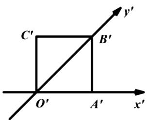

# 高中 数学 必修 第二册

# 第八章 立体几何初步 8.5 空间直线、平面的平行

# 一、单选题（共3题）

1.【单选题】如图所示，正方形 $O'A'B'C'$ 的边长为1cm

，它是用斜二测画法得到的一个水平放置的平面图形的直观图，则原图形的周长是（）

text_image

C'
B'
O'
A'
x'

A. 4cm   
B. 8cm   
C. $(2 + 3\sqrt{2})cm$   
D. $(2 + 2\sqrt{3})cm$

2.【单选题】用斜二测画法画水平放置的平面图形的直观图，其中说法不正确的是（）

A. 相等的线段在直观图中不一定相等  
B. 平行的线段在直观图中仍然平行  
C. 一个角的直观图仍是一个角  
D. 相等的角在直观图中仍然相等

3.【单选题】关于“斜二测画法”，下列说法不正确的是（）

A. 原图形中平行于x轴的线段, 其对应线段平行于 $x'$ 轴, 长度不变  
B. 原图形中平行于y轴的线段, 其对应线段平行于y'轴, 长度变为原来的一半  
C. 在画与直角坐标系xOy对应的坐标系 $x^{\prime}O^{\prime}y^{\prime}$ 时, $\angle x^{\prime}O^{\prime}y^{\prime}$ 必须是 $45^{\circ}$   
D. 在画直观图时, 由于选择坐标系的不同, 所得的直观图可能不同

# 二、填空题（共2题）

4.【填空题】如图所示， $\triangle ABC$ 是边长为 1 的等边三角形，那么 $\triangle ABC$ 的斜二测画法直观图 $\triangle A'B'C'$ 的面积是 \_\_\_\_。

text_image

y
C
A O B x

5.【填空题】如图所示，在所有棱长均为l的直三棱柱 $ABC-A_{1}B_{1}C_{1}$ 上，有一只蚂蚁从点A出发，围着三棱柱的侧面爬行一周到达点 $A_{1}$ ，则爬行的最短路程为\_\_\_\_。

text_image

A₁
B₁
C₁
D
E
A
B
C

