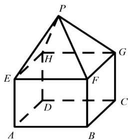
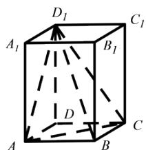
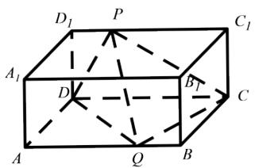

# 高中 数学 必修 第二册

# 第八章 立体几何初步 8.5 空间直线、平面的平行

# 一、单选题（共2题）

1.【单选题】正六棱柱的底面周长为12,侧面都是正方形,则此棱柱的体积为（）

A. $12 \sqrt{3}$   
B. 20   
C. 16   
D. $4\sqrt{3}$

2.【单选题】某组合体如图所示，上半部分是正四棱锥P-EFGH，下半部分是长方体ABCD-EFGH. 正四棱锥P-EFGH的高为 $\sqrt{3}$ ，EF=2,AE=1.则该组合体的表面积为（）

text_image

P
H
E
F
G
C
D
A
B

A. 20   
B. $4\sqrt{3} + 12$   
C. 16   
D. $4\sqrt{3} + 8$

# 二、填空题（共2题）

3.【填空题】已知一个正三棱台的两个底面的边长分别为3和9，侧棱长为5，则该棱台的表面积为\_\_\_\_。  
4.【填空题】如图，直四棱柱 $ABCD-A_{1}B_{1}C_{1}D_{1}$ 底面为菱形，且 $\angle BAD=60^{\circ}$

，侧棱长为3,对角线 $B_{D_{1}}=\sqrt{13}$ ，则三棱锥 $D_{1}-ACD$ 的表面积为\_\_\_\_。

text_image

D₁
A₁
B₁
C₁
D
A
B
C

# 三、问答题（共1题）

5. 【问答题】如图所示, 已知长方体 $ABCD - A_{1}B_{1}C_{1}D_{1}$ 的体积为V, P是棱 $D_{1}C_{1}$ 上的动点, Q是棱AB上的动点, 求三棱锥P - CDQ的体积。

text_image

D₁ P C₁
A₁ D B₁ C
A Q B

