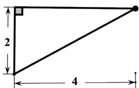
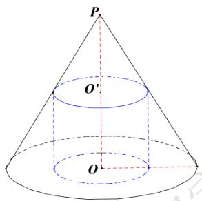

# 高中 数学 必修 第二册

# 第八章 立体几何初步 8.6 空间直线、平面的垂直

# 8.6.1 直线与直线垂直

# 一、单选题（共2题）

1.【单选题】若一个圆柱的表面积为 $12\pi$ ，则该圆柱的外接球的表面积的最小值为（）

A. $(12\sqrt{3} - 12)\pi$   
B. $(12\sqrt{5} - 12)\pi$   
C. $12\sqrt{3}\pi$   
D. $12\sqrt{5}\pi$

2.【单选题】一个圆柱的侧面展开图是一个正方形，这个圆柱的侧面积与表面积的比是（）。

A. $\frac{2\pi}{1+2\pi}$   
B. $\frac{4\pi}{1+4\pi}$   
C. $\frac{\pi}{1+2\pi}$   
D. $\frac{4\pi}{1+2\pi}$

# 二、填空题（共1题）

3.【填空题】某几何体的三视图如图所示，则该几何体的外接球的表面积为\_\_\_\_。

text_image

2
4

正视图

  
侧视图

text_image

2
4

俯视图

# 三、复合题（共1题）

4.【复合题】如图所示是古希腊数学家阿基米德的墓碑文，墓碑上刻着一个圆柱，圆柱内有一个内切球，这个球的直径恰好与圆柱的高相等，相传这个图形表达了阿基米德最引以为自豪的发现.我们来研究这个具有对称美的几何体。

(1)【填空题】球的表面积与圆柱的表面积之比为\_\_\_\_。   
(2)【填空题】球的体积与圆柱的体积之比为\_\_\_\_。

text_image

R
O

# 四、问答题（共1题）

5.【问答题】如图，圆锥PO的底面直径和高均是a，过PO的中点 $O'$

作平行于底面的截面，以该截面为底面挖去一个圆柱，求剩下几何体的体积。

text_image

P
O'
O'

