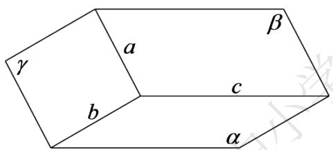

# 高中 数学 必修 第二册

# 第八章 立体几何初步 8.6 空间直线、平面的垂直

# 8.6.2 直线与平面垂直

# 一、单选题（共1题）

1.【单选题】下列命题正确的是（）

A. 经过三点确定一个平面  
B. 经过一条直线和一个点确定一个平面  
C. 四边形确定一个平面  
D. 两两相交且不共点的三条直线确定一个平面

# 二、问答题（共2题）

2.【问答题】已知三个平面 $\alpha,\beta,\gamma$ 满足： $\alpha\cap\beta=c,\quad\beta\cap\gamma=a,\quad\gamma\cap\alpha=b$ ，若直线a和b不平行，如图所示，求证：三条直线a,b,c过同一点。

text_image

γ
a
β
c
b
α

3. 【问答题】如图， $\triangle ABC$ 在平面 $\alpha$ 外， $AB \cap \alpha = P, BC \cap \alpha = Q, AC \cap \alpha = R$ ，求证： $P, Q, R$ 三点共线。

text_image

A
B
C
P
Q
R
α

