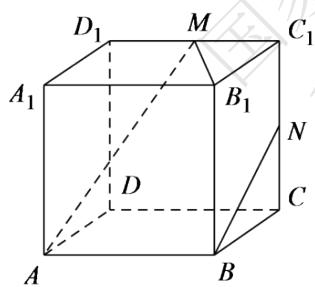
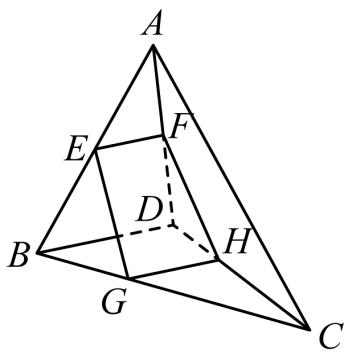
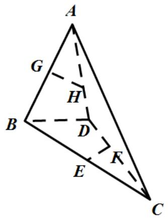

# 高中 数学 必修 第二册

# 第八章 立体几何初步 8.6 空间直线、平面的垂直

# 8.6.3平面与平面垂直

# 一、单选题（共1题）

1.【单选题】下列命题中，正确的有（）

A. 若直线 $l$ 上有无数个点不在平面 $\alpha$ 内，则 $l / / \alpha$   
B. 若直线 $l$ 与平面 $\alpha$ 平行，则 $l$ 与平面 $\alpha$ 内的任意一条直线都平行  
C. 如果两条平行直线中的一条与一个平面平行，那么另一条也与这个平面平行  
D. 若直线 $l$ 与平面 $\alpha$ 平行，则 $l$ 与平面 $\alpha$ 内的任意一条直线都没有公共点

# 二、填空题（共2题）

2.【填空题】如图，在正方体 $ABCD-A_{1}B_{1}C_{1}D_{1}$ 中，M,N分别为棱 $C_{1},D_{1},C_{1},C$ 的中点，有以下四个结论：

①直线AM与 $C_{C_{1}}$ 是相交直线；  
②直线AM与BN是相交直线；  
③直线BN与 $MB_{1}$ 是异面直线；  
④直线AM与 $D_{D_{1}}$ 是异面直线。

其中正确的结论为\_\_\_\_。

text_image

D₁ M C₁
A₁ B₁ N
D C
A B

3.【填空题】在正方体 $ABCD-A_{1}B_{1}C_{1}D_{1}$ 中，E,F分别为棱 $A_{A_{1}},C_{C_{1}}$ 的中点，则在空间中与三条直线 $A_{1}D_{1},EF,CD$ 都相交的直线有\_\_\_\_条。

# 三、复合题（共1题）

4.【复合题】填空题

(1)【填空题】若两个平面互相平行，则分别在这两个平行平面内的两条直线\_\_\_\_。

(2)【填空题】如果在两个平面内分别有一条直线, 这两条直线互相平行, 那么这两个平面的位置关系是\_\_\_\_。

# 四、问答题（共5题）

5.【问答题】如图，已知平面 $\alpha$ 和 $\beta$ 相交于直线 $l$ ，点 $A \in \alpha$ ，点 $B \in \alpha$ ，点 $C \in \beta$ ，且 $A \notin l$ ， $B \notin l$ ， $C \notin l$ 直线 $AB$ 与 $l$ 不平行，那么平面 $ABC$ 与平面 $\beta$ 的交线和直线 $l$ 有什么关系？证明你的结论。

text_image

A
B
α
l
C
β

6.【问答题】如图，在正方体 $ABCD - A_{1}B_{1}C_{1}D_{1}$ 中，哪几条棱所在直线与棱 $AB$

所在直线是异面直线？哪几条棱所在直线与直线 $B_{I}C$ 是异面直线？哪几条棱所在直线与直线B $D_{I}$ 是异面直线？

text_image

D₁
A₁ B₁ C₁
D
C
A B

7.【问答题】画图表示下列关系:

(1) $A \in \alpha, B \notin \alpha, A \in l, B \in l;$   
(2) $a \subset \alpha, b \subset \beta, \alpha \cap \beta = c, a // c, b \cap c = P$ 。

8.【问答题】如图，空间四边形ABCD中，平面EFHG分别交边AB，AD，CD，CB于E，F，H，G四点，其中E，F分别是AB，AD的中点，点G，H满足BG：GC=DH：HC

=1:2。试判断直线AC与平面EFHG的位置关系，并说明理由。

text_image

A
E
F
D
B
G
H
C

9.【问答题】如图，在三棱锥A-BCD中，E,G分别是BC,AB的中点，点F在CD上，点H在AD上，且有DF:FC=DH:HA=2:3.试判定直线EF,GH,BD的位置关系.

text_image

A
G
H
B
D
E
K
C

