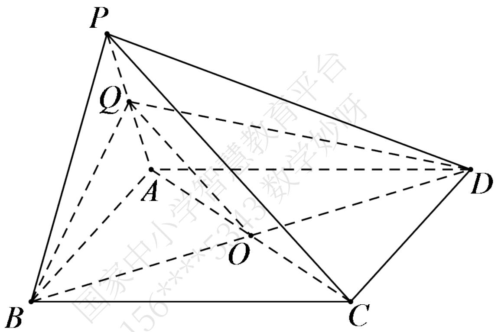

# 高中 数学 必修 第二册

# 第八章 立体几何初步 8.4

# 空间点、直线、平面之间的位置关系

# 一、单选题（共2题）

1. 【单选题】如图，P为平行四边形ABCD所在平面外一点，Q为PA的中点，O为AC与BD的交点，下列说法中错误的是（）

text_image

P
Q
A
O
B
C
D
国家中小学教育平台

A. $OQ \parallel$ 平面PCD  
B. PC // 平面BDQ  
C. AQ // 平面PCD  
D. CD // 平面PAB

2.【单选题】对于直线m,n和平面 $\alpha$ ，若 $n\subset\alpha$ ，则“ $m//n$ ”是“ $m//\alpha$ ”的（）

A. 充分不必要条件  
B. 必要不充分条件  
C. 充要条件

D. 既不充分也不必要条件

# 二、填空题（共1题）

3.【填空题】已知m,n是平面α外的两条直线，给出下列三个论断：①m//n；②m//α；③n//α，以其中两个为条件，余下的一个为结论，构造命题，写出你认为正确的一个命题\_\_\_\_。

# 三、复合题（共1题）

4. 【复合题】如图，四棱锥P-ABCD中，底面ABCD为平行四边形，F是AB的中点，E是PD的中点。

text_image

P
E
A
F
B
C
D
国家中小学智慧教育论坛

(1)【问答题】证明：PB//平面AEC;   
(2)【问答题】（2）在PC上求一点G，使FG平面AEC，并证明你的结论。