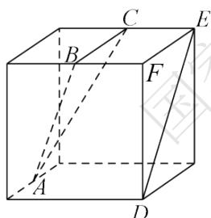
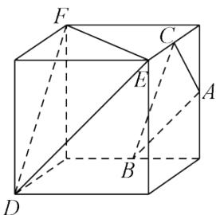
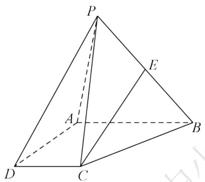

# 高中 数学 必修 第二册

# 第八章 立体几何初步 8.5 空间直线、平面的平行

# 一、单选题（共2题）

1.【单选题】下列四个正方体的图形中，A,B,C为正方体所在棱的中点，则能得出平面ABC//平面DEF的是（）

text_image

Geometric diagram of a cube with labeled vertices and internal diagonals, used for spatial geometry problems.

A.

text_image

Geometric diagram of a cube with labeled vertices and internal diagonals, used for spatial geometry problems.

B.

text_image

Geometric diagram of a cube with labeled vertices and internal diagonals, used for spatial geometry problems.

C.

text_image

Geometric diagram of a cube with labeled vertices and internal diagonals, used for spatial geometry problems.

D.

2.【单选题】已知两个平面 $\alpha, \beta$ ，下列条件中能判断出 $\alpha / / \beta$ 的是（）

A. $\alpha$ 内不共线的三点到 $\beta$ 的距离相等;

B. l, m 是 $\alpha$ 内的两条直线，且 $l // \beta$ ， $m // \beta$ ;  
C. l, m 是两条异面直线，且 $l \parallel \alpha$ ， $l \parallel \beta$ ， $m \parallel \alpha$ ， $m \parallel \beta$ ;  
D. $\alpha$ 内的 $\triangle ABC$ 与 $\beta$ 内的 $\triangle A_{1}B_{1}C_{1}$ 全等，且 $A_{A_{1}} // B_{B_{1}}$ .

# 二、填空题（共1题）

3.【填空题】已知正方体 $ABCD-A_{1}B_{1}C_{1}D_{1}$ 的棱长为2，E为棱 $C_{C_{1}}$ 的中点，点M在正方形 $BC_{C_{1}}B_{1}$ 内（包括边界）运动，且直线AM//平面 $A_{1}DE$ ，则动点M的轨迹长度为\_\_\_\_。

# 三、问答题（共1题）

4.【问答题】如图，四棱锥P-ABCD中， $AB//DC$ ，AB=2DC，E为PB的中点。

(1) 求证: $CE$ // 平面 PAD;  
(2) 在线段 $AB$ 上是否存在一点 $F$ , 使得平面 $PAD$ 平面 $CEF$

？若存在，证明你的结论，若不存在，请说明理由。

text_image

P
A
E
B
D
C

