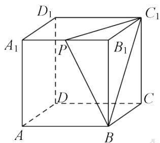

# 高中 数学 必修 第二册

# 第八章 立体几何初步 8.5 空间直线、平面的平行

# 一、单选题（共1题）

1. 【单选题】若平面 $\alpha //$ 平面 $\beta$ ，点 $A, C \in \alpha$ ， $B, D \in \beta$ ，则直线 $AC //$ 直线 $BD$ 的充要条件是（）.

A. AB // CD   
B. AD // CB   
C. AB 与 CD 相交  
D. A, B, C, D 四点共面

# 二、填空题（共1题）

2.【填空题】在棱长为2的正方体 $ABCD-A_{1}B_{1}C_{1}D_{1}$ 中，P是 $A_{1}B_{1}$ 的中点，过点 $A_{2}$ 作与平面PB $C_{1}$ 平行的截面，所得截面的面积是\_\_\_\_。

text_image

D₁
A₁ P B₁ C₁
D C
A B

# 三、问答题（共2题）

3.【问答题】如图，四棱柱 $ABCD-A_{1}B_{1}C_{1}D_{1}$ 的底面ABCD是正方形。

（1）证明：平面 $A_{1}BD$ // 平面 $C_{D_{1}}B_{1}$ ;  
(2) 若平面ABCD与平面 $B_{l}D_{l}C$ 交于直线l，证明： $B_{l}D_{l}/l$ 。

text_image

D₁
A₁
B₁
C₁
D
A
B
C

4. 【问答题】如图，已知平面 $\alpha / /$ 平面 $\beta$ ， $P \notin \alpha$ ，且 $P \notin \beta$ ，过点 $P$ 的直线 $m$ 与 $\alpha, \beta$ 分别交于点 $A, C$ ，过点 $P$ 的直线 $n$ 与 $\alpha, \beta$ 分别交于点 $B, D$ ，且 $PA = 6, AC = 9, PD = 8$ ，求 $BD$ 的长。

text_image

P
A B
α
β C D

