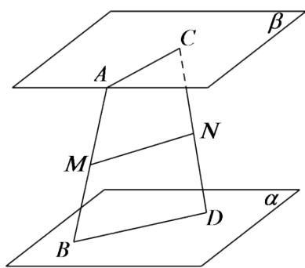

# 高中 数学 必修 第二册

# 第八章 立体几何初步 8.5 空间直线、平面的平行

# 一、单选题（共1题）

1.【单选题】已知四棱锥P-ABCD的底面四边形ABCD的对边互不平行，现用一平面 $\alpha$ 去截此四棱锥，且要使截面是平行四边形，则这样的平面 $\alpha$ （）

A. 有且只有一个  
B. 有四个   
C. 有无数个   
D. 不存在

# 二、填空题（共1题）

2.【填空题】如图，在正方体 $ABCD-A_{1}B_{1}C_{1}D_{1}$ 中，点E,F分别在AD,AC上，且 $A_{1}E=2ED$ ，CF=2FA，则EF与 $BD_{1}$ 的位置关系是\_\_\_\_。

text_image

D₁
A₁
E
B₁
C₁
D
F
A
B

# 三、问答题（共1题）

3.【问答题】如图，已知AB,CD是夹在两个平行平面 $\alpha,\beta$ 之间不共面的两条线段，M,N分别为AB,CD的中点，求证： $MN//\alpha$ 。

text_image

A
C
β
M
N
B
D
α

