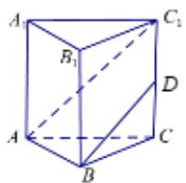
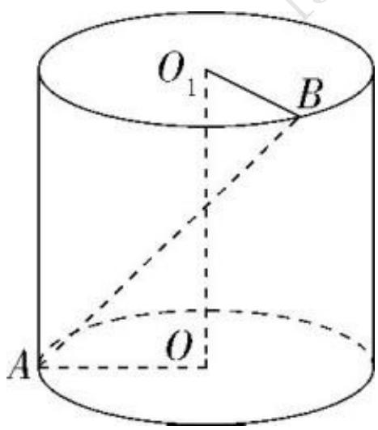

# 高中 数学 必修 第二册

# 第八章 立体几何初步 8.5 空间直线、平面的平行

# 一、单选题（共1题）

1.【单选题】若a是空间中的一条直线,则在平面α内一定存在直线b与直线a()

A. 平行  
B. 相交  
C. 垂直   
D. 异面

# 二、填空题（共3题）

2.【填空题】在正三棱柱 $ABC-A_{1}B_{1}C_{1}$ 中，D为 $CC_{1}$ 的中点，AB=2， $AA_{1}=2\sqrt{2}$

，求直线 $AC_{1}$ 与BD所成角的大小为\_\_\_\_

text_image

A
B₁
C₁
D
A
B
C

3.【填空题】如图，平面α过正方体ABCD - $A_{1}B_{1}C_{1}D_{1}$ 的顶点 $A_{1}$ ，α // 平面 $C_{1}BD$ ，α ∩ 平面ABCD = m，α ∩ 平面 $ABB_{1}A_{1} = n$ ，则m, n所成角的正弦值为\_\_\_\_。

text_image

D₁
A₁
B₁
C₁
D
C
A
B

4.【填空题】如图,圆柱 $OO_{1}$ 中,底面半径为1, $OA\perp O_{1}B$ ,异面直线AB与 $OO_{1}$ 所成角的正切值为 $\frac{\sqrt{2}}{4}$ ,则该圆柱 $OO_{1}$ 的体积为\_\_\_\_

text_image

O₁
B
A
O

# 三、问答题（共1题）

5.【问答题】在直三棱柱 $ABC-A_{1}B_{1}C_{1}$ 中， $AC\perp BC$ ，求证： $AC\perp BC_{1}$

text_image

C₁
A₁
B₁
C
B
A

