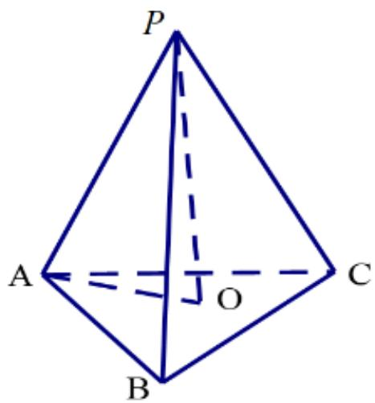
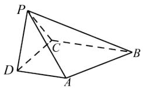

# 高中 数学 必修 第二册

# 第八章 立体几何初步 8.6 空间直线、平面的垂直

# 8.6.2 直线与平面垂直

# 一、单选题（共1题）

1.【单选题】如图所示的三棱锥P-

ABC中， $PA \perp$ 平面ABC， $BC \perp AC$ ，则图中直角三角形的个数为（）

natural_image

Geometric diagram of a tetrahedron with vertices labeled P, A, B, C (no text or symbols beyond labels)

A. 4   
B. 3   
C. 2   
D. 1

# 二、填空题（共1题）

2.【填空题】已知正三棱锥P-ABC的所有棱长都相等，则PA与平面ABC所成角的余弦值为\_\_\_\_。

text_image

P
A
O
C
B

# 三、问答题（共1题）

3.【问答题】如图，在四棱锥P-ABCD中， $AD \perp$ 平面PDC，AD//BC， $PD \perp PB$ ，AD=1，BC=3，CD=4，PD=2．求直线AB与平面PBC所成角的余弦值。

